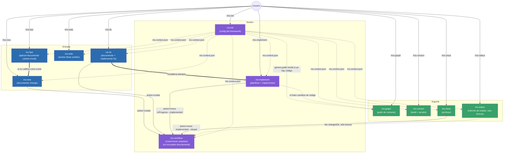

# Diseño — Framework `ms-*`

Mapa de las skills que componen el framework `ms-*` y cómo se invocan entre sí.

## Diagrama de relaciones

Leyenda:
- Flechas sólidas (`-->`, `==>`): invocación directa de skill a skill dentro del mismo proceso.
- Flechas punteadas (`-.->`): dependencia de contexto/config (lectura de `ms-context.json` o `graph.json`) o invocación condicional.
- `ms-todo` no tiene ninguna flecha hacia el resto del flujo: vive aislado en `{changesDir}/todo/`, ajeno al resto de skills.
- `ms-fast` es la única skill de "Entrada" que puede terminar sin pasar por `ms-workflow` ni por `inProgress`: si el cambio de verdad califica como trivial, escribe ella misma la carpeta en `{changesDir}/implemented/fast-*` (numeración/nombre propios, ajenos al `xxxx` secuencial). Solo cae en `ms-new` cuando el análisis revela que no era tan trivial (afecta a arquitectura/estilo, falta información, o toca más de 2 ficheros).

## Responsabilidades de cada skill

- **ms-init** — Inicializa el framework: crea/completa `.claude/ms-context.json` (rutas de `changesDir`, docs a sincronizar, config de versionado) y comprueba que las herramientas de línea de comandos necesarias estén instaladas. Único punto de configuración del que dependen todas las demás skills.
- **ms-new** — Documenta un cambio intencionado (funcionalidad nueva o modificación de comportamiento a propósito, no un bug). Anticipa dudas funcionales típicas, genera `description.md` vía `ms-workflow` y, si aplica, maquetas visuales `design_*.html`. No implementa nada.
- **ms-fix** — Documenta un bug y encadena automáticamente `ms-implement` para corregirlo de punta a punta, con el análisis acotado estrictamente a la causa raíz (sin ampliar alcance).
- **ms-fast** — Vía rápida para cambios tan pequeños que casi no requieren análisis (typo, texto, un valor/constante, un ajuste de estilo aislado). No pasa por `inProgress`/`plan.md`/`ms-workflow`: si de verdad califica (sin ambigüedad, ≤2 ficheros, sin afectar a `architectureDocPath`/`styleBibleDocPath`, sin comportamiento nuevo), aplica el cambio y lo documenta directamente en `{changesDir}/implemented/fast-{título}_{yyyyMMdd}/` en la misma invocación. Si no califica, no toca código: avisa al usuario e invoca `ms-new` con su petición para iniciar la definición de un change normal.
- **ms-implement** — Toma una entrada ya documentada en `inProgress`, analiza la solución técnica y escribe `plan.md`; si el usuario confirma, implementa el código, actualiza la documentación sincronizada (`architectureDocPath`/`featuresDocPath`/`styleBibleDocPath`), mueve la carpeta a `implemented` vía `ms-workflow` y regenera el grafo con `ms-graph` si hubo cambios de código.
- **ms-workflow** — Skill interna (no invocable por el usuario) que centraliza la mecánica de fichero del framework: numerar y crear entradas nuevas en `inProgress` (`action=create`), y mover carpetas entre estados (`action=move`). No analiza ni decide nada, solo ejecuta lo que la skill llamante ya resolvió. `ms-fast` no la usa: gestiona su propio espacio de nombres (`fast-{título}_{yyyyMMdd}`), fuera del `xxxx` secuencial que numera esta skill.
- **ms-version** — Genera una nueva versión del entregable: fija la versión en `versionFilePath`, ejecuta `buildCommand` y verifica el resultado en `buildOutputPath`. Paso explícito y separado, nunca automático tras `ms-implement`.
- **ms-close** — Archiva una entrada ya implementada, moviéndola de `implemented` a `closed` vía `ms-workflow`, con confirmación explícita previa. Puramente archivo, no toca código ni documentación. Funciona igual sobre entradas `change`/`fix` que sobre entradas `fast` de `ms-fast`.
- **ms-graph** — Genera/regenera `graph.json`: un mapa determinista (script Python) de ficheros, símbolos exportados y relaciones, usado como contexto reducido de arquitectura por `ms-implement`. Se invoca automáticamente al final de `ms-implement` (si hubo cambios de código) y de `ms-init` (si ya hay código al inicializar), o manualmente en cualquier momento. `ms-fast` nunca la invoca, aunque haya tocado código.
- **ms-status** — Da una vista general de solo lectura del estado del proyecto (totales por tipo —incluido `fast`— y por estado, detalle de qué está solo descrito vs. listo para implementar, y listado aparte de los cambios `fast` ya aplicados). No crea, mueve ni modifica nada; el informe se entrega en el chat salvo que el usuario pida guardarlo.
- **ms-todo** — Cuaderno de ideas sueltas, deliberadamente fuera del flujo de trabajo del framework: vive en `{changesDir}/todo/`, con numeración e identificadores propios que ninguna otra skill `ms-*` lee ni cuenta. Sirve para anotar ideas incompletas sin forzar el análisis de alcance de `ms-new`/`ms-fix`.
