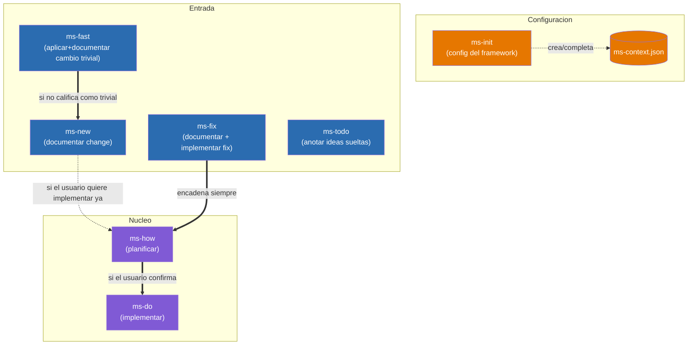

# Diseño — Framework `ms-*`

Mapa de las skills que componen el framework `ms-*` y cómo se invocan entre sí.

## Diagrama de relaciones

Diagrama simplificado con solo el flujo principal visible al usuario. Las skills internas (`ms-internal-workflow`, `ms-internal-tech-analysis`) y de soporte (`ms-internal-graph`, `ms-status`) no aparecen aquí — su relación con el resto está descrita en la sección de responsabilidades más abajo.

`ms-how` (planificar) y `ms-do` (implementar) son dos skills separadas: `ms-how` analiza la solución técnica y escribe `plan.md`, y solo si el usuario confirma que quiere implementar ya, encadena `ms-do`, que es quien edita el código. También se puede invocar `ms-do` directamente sobre una entrada que ya tenga `plan.md`, sin pasar por `ms-how` de nuevo.

Leyenda:
- Flechas sólidas (`-->`, `==>`): invocación directa de skill a skill dentro del mismo proceso.
- Flechas punteadas (`-.->`): dependencia de configuración o invocación condicional.
- `ms-todo` no tiene ninguna flecha hacia el resto del flujo: vive aislado en `{changesDir}/todo/`, ajeno al resto de skills.
- `ms-fast` es la única skill de "Entrada" que puede terminar sin pasar por `inProgress`: si el cambio de verdad califica como trivial, escribe ella misma la carpeta en `{changesDir}/implemented/fast-*` (numeración/nombre propios, ajenos al `xxxx` secuencial). Solo cae en `ms-new` cuando el análisis revela que no era tan trivial (afecta a arquitectura/estilo, falta información, o toca más de 2 ficheros).
- Todas las skills leen `.claude/ms-context.json` para funcionar, no solo las que aparecen aquí conectadas a él — se omite esa flecha hacia cada una para no saturar el diagrama; `ms-init` es la única que lo escribe.

## Responsabilidades de cada skill

### Invocables por el usuario

- **ms-init** — Inicializa el framework: crea/completa `.claude/ms-context.json` (rutas de `changesDir`, docs a sincronizar) y comprueba que las herramientas de línea de comandos necesarias estén instaladas. Único punto de configuración del que dependen todas las demás skills. Si ya hay código al inicializar, invoca `ms-internal-graph` para generar el grafo inicial. *Usa:* `ms-internal-graph`.
- **ms-new** — Documenta un cambio intencionado (funcionalidad nueva o modificación de comportamiento a propósito, no un bug). Invoca `ms-internal-tech-analysis` para reunir contexto técnico antes de anticipar dudas funcionales típicas, genera `description.md` vía `ms-internal-workflow` y, si aplica, maquetas visuales `design_*.html`. No implementa nada por sí misma, pero si el usuario quiere implementar de inmediato puede invocar directamente `ms-how` sobre la entrada recién creada. *Usa:* `ms-internal-workflow`, `ms-internal-tech-analysis`, `ms-how`.
- **ms-fix** — Documenta un bug (genera `description.md` vía `ms-internal-workflow`) y encadena automáticamente `ms-how` para corregirlo de punta a punta, con el análisis acotado estrictamente a la causa raíz (sin ampliar alcance). Invoca `ms-internal-tech-analysis` para distinguir qué hace hoy el proyecto de lo que el usuario cree que hace. *Usa:* `ms-internal-workflow`, `ms-internal-tech-analysis`, `ms-how`.
- **ms-fast** — Vía rápida para cambios tan pequeños que casi no requieren análisis (typo, texto, un valor/constante, un ajuste de estilo aislado). No pasa por `inProgress`/`plan.md`/`ms-internal-workflow`: invoca `ms-internal-tech-analysis` para valorar si de verdad califica (sin ambigüedad, ≤2 ficheros, sin afectar a `docs.tech.architectureDocPath`/`docs.tech.styleBibleDocPath` ni incongruencias detectadas con ellos, sin comportamiento nuevo); si califica, aplica el cambio y lo documenta directamente en `{changesDir}/implemented/fast-{título}_{yyyyMMdd}/` en la misma invocación. Si no califica, no toca código: avisa al usuario e invoca `ms-new` con su petición para iniciar la definición de un change normal. *Usa:* `ms-internal-tech-analysis`, `ms-new`.
- **ms-how** — Toma una entrada ya documentada en `inProgress`, invoca `ms-internal-tech-analysis` para reunir el contexto técnico, analiza la solución técnica y escribe `plan.md`; si el usuario confirma que quiere implementar ya, encadena directamente `ms-do` sobre la misma entrada. *Usa:* `ms-internal-tech-analysis`, `ms-do`.
- **ms-do** — Toma una entrada de `inProgress` cuyo `plan.md` ya está escrito (por `ms-how`, o invocada directamente por el usuario), implementa el código, actualiza la documentación sincronizada (`docs.tech.architectureDocPath`/`docs.functional.featuresDocPath`/`docs.tech.styleBibleDocPath` — incluyendo cualquier incongruencia que `ms-internal-tech-analysis` haya reportado vía `ms-how`), mueve la carpeta a `implemented` vía `ms-internal-workflow` y regenera el grafo con `ms-internal-graph` si hubo cambios de código. *Usa:* `ms-internal-workflow`, `ms-internal-graph`.
- **ms-status** — Da una vista general de solo lectura del estado del proyecto (totales por tipo —incluido `fast`— y por estado, detalle de qué está solo descrito vs. listo para implementar, y listado aparte de los cambios `fast` ya aplicados). No crea, mueve ni modifica nada; el informe se entrega en el chat salvo que el usuario pida guardarlo. *Usa:* ninguna otra skill.
- **ms-todo** — Cuaderno de ideas sueltas, deliberadamente fuera del flujo de trabajo del framework: vive en `{changesDir}/todo/`, con numeración e identificadores propios que ninguna otra skill `ms-*` lee ni cuenta. Sirve para anotar ideas incompletas sin forzar el análisis de alcance de `ms-new`/`ms-fix`. *Usa:* ninguna otra skill.

### Internas y de soporte

`ms-internal-workflow` y `ms-internal-tech-analysis` solo se ejecutan cuando otra skill del framework las invoca como parte de su propio proceso; si el usuario las invoca directamente (o pide "ejecuta X" en texto plano sin venir de ese contexto), se detienen sin hacer nada y redirigen a la skill correspondiente. `ms-internal-graph`, en cambio, sí admite invocación directa del usuario (`/ms-internal-graph`) — se agrupa aquí porque no forma parte del flujo principal `ms-new`/`ms-fix`/`ms-fast` → `ms-how`/`ms-do`, sino que da soporte de contexto a otras skills.

- **ms-internal-workflow** — Centraliza la mecánica de fichero del framework: numerar y crear entradas nuevas en `inProgress` (`action=create`), y mover carpetas entre estados (`action=move`). No analiza ni decide nada, solo ejecuta lo que la skill llamante ya resolvió. `ms-fast` no la usa: gestiona su propio espacio de nombres (`fast-{título}_{yyyyMMdd}`), fuera del `xxxx` secuencial que numera esta skill. *Usa:* ninguna otra skill.
- **ms-internal-tech-analysis** — Centraliza cómo reunir contexto técnico fiable: lee primero la documentación de `framework.docs.tech` configurada, y solo explora código si hace falta completar información. Si detecta incongruencias entre documentación y código, el código manda y la incongruencia se devuelve como hallazgo a quien invoca (nunca edita nada ella misma). La usan `ms-new`, `ms-fix`, `ms-fast` e `ms-how`. *Usa:* ninguna otra skill.
- **ms-internal-graph** — Genera/regenera `graph.json`: un mapa determinista (script Python) de ficheros, símbolos exportados y relaciones, usado como contexto reducido de arquitectura por `ms-how`/`ms-internal-tech-analysis`. Se invoca automáticamente al final de `ms-do` (si hubo cambios de código) y de `ms-init` (si ya hay código al inicializar), o manualmente en cualquier momento. `ms-fast` nunca la invoca, aunque haya tocado código. *Usa:* ninguna otra skill.
