# Guía de uso — MinSDD

MinSDD (nombre provisional para el framework `ms-*`) es un conjunto de skills de Claude Code que estandariza cómo se documentan, planifican, implementan y versionan los cambios en este proyecto. Todo cambio real en el código pasa por el mismo ciclo: **documentar la intención → planificar la solución técnica → implementar → (opcional) versionar → cerrar**.

Todas las skills viven bajo `.claude/skills/ms-*` y comparten un único fichero de configuración: `.claude/ms-context.json`.

## Puntos fuertes

- **Pensado para proyectos pequeños y medianos.** Aporta el control y la trazabilidad del *spec-driven development* (SDD) sin la sobrecarga de proceso que ese enfoque suele exigir en proyectos grandes.
- **100% conversacional y dirigido por IA.** Todo el ciclo — desde que surge la idea hasta que queda implementada — está pensado para que lo lleve una IA conversando con personas, no para rellenar formularios ni seguir un asistente rígido paso a paso.
- **Especificación completa, formato libre.** Cada entrada exige la estructura mínima necesaria para ser útil (intención, plan, estado), pero sin formatos de *spec* complejos y rígidos que haya que aprender o mantener a mano.
- **Sin herramientas adicionales.** No requiere más que Claude y Python instalados en la máquina de desarrollo — nada de servicios externos, bases de datos ni infraestructura propia que mantener.
- **Valida el diseño antes de tocar código.** No se limita a analizar y planificar el cambio: cuando hay componente visual, genera maquetas estáticas en HTML/CSS (`design_*.html`) que puedes abrir y revisar en el navegador para validar el aspecto antes de que se implemente nada — evitando el ciclo de "implementar → ver que no convence → rehacer".

## Preparación

### 1. Herramientas necesarias

El propio `ms-init` comprueba esto por ti la primera vez, pero para referencia:

- **Git** — el repo ya lo es; solo hace falta que el CLI funcione (`git --version`).
- **Python 3** — usado por los scripts internos de `ms-workflow`, `ms-implement` y `ms-graph` (numeración de cambios, mover carpetas, generar el grafo). Comprueba `python --version`.
- **Herramientas condicionales según el proyecto**, por ejemplo:
  - Node/npm si hay `package.json`.
  - PowerShell/bash si el `buildCommand` configurado es un `.ps1`/`.sh`.
  - Cualquier otro intérprete que necesite el build del proyecto.

En este repo (Errantes), el build se ejecuta con `python ./src/scripts/build.py`, así que basta con Python 3.

### 2. Inicializar el framework: `/ms-init`

Antes de poder usar cualquier otra skill `ms-*`, hay que ejecutar `/ms-init` una vez por proyecto. Genera `.claude/ms-context.json`, que es el único sitio donde vive la configuración: dónde se guardan los cambios, si el proyecto versiona entregables, dónde está el código fuente, qué documentos mantener sincronizados, etc.

`ms-init` explora el repo en busca de pistas (carpeta de cambios existente, `package.json`, ficheros de versión, docs de arquitectura...) y solo pregunta lo que no puede deducir. Si se vuelve a invocar sobre un proyecto ya inicializado, permite reconfigurar o completar campos que falten sin repetir todo el cuestionario.

Ejemplo de `.claude/ms-context.json` ya configurado en este proyecto:

```json
{
  "framework": {
    "sourcecodeDir": "src",
    "changesDir": "changes",
    "numberWidth": 5,
    "docs": {
      "functional": {
        "featuresDocPath": "design/docs/FEATURES.md"
      },
      "tech": {
        "architectureDocPath": "design/docs/ARCHITECTURE.md",
        "styleBibleDocPath": "design/docs/STYLE_BIBLE.md",
        "projectGraphPath": "src/_graph/graph.json"
      }
    },
    "versioning": true,
    "versionFilePath": "src/data/version.js",
    "versionVariable": "CURRENT_VERSION",
    "versionFormat": "v{xxxx}",
    "buildCommand": "python ./src/scripts/build.py",
    "buildOutputPath": "src/_output/versions/index-{version}.html"
  },
  "project": {
    "name": "Errantes",
    "summary": "Prototipo digital jugable en navegador del juego de mesa Errantes",
    "stack": ["JavaScript vanilla (ES modules)", "HTML/CSS", "Python build script"],
    "notes": "El entregable es un único HTML autocontenido por versión, generado sin Node.js"
  }
}
```

Todos los campos de `framework` (excepto `changesDir` y `versioning`) son opcionales — el framework funciona sin `docs.tech.architectureDocPath`, `docs.functional.featuresDocPath`, `docs.tech.styleBibleDocPath` o `docs.tech.projectGraphPath`, simplemente usa menos contexto al analizar y no mantiene esos documentos sincronizados.

## Guía de uso rápida: el flujo natural

```mermaid
flowchart LR
    T["/ms-todo\n(idea suelta)"]
    A["/ms-new o /ms-fix\n(documentar intención)"]
    B["ms-implement\n(planificar: plan.md)"]
    C["ms-implement\n(implementar código)"]
    D["/ms-version\n(cortar release)"]
    E["/ms-close\n(archivar)"]
    F["queda en inProgress\npendiente de retomar"]
    G["/ms-fast\n(cambio trivial)"]
    H["fin de ciclo"]

    T -->|"/ms-new todo {código}"| A
    A -->|"inProgress"| B
    B -->|usuario confirma| C
    C -->|"implemented"| D
    C -->|"implemented"| E
    B -->|usuario no confirma| F
    F -->|usuario confirma más tarde| C
    G -->|"implemented"| C
    G -->|si no califica| A
    E -->|"closed"| H

    N1["comentario:\nno interfiere con\ninProgress/implemented/closed\nni con la numeración xxxx"]
    N1 --- T
    N2["comentario:\nsolo si framework.versioning\nes true"]
    N2 --- D
    N3["comentario:\npide confirmación explícita\nantes de mover"]
    N3 --- E
    N4["comentario:\nun bug se corrige de punta a punta\nen la misma invocación\n(alcance acotado a la causa raíz)"]
    N4 --- A

    class T,D,F,H opcional
    class A,B,C,G,E obligatorio
    class N1,N2,N3,N4 comentario
    classDef obligatorio fill:#4c6ef5,stroke:#364fc7,stroke-width:2px,color:#fff
    classDef opcional fill:#fff,stroke:#adb5bd,stroke-width:1px,color:#212529
    classDef comentario fill:#fff9c4,stroke:#e6d84a,stroke-width:1px,color:#333
    linkStyle 1 color:#8b0000,stroke:#8b0000,stroke-width:2px
    linkStyle 3 color:#8b0000,stroke:#8b0000,stroke-width:2px
    linkStyle 4 color:#8b0000,stroke:#8b0000,stroke-width:2px
    linkStyle 7 color:#8b0000,stroke:#8b0000,stroke-width:2px
    linkStyle 9 color:#8b0000,stroke:#8b0000,stroke-width:2px
```



Nodos azules = paso obligatorio del ciclo (Paso 1, Paso 2 y Paso 4) o vía directa equivalente (`/ms-fast`, que aplica el código sin pasar por `plan.md` si el cambio califica como trivial). Nodos blancos = punto de entrada u operación opcional (`/ms-todo`, `/ms-version`, o quedarse pendiente en `inProgress`). Las flechas rojo oscuro con fondo blanco y texto rojo oscuro indican un cambio de estado (solo el nombre de la carpeta destino: `inProgress`, `implemented`, `closed`); el resto de flechas indican solo una transición sin cambio de carpeta. Los cuadros amarillos son comentarios aclaratorios conectados sin flecha al nodo al que se refieren.

Cada entrada de trabajo vive en una carpeta numerada `xxxx` (p.ej. `00007`) que va viajando entre subcarpetas de `changesDir` según su estado: `inProgress/` → `implemented/` → `closed/`.

### Paso 0 (opcional) — Apuntar ideas sueltas: `/ms-todo`

Antes de que una idea sea un change o un fix, puede que solo quieras dejarla anotada para más adelante sin comprometerte a documentarla ni implementarla todavía. `/ms-todo <idea>` la guarda en `changes/todo/{código}/description.md` — una carpeta aparte que ninguna otra skill del framework usa ni tiene en cuenta, así que no interfiere con `inProgress`/`implemented`/`closed` ni con la numeración `xxxx`.

- **Apuntar o ampliar**: `/ms-todo <idea>` crea una nueva; `/ms-todo {código} <más detalle>` sigue desarrollando una ya existente.
- **Consultar lo apuntado**: `/ms-status todo` lista las ideas pendientes con su código y texto completo.
- **Convertir en cambio**: cuando una idea de la lista madura y quieres llevarla al flujo real, `/ms-new todo {código}` arranca `ms-new` partiendo de esa idea en vez de una petición nueva, y borra la entrada de `todo/` automáticamente al terminar (sin pedir confirmación) — la idea pasa a vivir como entrada normal en `changes/inProgress/`.

### Paso 1 — Definir el cambio: tres maneras

El framework ofrece tres puntos de entrada según la naturaleza y el tamaño del cambio. Los tres conviven — la elección depende de qué tipo de trabajo es y de si merece pasar por documentación formal.

#### 1. `/ms-new` — funcionalidad nueva o cambio de comportamiento intencionado

Para funcionalidad nueva o un cambio de comportamiento **intencionado**. Ejemplo: `/ms-new añade un botón para barajar el mazo de eventos manualmente`.

#### 2. `/ms-fix` — corregir un bug

Para un bug, algo que ya debería funcionar de otra forma. Ejemplo: `/ms-fix al recargar la página se pierde la partida en curso aunque estaba guardada`.

En ambos casos (`/ms-new` y `/ms-fix`), la skill:

1. Analiza el alcance y **anticipa** las dudas típicas (casos límite, convivencia con lo existente, alcance de los datos, quién puede usarlo, aspecto visual de alto nivel) y te propone respuestas razonables para que las confirmes o corrijas, en vez de preguntar a ciegas.
2. Genera `changes/inProgress/{xxxx}/description.md` con el resumen funcional (nunca solución técnica todavía).
3. Si el cambio tiene componente visual, crea maquetas estáticas `design_*.html` (solo HTML/CSS/SVG, sin lógica) como referencia visual navegable — para validar el diseño antes de escribir una sola línea de código real.

Diferencia clave: `/ms-fix` encadena automáticamente `ms-implement` al terminar (un bug se corrige de punta a punta en la misma invocación, con alcance estrictamente acotado a la causa raíz). `/ms-new` solo documenta — decides tú cuándo planificar/implementar después.

Si ya existe una entrada en `inProgress` y quieres ampliarla en vez de crear una nueva, invoca `/ms-new {xxxx} <descripción de la ampliación>` — detecta que ya existe y añade a lo documentado en vez de crear otra carpeta.

#### 3. `/ms-fast` — atajo para cambios triviales

Para algo tan pequeño que no merece pasar por `description.md` + `plan.md` + confirmación (un typo, un texto, un valor/constante puntual, un ajuste de estilo aislado), usa `/ms-fast <descripción del cambio>` en vez de `/ms-new`/`/ms-fix`. Ejemplo: `/ms-fast corrige el texto del botón "Guradar" a "Guardar"`.

`ms-fast` primero valora si el cambio de verdad es trivial (sin ambigüedad, como mucho 2 ficheros, sin comportamiento nuevo, sin tocar `docs.tech.architectureDocPath` ni `docs.tech.styleBibleDocPath`):

- **Si califica**: aplica el cambio directamente en el código y, en la misma invocación, documenta lo hecho en `changes/implemented/fast-{título}_{yyyyMMdd}/description.md` — sin pasar por `inProgress`, sin `plan.md`, sin `ms-workflow` (usa su propio nombre de carpeta, no el `xxxx` secuencial). Queda ya en `implemented`, listo para cerrarse más adelante con `/ms-close` igual que cualquier otro change/fix.
- **Si no califica** (afecta a arquitectura/estilo, falta información, toca más de 2 ficheros, o resulta ser un bug con causa no evidente): no toca nada de código, te avisa de por qué no encaja, e invoca directamente `ms-new` con tu petición para arrancar el flujo normal de documentación.

### Paso 2 — Planificar e implementar: `ms-implement`

`/ms-implement {xxxx}` toma una entrada ya documentada en `inProgress` y:

1. Analiza la causa raíz (fix) o diseña la solución técnica (change), usando como fuente de verdad el código real, el grafo (`docs.tech.projectGraphPath`), la documentación de arquitectura (`docs.tech.architectureDocPath`) y la guía de estilo (`docs.tech.styleBibleDocPath`) — nunca lo que otras entradas de `changes/` asuman ni la memoria de la conversación.
2. Escribe `changes/inProgress/{xxxx}/plan.md` con tres secciones: (a) anotaciones funcionales, (b) solución técnica paso a paso, (c) cambios de arquitectura si aplica.
3. Pregunta si quieres implementarlo ya. Si confirmas, edita el código, actualiza `docs.tech.architectureDocPath`/`docs.functional.featuresDocPath`/`docs.tech.styleBibleDocPath` según corresponda, mueve la carpeta a `changes/implemented/{xxxx}/` y regenera el grafo de contexto si hubo cambios de código.

Si invocas `/ms-implement` sin argumento, lista lo que hay pendiente en `inProgress` y te pregunta cuál quieres. Si `plan.md` ya existía (por ejemplo, quieres retomarlo), te pregunta si quieres regenerarlo desde cero o implementar directamente lo que ya dice.

### Paso 3 (opcional) — Generar versión: `/ms-version`

Solo aplica si `framework.versioning` es `true` (en este proyecto lo es). `/ms-version` toma el `xxxx` más alto ya implementado, fija la versión en `versionFilePath` (aquí, `CURRENT_VERSION` en `src/data/version.js`, con formato `v{xxxx}`), ejecuta `buildCommand` y verifica que el entregable se generó correctamente en `buildOutputPath`.

Es un paso explícito y separado: `ms-implement` nunca genera versión por su cuenta, aunque el proyecto versione.

### Paso 4 — Cerrar: `/ms-close`

Cuando una entrada ya implementada deja de ser relevante para consulta activa (ya está integrada y no hace falta volver a mirarla), `/ms-close {xxxx}` la mueve de `implemented/` a `closed/`, pidiendo confirmación explícita antes de mover nada. Es puramente archivo — no toca código ni documentación.

### Soporte: `ms-graph`

`/ms-graph` genera o regenera `graph.json` (aquí, `src/_graph/graph.json`): un mapa de ficheros, símbolos exportados y relaciones entre ellos, sin usar LLM para la parte estructural (un script Python determinista hace el parseo). Sirve de contexto reducido de arquitectura para `ms-implement`, en vez de tener que releer todo el código fuente cada vez. Se ejecuta automáticamente al final de `ms-implement` si hubo cambios de código, pero puede invocarse manualmente en cualquier momento.

## Ejemplo de ciclo completo

```
/ms-fix el temporizador de turno no se detiene al pausar la partida
```

1. `ms-fix` documenta el bug en `changes/inProgress/00008/description.md` y encadena `ms-implement` automáticamente.
2. `ms-implement` analiza la causa raíz, escribe `plan.md` (acotado solo a ese bug) y pregunta si implementar.
3. Confirmas → se edita el código, se actualiza `FEATURES.md`/`ARCHITECTURE.md` si aplica, se mueve la carpeta a `changes/implemented/00008/`, se regenera `src/_graph/graph.json`.
4. Cuando quieras cortar una nueva build: `/ms-version` → fija `v00008` en `version.js` y ejecuta el build.
5. Más adelante, si ya no necesitas consultar esa entrada: `/ms-close 00008`.

Y para algo trivial:

```
/ms-fast corrige el texto del botón "Guradar" a "Guardar"
```

1. `ms-fast` valora que es trivial (un texto, un fichero) y aplica el cambio directamente.
2. Documenta lo hecho en `changes/implemented/fast-corrige-texto-boton-guardar_20260717/description.md`, ya en `implemented` sin haber pasado por `inProgress` ni `plan.md`.
3. Igual que cualquier otra entrada implementada, puede cerrarse más adelante con `/ms-close`.

## Trucos

- **Reanálisis sobre una entrada ya en curso**: si invocas `/ms-new {xxxx} ...` o `/ms-implement {xxxx}` sobre un `xxxx` que ya existe en `inProgress`, el framework no crea nada nuevo — reanaliza esa misma entrada (funcionalmente en el caso de `ms-new`, ampliando la documentación existente; técnicamente en el caso de `ms-implement`, regenerando el `plan.md`). Útil para corregir el rumbo de un cambio sin perder lo ya documentado ni generar carpetas duplicadas.
- **`/ms-fast` para lo trivial**: si el cambio es tan pequeño que no merece pasar por `description.md`/`plan.md`, usa `/ms-fast` en vez de `/ms-new` — ver la opción 3 dentro del Paso 1 más arriba.

## Notas

- Nunca se escribe a mano el `description.md`, el `plan.md` ni se numeran/mueven carpetas — eso lo hace siempre `ms-workflow` (skill interna, no invocable directamente) para mantener esa lógica en un único sitio.
- Un `xxxx` nunca se reutiliza ni se calcula a mano: siempre lo asigna el script de `ms-workflow` recorriendo todas las subcarpetas de `changes/`.
- Las skills verifican siempre que `.claude/ms-context.json` existe y está completo antes de actuar; si falta algo, piden ejecutar/completar `ms-init` en vez de improvisar valores por defecto.
- Siempre que `ms-new`, `ms-fix`, `ms-fast` o `ms-implement` necesitan contexto técnico, lo piden invocando `ms-tech-analysis` (skill interna, no invocable directamente): primero lee la documentación de `framework.docs.tech` ya configurada, y solo explora código si hace falta completar información. Si documentación y código no coinciden, el código manda y la incongruencia se devuelve como hallazgo — nunca se corrige el documento dentro de esa misma skill sin que la skill llamante lo decida.
