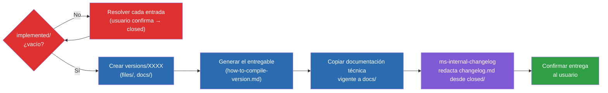

# Plan — nueva skill `ms-version` (+ `ms-internal-changelog`)

## Contexto

El proyecto ya tiene un flujo `ms-*` (`ms-new`/`ms-fix` → `ms-how` → `ms-do`) que documenta, planifica e implementa changes/fixes uno a uno en `changes/{inProgress,implemented,closed}/{xxxx}/`. Lo que falta es un paso periódico de **empaquetar una entrega**: generar el HTML jugable con `src/scripts/build.py`, dejar constancia de en qué documentación técnica se apoyaba esa entrega, y redactar un changelog funcional legible por alguien no técnico — hoy esto no existe en ningún sitio y `changes/closed/` ha ido acumulando carpetas sin que nada las convierta en changelog.

Se añaden dos skills nuevas siguiendo el mismo patrón que el resto del framework (`SKILL.md` con frontmatter estándar, guardarraíl "framework inicializado", trabajo mecánico delegado a scripts Python, contenido/juicio hecho por el LLM):

- **`ms-version`** (invocable por el usuario, `/ms-version <XXXX>`): orquesta la generación de una entrega en `{versionsDir}/{XXXX}/`.
- **`ms-internal-changelog`** (interna, `user-invocable: false`, invocada por `ms-version` vía herramienta Skill): redacta `changelog.md` a partir de `changes/closed/` y, tras confirmación, vacía esas carpetas.

Decisiones ya confirmadas con el usuario:
- El changelog es **histórico acumulado de `closed/`**, no incremental — y por eso, justo después de incorporar una entrada al changelog, esa carpeta se **borra** de `closed/` (así `closed/` funciona como una cola pendiente de "changelog por escribir", no como un archivo histórico permanente).
- El paso 3 (copiar documentación) copia **carpetas completas**: `docs.tech.architectureDocDir` y `docs.tech.styleBibleDocDir` de `.claude/ms-context.json`, tal como esas dos rutas ya se tratan en el resto del framework (`ms-do`, `ms-how`, `ms-internal-tech-analysis`) — carpetas con varios ficheros más un `INDEX.md`, no ficheros sueltos. No se copia el resto de `design/docs/`.
- **`changesDir` y `versionsDir` desaparecen como campos configurables.** Se sustituyen por un único campo `framework.workFolder` (raíz de trabajo del framework, `"/"` = raíz del repo por defecto). Dentro de `workFolder`, las skills **crean ellas mismas** las subcarpetas `changes/` y `versions/` con esos nombres fijos, no elegibles por el usuario — así se elimina la posibilidad de que una configuración manual mal escrita rompa el framework o haga colisionar dos rutas. Ver sección dedicada más abajo, "Migración de configuración: `framework.workFolder`", que detalla el alcance completo (afecta a 22 ficheros ya existentes del framework, no solo a lo nuevo de este plan).
- **Tres espacios de numeración/carpetas "versions" totalmente independientes en este repo — no deben confundirse ni mezclarse nunca:**
  1. `{workFolder}/changes/` — numeración `xxxx` de change/fix, gestionada por `next-change-number.py`. Mismo comportamiento de siempre; solo cambia cómo se resuelve la ruta (ver migración).
  2. **`{workFolder}/versions/`** — numeración `XXXX` **libre, la indica el usuario** en cada invocación de `/ms-version`, sin relación con `numberWidth` ni con la numeración de change/fix. Es donde trabajan las skills de este plan.
  3. `src/_output/versions/` — carpeta que ya genera `src/scripts/build.py` por su cuenta, con sus propios ficheros `index-v{NNNN}.html` numerados por el contador interno `CURRENT_VERSION` de `src/data/version.js` (autoincremental, ajeno al framework `ms-*`). Es simplemente el **origen** del entregable que el paso 4 de `ms-version` copia a `{workFolder}/versions/{XXXX}/files/` — nunca el destino, y su numeración `NNNN` no debe leerse, compararse ni confundirse con el `XXXX` de `versions/`.

  Ningún script debe escanear el repo buscando carpetas llamadas "versions" o "changes": todos operan estrictamente sobre `{workFolder}/versions` y `{workFolder}/changes`, ignorando cualquier otra carpeta con esos nombres que exista en el repo (como `src/_output/versions/`).

  A partir de aquí, y en el resto de `SKILL.md` de todo el framework (nuevos y ya existentes), `{changesDir}` y `{versionsDir}` se mantienen como **notación abreviada en prosa** para `{workFolder}/changes` y `{workFolder}/versions` respectivamente — ya no son campos de configuración leídos tal cual de `ms-context.json`, son rutas fijas calculadas a partir de `workFolder`. Los usos puramente narrativos de `{changesDir}` en los `SKILL.md` ya existentes (p.ej. "mueve la carpeta a `{changesDir}/implemented/{xxxx}/`") siguen siendo válidos tal cual y no hace falta reescribirlos frase a frase; solo hay que corregir los puntos concretos que leen/comprueban el campo de configuración en sí (listados en la sección de migración).
- `changelog.md` no es una lista plana: diferencia tres secciones — **Nuevo**, **Cambios**, **Eliminado** — comparando cada entrada de `closed/` contra el `changelog.md` de la versión anterior (si no hay versión anterior, todo va a **Nuevo**). La versión anterior se detecta como la carpeta de `{versionsDir}/` con fecha de creación más reciente (excluyendo la que se está generando), y esa detección se le confirma al usuario antes de usarla, por si hubiera ambigüedad.
- Tanto `ms-version` como `ms-internal-changelog` se quedan en el modelo por defecto (Sonnet), sin overrides en `skillModels`. La documentación de Claude Code sugiere que el `model` de una skill "aplica para el resto del turno actual" al activarse, pero el usuario ha confirmado empíricamente que ese cambio de modelo **no se garantiza de forma fiable dentro de la misma sesión** cuando una skill encadena otra vía la herramienta Skill. Dado que `ms-internal-changelog` es la parte que exige criterio real (clasificar Nuevo/Cambios/Eliminado leyendo varias entradas), no se puede arriesgar a que corra en Haiku por un cambio de modelo que no se aplica de forma fiable — así que no se fuerza ningún override de modelo para ninguna de las dos skills nuevas.

## Migración de configuración: `framework.workFolder`

**Alcance confirmado con el usuario: esta migración toca todo el framework `ms-*` ya existente, no solo las skills nuevas de este plan.** Objetivo: que el usuario no pueda desconfigurar/romper las rutas de trabajo del framework — deja de elegir nombres de carpeta (`changesDir`, `versionsDir`) y en su lugar elige (o acepta por defecto) **una única raíz de trabajo**, dentro de la cual el framework crea siempre las mismas dos subcarpetas de nombre fijo: `changes/` y `versions/`.

```json
"framework": {
  "workFolder": "/",
  ...
}
```

- `workFolder` es una ruta relativa a la raíz del repo; `"/"` (valor por defecto) significa la propia raíz del repo. Si el usuario quiere agrupar todo el trabajo del framework en una subcarpeta (p.ej. para no ensuciar la raíz), puede indicar otra cosa (p.ej. `"_ms"`), y entonces las rutas de trabajo pasan a ser `_ms/changes/` y `_ms/versions/`.
- Ninguna skill pregunta ni acepta nombres de subcarpeta distintos de `changes`/`versions` — son fijos, los crea el propio framework (`mkdir` si no existen) la primera vez que hacen falta, nunca responsabilidad del usuario.

### `.claude/skills/ms-init/schema.json`

- Quitar `changesDir` de `framework.properties` y de `framework.required` (framework deja de tener ningún campo `required` a nivel de schema).
- Añadir `workFolder`: `string`, opcional, `default: "/"`, con descripción explicando que es la raíz relativa al repo bajo la que el framework gestiona `changes/` y `versions/` (nombres fijos, no configurables), y que `"/"` significa la raíz del repo.
- Quitar cualquier mención a `versionsDir` que se hubiera añadido en la iteración anterior de este plan (no llegó a implementarse, pero por si acaso).

### `.claude/skills/ms-init/scripts/check-context.py`

- `ALWAYS_REQUIRED = ("changesDir",)` → `ALWAYS_REQUIRED = ()` (framework ya no tiene campos obligatorios propios; con `workFolder` opcional y su default `"/"`, lo único que hace falta es que `.claude/ms-context.json` exista con la sección `framework`, que es justo lo que crea `ms-init`).
- Actualizar el docstring del script (línea 4 y el ejemplo de `missingRequired`), que hoy documentan `changesDir` como "el único campo obligatorio".

### `.claude/skills/ms-init/SKILL.md`

- Sustituir la pregunta actual de `changesDir` (obligatorio) por una pregunta sobre `workFolder` (opcional, pero se pregunta siempre explícitamente, igual que `sourcecodeDir`): proponer `"/"` (raíz del repo) como opción recomendada/por defecto, y aceptar una subcarpeta si el usuario prefiere agrupar ahí el trabajo del framework.
- Ajustar el paso que interpreta `missingRequired` de `check-context.py` (ya no reporta `changesDir`) y el paso de verificación final (hoy dice literalmente "p.ej. `changesDir` quedó vacío" — cambiar el ejemplo a `workFolder`).
- Para este repo en concreto, aplicar el alta de `workFolder: "/"` sobre el `.claude/ms-context.json` real (vía `ms-init` o edición directa equivalente) como parte de la implementación, no solo documentarlo.

### Scripts Python a migrar (mismo patrón en los 8)

Todos siguen hoy el mismo patrón: una función `load_framework_defaults`/`resolve_*` que lee `framework.get("changesDir")` de `.claude/ms-context.json`, lanza `SystemExit` si falta, y expone un parámetro CLI `--changes-dir` como override manual. Pasan a: leer `framework.get("workFolder", "/")`, calcular `work_root = root` si es `"/"` (o `root / workFolder` en cualquier otro caso), y devolver `work_root / "changes"` (creando esa carpeta con `mkdir(parents=True, exist_ok=True)` en los scripts que **escriben**, no en los que solo listan/leen). El parámetro CLI pasa a ser `--work-folder` en vez de `--changes-dir`.

Ficheros:
- `.claude/skills/ms-internal-workflow/scripts/next-change-number.py`
- `.claude/skills/ms-internal-workflow/scripts/move-change.py`
- `.claude/skills/ms-how/scripts/get-max-change-codes.py`
- `.claude/skills/ms-todo/scripts/new-todo-code.py`
- `.claude/skills/ms-status/scripts/collect_status.py`
- `.claude/skills/ms-status/scripts/filter_status.py`
- `.claude/skills/ms-status/scripts/list_todo.py`
- `.claude/skills/ms-status/scripts/render_status.py`

### `SKILL.md` con guardarraíl/lectura explícita de `framework.changesDir` a reformular

Estos puntos concretos (no las menciones narrativas de `{changesDir}` en general, que se quedan igual — ver nota en "Contexto") pasan de "si falta `framework.changesDir`" a "si falta la sección `framework`" (workFolder ya no puede faltar, tiene default):

- `.claude/skills/ms-do/SKILL.md` (línea del guardarraíl inicial)
- `.claude/skills/ms-how/SKILL.md` (ídem)
- `.claude/skills/ms-status/SKILL.md` (ídem)
- `.claude/skills/ms-todo/SKILL.md` (guardarraíl inicial + la línea que define "a partir de aquí `changesDir` se refiere a...")
- `.claude/skills/ms-internal-workflow/SKILL.md` (la línea que define "`changesDir` y `numberWidth` se refieren a...")
- `.claude/skills/ms-version/SKILL.md` y `.claude/skills/ms-internal-changelog/SKILL.md` (las skills nuevas de este plan, que ya nacen escritas contra `workFolder` directamente — ver más abajo).

### Nuevo dato: `{versionsDir}` en este plan pasa a ser `{workFolder}/versions`

Todas las referencias a `{versionsDir}` en las secciones siguientes de este documento (diagramas, pasos de `ms-version`/`ms-internal-changelog`) se mantienen como notación abreviada, ahora definida como `{workFolder}/versions` (carpeta de nombre fijo `versions` dentro de `workFolder`, creada por `scripts/init-version-folder.py` si no existe) en vez de un campo de configuración propio.

```mermaid
flowchart TD
    Start(["/ms-version XXXX"]) --> Guard{"¿ms-context.json\ncon framework.changesDir\ny framework.versionsDir?"}
    Guard -- No --> StopInit["Pedir /ms-init y parar"]
    Guard -- Sí --> GuardImpl{"¿implemented/\ntiene alguna carpeta?"}
    GuardImpl -- No --> ResolveXXXX
    GuardImpl -- Sí --> PickImpl["Tomar la siguiente carpeta\nde implemented/ sin resolver"]
    PickImpl --> AskClosed{"Preguntar al usuario:\n¿esta pasa a closed?"}
    AskClosed -- No --> WaitUser["Esperar confirmación\n(no se avanza de ninguna manera)"]
    WaitUser --> AskClosed
    AskClosed -- Sí --> MoveClosed["move-change.py\n--from implemented --to closed"]
    MoveClosed --> GuardImpl
    ResolveXXXX{"¿XXXX indicado?"}
    ResolveXXXX -- No --> AskXXXX["Preguntar XXXX al usuario"]
    AskXXXX --> CreateFolder
    ResolveXXXX -- Sí --> CreateFolder["init-version-folder.py\ncrea {versionsDir}/XXXX/{files,docs}"]
    CreateFolder --> Exists{"¿ya existía\n{versionsDir}/XXXX/?"}
    Exists -- Sí --> AskOverwrite["Preguntar: regenerar\no elegir otro XXXX"]
    AskOverwrite --> HowTo
    Exists -- No --> HowTo{"¿existe\nhow-to-compile-version.md?"}
    HowTo -- No --> AskProcedure["Preguntar procedimiento\nal usuario y escribirlo\n(how-to-compile-version.template.md)"]
    AskProcedure --> Compile
    HowTo -- Sí --> Compile["Ejecutar comando(s) del\nprocedimiento y generar el entregable"]
    Compile --> CompileOk{"¿generado\ncorrectamente?"}
    CompileOk -- No --> StopCompile["Parar y explicar\nel fallo al usuario"]
    CompileOk -- Sí --> CopyFiles["Copiar entregable a\n{versionsDir}/XXXX/files/"]
    CopyFiles --> CopyDocs["copy-tech-docs.py\ncopia carpetas docs.tech.*\na {versionsDir}/XXXX/docs/"]
    CopyDocs --> InvokeChangelog["Invocar ms-internal-changelog\ncon {versionsDir}/XXXX/"]

    subgraph SG["ms-internal-changelog"]
        direction TB
        ListClosed["list-closed-entries.py\nlista changes/closed/*"]
        ListClosed --> ClosedEmpty{"¿closed/\nvacío?"}
        ClosedEmpty -- Sí --> NoChangelog["Avisar: nada que incorporar\n(no crea changelog.md)"]
        ClosedEmpty -- No --> FindPrev["find-previous-version.py\nbusca {versionsDir}/* más reciente\n(excluyendo XXXX actual)"]
        FindPrev --> PrevFound{"¿encontrada?"}
        PrevFound -- Sí --> ConfirmPrev["Confirmar con el usuario\nque es la versión anterior"]
        ConfirmPrev --> ReadPrevChangelog["Leer changelog.md\nde esa versión anterior"]
        PrevFound -- No --> AllNew["No hay anterior:\ntodo irá a 'Nuevo'"]
        ReadPrevChangelog --> Classify
        AllNew --> Classify["Por cada entrada de closed/:\nclasificar Nuevo / Cambios / Eliminado\ncomparando con el changelog anterior"]
        Classify --> WriteChangelog["Escribir changelog.md\n(changelog.template.md)"]
        WriteChangelog --> ConfirmDelete{"¿usuario confirma\nborrar esas carpetas\nde closed/?"}
        ConfirmDelete -- No --> KeepClosed["No borrar nada\n(changelog.md queda escrito)"]
        ConfirmDelete -- Sí --> DeleteClosed["delete-closed-entries.py\nborra solo los xxxx incorporados"]
    end

    InvokeChangelog --> ListClosed
    NoChangelog --> Confirm
    KeepClosed --> Confirm
    DeleteClosed --> Confirm["Confirmar al usuario:\nfiles/, docs/, changelog.md\ny estado final de closed/"]
```

## Flujo completo de `/ms-version <XXXX>`



## Diagrama general del proceso de versionado (plantilla reutilizable)

Además del flowchart técnico de implementación de arriba, se añade un **diagrama general, orientado al usuario**, sin detalle de scripts ni nombres de parámetros — pensado para poder enseñárselo tal cual si pregunta "¿cómo funciona `/ms-version`?" durante la invocación, o para documentación.

Se guarda como plantilla reutilizable en `.claude/skills/ms-version/version-flow-diagram.template.md`, con este contenido:



Leyenda: rojo = guardarraíl de `implemented/` (bloquea hasta resolverse); azul = pasos mecánicos de `ms-version`; morado = delegado en `ms-internal-changelog`; verde = fin del proceso.

Usos de esta misma plantilla (un único fichero, tres puntos de uso — no se redacta el diagrama de nuevo en ningún sitio):

1. **`ms-version`** — si durante la invocación el usuario pregunta cómo funciona el proceso (o pide explícitamente "el diagrama"/"el flujo"), la skill lee `version-flow-diagram.template.md` y muestra su contenido **directamente**, sin regenerarlo ni parafrasearlo.
2. **`ms-design.md`** — en la sección "Diagrama de relaciones" (o una nueva subsección para `ms-version`/`ms-internal-changelog`, ya que hoy esas skills no aparecen en ese fichero), añadir una referencia/enlace a `.claude/skills/ms-version/version-flow-diagram.template.md` en vez de duplicar el mermaid ahí, y documentar el campo `framework.versionsDir`.
3. **`ms-guide.md`** — copiar el bloque mermaid completo (no solo un enlace, ya que este fichero es la guía leída por humanos) en una nueva sección "Preparar una entrega: `/ms-version`", junto con una explicación breve del flujo en prosa. Esta sección también debe corregir la frase ya desactualizada en `ms-guide.md` ("Generar una versión del entregable **no** forma parte del framework `ms-*`... es un paso manual"), puesto que con esta skill sí pasa a formar parte del framework.

## Skill `ms-version`

Fichero: `.claude/skills/ms-version/SKILL.md`

Frontmatter siguiendo el patrón estándar (ver `.claude/skills/ms-do/SKILL.md` como referencia):
```yaml
name: ms-version
description: Prepara una entrega/versión del proyecto en {versionsDir}/{XXXX}/ — genera el entregable, copia la documentación técnica vigente y encadena ms-internal-changelog para el changelog funcional. Parte del framework ms-*. Trigger: /ms-version <XXXX>, o cuando el usuario pide preparar/empaquetar una versión entregable.
argument-hint: <XXXX de la versión a preparar>
model: claude-sonnet-5
effort: medium
metadata:
  version: 1.0.0
  uses: [ms-internal-changelog]
```

Sin entrada en `skillModels.overrides` de `.claude/ms-context.json`: se queda en `skillModels.default` (Sonnet), igual que `ms-internal-changelog` — ver "Decisiones ya confirmadas con el usuario" arriba sobre por qué no se fuerza Haiku aquí.

Pasos:

0. **Framework inicializado** — guardarraíl: `.claude/ms-context.json` debe existir con la sección `framework` (creada por `ms-init`; `workFolder` tiene default `"/"` así que no hace falta comprobarlo campo a campo). Si no existe `framework`, remitir a `/ms-init` y parar.

0.1. **Diagrama del proceso, bajo demanda** — en cualquier momento de la invocación, si el usuario pregunta cómo funciona el proceso o pide "el diagrama"/"el flujo", mostrar el contenido íntegro de `.claude/skills/ms-version/version-flow-diagram.template.md` tal cual (sin regenerarlo) y continuar donde se había quedado el flujo.

0.5. **Guardarraíl: `implemented/` debe estar vacío antes de empezar** — al arrancar el proceso de versionado no puede haber ningún change/fix en estado `implemented`. Listar las carpetas de `{changesDir}/implemented/`; si hay alguna, **no se puede avanzar de ninguna manera** (ni crear la carpeta de versión, ni nada de lo que sigue) hasta resolverlas todas. Por cada carpeta encontrada, preguntar explícitamente al usuario si ese change/fix pasa a `closed` — si confirma, ejecutar `move-change.py --xxxx <xxxx> --from implemented --to closed` (script ya existente en `ms-internal-workflow`); si no confirma, **esperar la confirmación del usuario** sin continuar el flujo (no se salta ni se ignora la entrada, no hay "seguir de todas formas"). Repetir hasta que `implemented/` quede vacío; solo entonces continuar con el paso 1.

1. **Resolver `XXXX`** — si no se indica al invocar, preguntarlo explícitamente (no asumir). Es texto libre elegido por el usuario, no se calcula ni se valida contra `numberWidth` (espacio de numeración independiente del de change/fix — ver "Tres espacios de numeración" arriba).

2. **Crear la carpeta de la versión** — ejecutar `scripts/init-version-folder.py --xxxx <XXXX>` (nuevo script, mecánico): crea `{versionsDir}/{XXXX}/` con subcarpetas vacías `files/` y `docs/`. Si `{versionsDir}/{XXXX}/` ya existe, el script termina en error sin tocar nada (mismo criterio que `move-change.py`); en ese caso, preguntar al usuario si quiere continuar sobre lo ya existente (regenerar) o elegir otro `XXXX`.

3. **Comprobar `how-to-compile-version.md`** — en `.claude/skills/ms-version/how-to-compile-version.md` (fichero propio de la skill, no en `ms-context.json`: es un procedimiento de shell/build, no configuración declarativa).
   - Si **no existe**: preguntar al usuario el procedimiento exacto para generar el entregable de este proyecto (qué comando(s) ejecutar, dónde queda el fichero resultante y cómo identificarlo — p.ej. este repo usaría `python src/scripts/build.py`, que autoincrementa `CURRENT_VERSION` en `src/data/version.js` y escribe `src/_output/versions/index-v{NNNN}.html` — carpeta ajena a `framework.versionsDir`, ver nota arriba), y escribirlo siguiendo `how-to-compile-version.template.md` (nuevo, plantilla con secciones `## Comando(s) a ejecutar`, `## Fichero(s) generado(s)` y `## Notas`). No continuar con el paso 4 en la misma respuesta sin haber guardado el fichero.
   - Si **ya existe**: leerlo y seguirlo tal cual.

4. **Generar la versión** — ejecutar el/los comando(s) que indique `how-to-compile-version.md`, localizar el/los fichero(s) resultantes tal como describe, y copiarlos a `{versionsDir}/{XXXX}/files/`. Si el comando falla o el fichero esperado no aparece, parar y explicarlo al usuario en vez de improvisar.

5. **Copiar documentación técnica** — SOLO si el paso 4 generó el entregable correctamente. Ejecutar `scripts/copy-tech-docs.py --xxxx <XXXX>` (nuevo script): lee `framework.docs.tech.architectureDocDir` y `framework.docs.tech.styleBibleDocDir` de `.claude/ms-context.json` (los que estén configurados; si ninguno lo está, omitir sin preguntar, igual que hace `ms-do`) y copia cada **carpeta completa** (con todos sus ficheros, incluyendo su `INDEX.md`) a `{versionsDir}/{XXXX}/docs/<nombre-de-la-carpeta>/`.

6. **Generar el changelog** — invocar la skill `ms-internal-changelog` (herramienta Skill) pasándole la carpeta destino `{versionsDir}/{XXXX}/`.

7. **Confirmar al usuario** — resumen de lo generado: entregable en `files/`, docs copiados en `docs/` (o cuáles se omitieron por no estar configurados), y que el changelog quedó en `changelog.md` (ver skill siguiente para el detalle de qué se hizo con `closed/`).

## Skill interna `ms-internal-changelog`

Fichero: `.claude/skills/ms-internal-changelog/SKILL.md`

Frontmatter con `user-invocable: false` (patrón de `ms-internal-workflow`), sin `argument-hint`:
```yaml
name: ms-internal-changelog
description: Redacta changelog.md a partir de las entradas acumuladas en {changesDir}/closed, desde una perspectiva estrictamente funcional, y borra las carpetas incorporadas tras confirmación. Uso interno de la skill ms-version.
user-invocable: false
model: claude-sonnet-5
effort: medium
metadata:
  version: 1.0.0
  uses: []
```
Con el mismo "Guardarraíl de invocación" que `ms-internal-workflow` (rechazar si se invoca directamente por el usuario en vez de desde `ms-version`).

**Entrada esperada de quien invoca:** carpeta destino `{versionsDir}/{XXXX}/` (la versión que se está preparando).

Pasos:

1. **Listar entradas de `closed`** — ejecutar `scripts/list-closed-entries.py` (nuevo, mecánico): devuelve por stdout un JSON con, por cada subcarpeta de `{changesDir}/closed/`, su `xxxx` y la ruta a su `description.md`. Si `closed/` está vacía, informar a quien invoca que no hay nada que incorporar y terminar sin crear `changelog.md` ni tocar nada.

2. **Localizar el changelog de la versión anterior** — ejecutar `scripts/find-previous-version.py --xxxx <XXXX>` (nuevo, mecánico): recorre `{versionsDir}/`, excluye la carpeta `{XXXX}` que se está generando, y devuelve la de fecha de creación más reciente (o nada si no hay ninguna otra). Si encuentra una candidata, **confirmar con el usuario** que es la versión anterior correcta antes de usarla (mostrando su `XXXX`) — si el usuario indica otra, usar esa. Si no hay ninguna carpeta previa, no hay versión anterior: todo irá a "Nuevo" en el paso 3. Si hay versión anterior, leer su `changelog.md` como referencia de qué funcionalidad ya estaba recogida.

3. **Redactar `changelog.md`** — por cada entrada de `closed/`, leer su `description.md` y tomar sus campos **Nombre** y **Descripción completa** (ya redactados en términos puramente funcionales por `ms-internal-workflow` al crearlos — no releer código ni reinterpretar técnicamente). Clasificarla, comparando contra el `changelog.md` de la versión anterior (si existe), en una de tres secciones:
   - **Nuevo** — funcionalidad que no existía antes (o no hay versión anterior con la que comparar).
   - **Cambios** — modifica o amplía algo que ya aparecía en el changelog anterior.
   - **Eliminado** — quita o desactiva algo que aparecía en el changelog anterior.

   Escribir `{versionsDir}/{XXXX}/changelog.md` siguiendo la plantilla [`changelog.template.md`](changelog.template.md) (nueva): cabecera con el `XXXX` de la versión y la fecha, seguida de las tres secciones (omitir una sección si queda vacía), cada entrada con nombre + resumen funcional en una o dos frases (tono changelog/pasado), sin mencionar ficheros, funciones ni detalles técnicos.

4. **Confirmar borrado con el usuario antes de borrar nada** — mostrar la lista de `xxxx` que se han incorporado al changelog y pedir confirmación explícita de que se pueden borrar sus carpetas de `{changesDir}/closed/` (acción irreversible). Si el usuario no confirma, dejar `changelog.md` ya escrito pero no borrar nada, y decírselo a quien invoca (`ms-version`).

5. **Borrar las entradas incorporadas** — solo tras confirmación, ejecutar `scripts/delete-closed-entries.py --xxxx-list <lista exacta de xxxx incorporados>` (nuevo, mecánico: borra únicamente esas carpetas concretas de `{changesDir}/closed/`, nunca "todo `closed/`" a ciegas, por si aparecieron entradas nuevas entretanto).

6. **Confirmar a quien invoca** — ruta de `changelog.md` generado, cuántas entradas cayeron en cada sección, y si se borraron o no las carpetas de `closed/`.

## Ficheros nuevos

- `.claude/skills/ms-version/SKILL.md`
- `.claude/skills/ms-version/how-to-compile-version.template.md`
- `.claude/skills/ms-version/version-flow-diagram.template.md` — diagrama general del proceso (ver sección dedicada arriba), leído y mostrado tal cual por `ms-version` si el usuario lo pide durante la invocación.
- `.claude/skills/ms-version/scripts/init-version-folder.py`
- `.claude/skills/ms-version/scripts/copy-tech-docs.py`
- `.claude/skills/ms-internal-changelog/SKILL.md`
- `.claude/skills/ms-internal-changelog/changelog.template.md`
- `.claude/skills/ms-internal-changelog/scripts/list-closed-entries.py`
- `.claude/skills/ms-internal-changelog/scripts/find-previous-version.py`
- `.claude/skills/ms-internal-changelog/scripts/delete-closed-entries.py`

Nota: `how-to-compile-version.md` (el fichero real, no la plantilla) **no** se crea durante esta implementación — se crea la primera vez que alguien invoque `/ms-version` en este repo y el fichero no exista todavía, tal como pide el requisito original.

## Ficheros modificados

**Migración `workFolder` (framework existente):**
- `.claude/skills/ms-init/schema.json` — quitar `changesDir`/`versionsDir`, añadir `framework.workFolder` (opcional, default `"/"`).
- `.claude/skills/ms-init/scripts/check-context.py` — `ALWAYS_REQUIRED` pasa de `("changesDir",)` a `()`; actualizar docstring.
- `.claude/skills/ms-init/SKILL.md` — preguntar `workFolder` en vez de `changesDir`; ajustar interpretación de `missingRequired` y el ejemplo de verificación final.
- `.claude/skills/ms-internal-workflow/scripts/next-change-number.py` — resolver `changes/` desde `workFolder`.
- `.claude/skills/ms-internal-workflow/scripts/move-change.py` — ídem.
- `.claude/skills/ms-internal-workflow/SKILL.md` — reformular la línea que define `changesDir`/`numberWidth` a partir de `framework`.
- `.claude/skills/ms-how/scripts/get-max-change-codes.py` — resolver `changes/` desde `workFolder`.
- `.claude/skills/ms-how/SKILL.md` — reformular guardarraíl inicial.
- `.claude/skills/ms-do/SKILL.md` — reformular guardarraíl inicial.
- `.claude/skills/ms-todo/scripts/new-todo-code.py` — resolver `changes/` desde `workFolder`.
- `.claude/skills/ms-todo/SKILL.md` — reformular guardarraíl inicial + línea "`changesDir` se refiere a...".
- `.claude/skills/ms-status/scripts/collect_status.py`, `filter_status.py`, `list_todo.py`, `render_status.py` — resolver `changes/` desde `workFolder`; `--changes-dir` → `--work-folder`.
- `.claude/skills/ms-status/SKILL.md` — reformular guardarraíl inicial.
- `.claude/ms-context.json` (el fichero real de este repo) — añadir `framework.workFolder: "/"`.

**Lo nuevo de este plan (`ms-version`/`ms-internal-changelog`), ya escrito directamente contra `workFolder`:**
- `.claude/ms-design.md` — referenciar `.claude/skills/ms-version/version-flow-diagram.template.md` (enlace, sin duplicar el mermaid) junto a la documentación de `ms-version`/`ms-internal-changelog`, y documentar `framework.workFolder`.
- `.claude/ms-guide.md` — nueva sección "Preparar una entrega: `/ms-version`" con el bloque mermaid de `version-flow-diagram.template.md` copiado íntegro más explicación en prosa, y corrección de la frase desactualizada sobre que generar una versión es "un paso manual" fuera del framework.

**Ya no aplica** (descartado en iteraciones previas de este plan): el campo `versionsDir` independiente (sustituido por `workFolder`), y el ajuste puntual a `next-change-number.py` para excluir una supuesta subcarpeta `versions` de `changesDir` (ya no aplica porque `versions/` nunca cuelga de `changes/`).

## Verificación

- Confirmar que `.claude/ms-context.json` tiene `framework.workFolder: "/"` (o el valor que se decida) y que ni `changes/` ni `versions/` (carpetas reales en la raíz del repo) dependen ya de campos `changesDir`/`versionsDir` en el JSON.
- Ejecutar `python .claude/skills/ms-init/scripts/check-context.py` y confirmar `"complete": true` con `framework` conteniendo solo `workFolder` (sin `changesDir`).
- Ejecutar un comando ya existente que dependa de `changes/` (p.ej. `next-change-number.py`, o `/ms-status`) antes y después de migrar, confirmando que devuelve el mismo resultado — la migración no debe cambiar el comportamiento observable, solo cómo se resuelve la ruta.
- Invocar `/ms-version 00001` (o el `XXXX` que se decida de prueba) en una copia de trabajo, confirmando: creación de `versions/00001/{files,docs}` bajo `workFolder` (creando `versions/` si no existía), escritura interactiva de `how-to-compile-version.md` la primera vez, generación real del HTML vía `src/scripts/build.py` (dejando `src/_output/versions/` intacto como origen, sin que nada de este flujo escriba ahí) y su copia a `files/`, copia de las carpetas completas `design/docs/architecture/` y `design/docs/style/` a `docs/`, y `changelog.md` final con secciones Nuevo/Cambios/Eliminado cubriendo cada carpeta que hubiera en `changes/closed/` en ese momento (todo en "Nuevo" al no existir versión anterior).
- Repetir generando una segunda versión de prueba (`/ms-version 00002`) con alguna carpeta nueva en `closed/`, confirmando que detecta `00001` como versión anterior (pidiendo confirmación), y que el nuevo `changelog.md` distingue correctamente Nuevo/Cambios/Eliminado comparando contra el `changelog.md` de `00001`.
- Confirmar que, tras aceptar el borrado, esas carpetas ya no están en `changes/closed/`, y que si se rechaza el borrado, `changelog.md` queda escrito pero `closed/` permanece intacto.
- (Opcional, si da tiempo) probar `workFolder` con un valor distinto de `"/"` (p.ej. `"_ms"`) en una copia de prueba del repo y confirmar que `changes/` y `versions/` se crean bajo esa subcarpeta y todo el framework sigue funcionando igual.

## Lista de tareas de implementación

Tareas en orden de ejecución, para poder retomar el trabajo si se interrumpe a mitad. Primero la migración de configuración (toca todo el framework existente), luego lo nuevo de `ms-version`/`ms-internal-changelog`, que ya se apoya en `workFolder` desde el principio.

**A. Migración `framework.workFolder`**

1. [ ] `.claude/skills/ms-init/schema.json` — quitar `changesDir`/`versionsDir`, añadir `framework.workFolder` (opcional, default `"/"`).
2. [ ] `.claude/skills/ms-init/scripts/check-context.py` — `ALWAYS_REQUIRED = ()`, actualizar docstring.
3. [ ] `.claude/skills/ms-init/SKILL.md` — preguntar `workFolder`; ajustar interpretación de `missingRequired` y ejemplo de verificación final.
4. [ ] `.claude/skills/ms-internal-workflow/scripts/next-change-number.py` — resolver `changes/` desde `workFolder` (`--work-folder` en vez de `--changes-dir`).
5. [ ] `.claude/skills/ms-internal-workflow/scripts/move-change.py` — ídem.
6. [ ] `.claude/skills/ms-internal-workflow/SKILL.md` — reformular línea de definición de `changesDir`/`numberWidth`.
7. [ ] `.claude/skills/ms-how/scripts/get-max-change-codes.py` — ídem resolución.
8. [ ] `.claude/skills/ms-how/SKILL.md` — reformular guardarraíl inicial.
9. [ ] `.claude/skills/ms-do/SKILL.md` — reformular guardarraíl inicial.
10. [ ] `.claude/skills/ms-todo/scripts/new-todo-code.py` — ídem resolución.
11. [ ] `.claude/skills/ms-todo/SKILL.md` — reformular guardarraíl inicial + línea "`changesDir` se refiere a...".
12. [ ] `.claude/skills/ms-status/scripts/collect_status.py`, `filter_status.py`, `list_todo.py`, `render_status.py` — ídem resolución + flag `--work-folder`.
13. [ ] `.claude/skills/ms-status/SKILL.md` — reformular guardarraíl inicial.
14. [ ] `.claude/ms-context.json` (real) — añadir `framework.workFolder: "/"`; confirmar con `check-context.py` que queda `"complete": true`.

**B. `ms-version` / `ms-internal-changelog` (nuevo)**

15. [ ] `.claude/skills/ms-version/scripts/init-version-folder.py` — crea `{workFolder}/versions/{XXXX}/{files,docs}`; error sin tocar nada si ya existe.
16. [ ] `.claude/skills/ms-version/scripts/copy-tech-docs.py` — copia carpetas completas `architectureDocDir`/`styleBibleDocDir` a `{workFolder}/versions/{XXXX}/docs/`.
17. [ ] `.claude/skills/ms-version/how-to-compile-version.template.md`
18. [ ] `.claude/skills/ms-version/version-flow-diagram.template.md`
19. [ ] `.claude/skills/ms-version/SKILL.md` (pasos 0–7, rutas basadas en `workFolder`)
20. [ ] `.claude/skills/ms-internal-changelog/scripts/list-closed-entries.py`
21. [ ] `.claude/skills/ms-internal-changelog/scripts/find-previous-version.py` (busca en `{workFolder}/versions`)
22. [ ] `.claude/skills/ms-internal-changelog/scripts/delete-closed-entries.py`
23. [ ] `.claude/skills/ms-internal-changelog/changelog.template.md`
24. [ ] `.claude/skills/ms-internal-changelog/SKILL.md` (pasos 1–6 + guardarraíl de invocación directa)
25. [ ] `.claude/ms-design.md` — referencia al diagrama + documentar `workFolder`.
26. [ ] `.claude/ms-guide.md` — nueva sección `/ms-version` + corregir frase desactualizada sobre "paso manual".

**C. Verificación**

27. [ ] `check-context.py` devuelve `"complete": true` tras la migración; `next-change-number.py`/`/ms-status` devuelven lo mismo que antes de migrar.
28. [ ] `/ms-version 00001` de extremo a extremo (primera versión, sin anterior).
29. [ ] `/ms-version 00002` de prueba, comparando changelog contra `00001` (Nuevo/Cambios/Eliminado).
30. [ ] Confirmar borrado condicional de `closed/` (aceptando y rechazando en pruebas separadas si es viable).
