# Plan — nueva skill `ms-version` (+ `ms-internal-changelog`)

## Contexto

El proyecto ya tiene un flujo `ms-*` (`ms-new`/`ms-fix` → `ms-how` → `ms-do`) que documenta, planifica e implementa changes/fixes uno a uno en `changes/{inProgress,implemented,closed}/{xxxx}/`. Lo que falta es un paso periódico de **empaquetar una entrega**: generar el HTML jugable con `src/scripts/build.py`, dejar constancia de en qué documentación técnica se apoyaba esa entrega, y redactar un changelog funcional legible por alguien no técnico — hoy esto no existe en ningún sitio y `changes/closed/` ha ido acumulando 168 carpetas sin que nada las convierta en changelog.

Se añaden dos skills nuevas siguiendo el mismo patrón que el resto del framework (`SKILL.md` con frontmatter estándar, guardarraíl "framework inicializado", trabajo mecánico delegado a scripts Python, contenido/juicio hecho por el LLM):

- **`ms-version`** (invocable por el usuario, `/ms-version <XXXX>`): orquesta la generación de una entrega en `changes/versions/{XXXX}/`.
- **`ms-internal-changelog`** (interna, `user-invocable: false`, invocada por `ms-version` vía herramienta Skill): redacta `changelog.md` a partir de `changes/closed/` y, tras confirmación, vacía esas carpetas.

Decisiones ya confirmadas con el usuario:
- El changelog es **histórico acumulado de `closed/`**, no incremental — y por eso, justo después de incorporar una entrada al changelog, esa carpeta se **borra** de `closed/` (así `closed/` funciona como una cola pendiente de "changelog por escribir", no como un archivo histórico permanente).
- El paso 3 (copiar documentación) copia **solo** los ficheros configurados en `framework.docs.tech.*` de `.claude/ms-context.json` (`architectureDocPath`, `styleBibleDocPath`), no toda la carpeta `design/docs/`.
- El número `XXXX` de `changes/versions/XXXX` es **libre, lo indica el usuario** en cada invocación, e **independiente** del contador interno `CURRENT_VERSION` de `src/data/version.js` que autoincrementa `build.py`.
- `changelog.md` no es una lista plana: diferencia tres secciones — **Nuevo**, **Cambios**, **Eliminado** — comparando cada entrada de `closed/` contra el `changelog.md` de la versión anterior (si no hay versión anterior, todo va a **Nuevo**). La versión anterior se detecta como la carpeta de `changes/versions/` con fecha de creación más reciente (excluyendo la que se está generando), y esa detección se le confirma al usuario antes de usarla, por si hubiera ambigüedad.
- Tanto `ms-version` como `ms-internal-changelog` se quedan en el modelo por defecto (Sonnet), sin overrides en `skillModels`. La documentación de Claude Code sugiere que el `model` de una skill "aplica para el resto del turno actual" al activarse, pero el usuario ha confirmado empíricamente que ese cambio de modelo **no se garantiza de forma fiable dentro de la misma sesión** cuando una skill encadena otra vía la herramienta Skill. Dado que `ms-internal-changelog` es la parte que exige criterio real (clasificar Nuevo/Cambios/Eliminado leyendo varias entradas), no se puede arriesgar a que corra en Haiku por un cambio de modelo que no se aplica de forma fiable — así que no se fuerza ningún override de modelo para ninguna de las dos skills nuevas.

```mermaid
flowchart TD
    Start(["/ms-version XXXX"]) --> Guard{"¿ms-context.json\ncon framework.changesDir?"}
    Guard -- No --> StopInit["Pedir /ms-init y parar"]
    Guard -- Sí --> ResolveXXXX{"¿XXXX indicado?"}
    ResolveXXXX -- No --> AskXXXX["Preguntar XXXX al usuario"]
    AskXXXX --> CreateFolder
    ResolveXXXX -- Sí --> CreateFolder["init-version-folder.py\ncrea versions/XXXX/{files,docs}"]
    CreateFolder --> Exists{"¿ya existía\nversions/XXXX/?"}
    Exists -- Sí --> AskOverwrite["Preguntar: regenerar\no elegir otro XXXX"]
    AskOverwrite --> HowTo
    Exists -- No --> HowTo{"¿existe\nhow-to-compile-version.md?"}
    HowTo -- No --> AskProcedure["Preguntar procedimiento\nal usuario y escribirlo\n(how-to-compile-version.template.md)"]
    AskProcedure --> Compile
    HowTo -- Sí --> Compile["Ejecutar comando(s) del\nprocedimiento y generar el entregable"]
    Compile --> CompileOk{"¿generado\ncorrectamente?"}
    CompileOk -- No --> StopCompile["Parar y explicar\nel fallo al usuario"]
    CompileOk -- Sí --> CopyFiles["Copiar entregable a\nversions/XXXX/files/"]
    CopyFiles --> CopyDocs["copy-tech-docs.py\ncopia docs.tech.* configurados\na versions/XXXX/docs/"]
    CopyDocs --> InvokeChangelog["Invocar ms-internal-changelog\ncon versions/XXXX/"]

    subgraph SG["ms-internal-changelog"]
        direction TB
        ListClosed["list-closed-entries.py\nlista changes/closed/*"]
        ListClosed --> ClosedEmpty{"¿closed/\nvacío?"}
        ClosedEmpty -- Sí --> NoChangelog["Avisar: nada que incorporar\n(no crea changelog.md)"]
        ClosedEmpty -- No --> FindPrev["find-previous-version.py\nbusca versions/* más reciente\n(excluyendo XXXX actual)"]
        FindPrev --> PrevFound{"¿encontrada?"}
        PrevFound -- Sí --> ConfirmPrev["Confirmar con el usuario\nque es la versión anterior"]
        ConfirmPrev --> ReadPrevChangelog["Leer changelog.md\nde esa versión anterior"]
        PrevFound -- No --> AllNew["No hay anterior:\ntodo irá a 'Nuevo'"]
        ReadPrevChangelog --> Classify
        AllNew --> Classify["Por cada entrada de closed/:\nclasificar Nuevo / Cambios / Eliminado\ncomparando con el changelog anterior"]
        Classify --> WriteChangelog["Escribir changelog.md\n(changelog.template.md)"]
        WriteChangelog --> ConfirmDelete{"¿usuario confirma\nborrar esas carpetas\nde closed/?"}
        ConfirmDelete -- No --> KeepClosed["No borrar nada\n(changelog.md queda escrito)"]
        ConfirmDelete -- Sí --> DeleteClosed["delete-closed-entries.py\nborra solo los xxxx incorporados"]
    end

    InvokeChangelog --> ListClosed
    NoChangelog --> Confirm
    KeepClosed --> Confirm
    DeleteClosed --> Confirm["Confirmar al usuario:\nfiles/, docs/, changelog.md\ny estado final de closed/"]
```

## Flujo completo de `/ms-version <XXXX>`



## Hallazgo técnico a corregir de paso

`.claude/skills/ms-internal-workflow/scripts/next-change-number.py` calcula el siguiente `xxxx` de change/fix recorriendo **todas** las subcarpetas directas de `changesDir` excepto `todo`, buscando nombres numéricos dentro. Si se crea `changes/versions/00128/`, ese `00128` contaminaría el cálculo del siguiente `xxxx` de change/fix (colisión de dos espacios de numeración que deben ser independientes, según lo confirmado arriba). Hay que añadir `"versions"` a `EXCLUDED_STATE_DIRS` en ese script (mismo tratamiento que ya recibe `"todo"`), y actualizar su docstring. `get-max-change-codes.py` no necesita cambios: usa una lista fija `STATES = ("inProgress", "implemented", "closed")`, no escanea genéricamente.

## Skill `ms-version`

Fichero: `.claude/skills/ms-version/SKILL.md`

Frontmatter siguiendo el patrón estándar (ver `.claude/skills/ms-do/SKILL.md` como referencia):
```yaml
name: ms-version
description: Prepara una entrega/versión del proyecto en {changesDir}/versions/{XXXX}/ — genera el entregable, copia la documentación técnica vigente y encadena ms-internal-changelog para el changelog funcional. Parte del framework ms-*. Trigger: /ms-version <XXXX>, o cuando el usuario pide preparar/empaquetar una versión entregable.
argument-hint: <XXXX de la versión a preparar>
model: claude-sonnet-5
effort: medium
metadata:
  version: 1.0.0
  uses: [ms-internal-changelog]
```

Sin entrada en `skillModels.overrides` de `.claude/ms-context.json`: se queda en `skillModels.default` (Sonnet), igual que `ms-internal-changelog` — ver "Decisiones ya confirmadas con el usuario" arriba sobre por qué no se fuerza Haiku aquí.

Pasos:

0. **Framework inicializado** — mismo guardarraíl que el resto (`.claude/ms-context.json` con `framework.changesDir`; si falta, remitir a `/ms-init` y parar).

1. **Resolver `XXXX`** — si no se indica al invocar, preguntarlo explícitamente (no asumir). Es texto libre elegido por el usuario, no se calcula ni se valida contra `numberWidth` (espacio de numeración independiente del de change/fix, confirmado arriba).

2. **Crear la carpeta de la versión** — ejecutar `scripts/init-version-folder.py --xxxx <XXXX>` (nuevo script, mecánico): crea `{changesDir}/versions/{XXXX}/` con subcarpetas vacías `files/` y `docs/`. Si `{changesDir}/versions/{XXXX}/` ya existe, el script termina en error sin tocar nada (mismo criterio que `move-change.py`); en ese caso, preguntar al usuario si quiere continuar sobre lo ya existente (regenerar) o elegir otro `XXXX`.

3. **Comprobar `how-to-compile-version.md`** — en `.claude/skills/ms-version/how-to-compile-version.md` (fichero propio de la skill, no en `ms-context.json`: es un procedimiento de shell/build, no configuración declarativa).
   - Si **no existe**: preguntar al usuario el procedimiento exacto para generar el entregable de este proyecto (qué comando(s) ejecutar, dónde queda el fichero resultante y cómo identificarlo — p.ej. este repo usaría `python src/scripts/build.py`, que autoincrementa `CURRENT_VERSION` en `src/data/version.js` y escribe `src/_output/versions/index-v{NNNN}.html`), y escribirlo siguiendo `how-to-compile-version.template.md` (nuevo, plantilla con secciones `## Comando(s) a ejecutar`, `## Fichero(s) generado(s)` y `## Notas`). No continuar con el paso 4 en la misma respuesta sin haber guardado el fichero.
   - Si **ya existe**: leerlo y seguirlo tal cual.

4. **Generar la versión** — ejecutar el/los comando(s) que indique `how-to-compile-version.md`, localizar el/los fichero(s) resultantes tal como describe, y copiarlos a `{changesDir}/versions/{XXXX}/files/`. Si el comando falla o el fichero esperado no aparece, parar y explicarlo al usuario en vez de improvisar.

5. **Copiar documentación técnica** — SOLO si el paso 4 generó el entregable correctamente. Ejecutar `scripts/copy-tech-docs.py --xxxx <XXXX>` (nuevo script): lee `framework.docs.tech.architectureDocPath` y `framework.docs.tech.styleBibleDocPath` de `.claude/ms-context.json` (los que estén configurados; si ninguno lo está, omitir sin preguntar, igual que hace `ms-do`) y copia cada uno a `{changesDir}/versions/{XXXX}/docs/`, preservando su nombre de fichero.

6. **Generar el changelog** — invocar la skill `ms-internal-changelog` (herramienta Skill) pasándole la carpeta destino `{changesDir}/versions/{XXXX}/`.

7. **Confirmar al usuario** — resumen de lo generado: entregable en `files/`, docs copiados en `docs/` (o cuáles se omitieron por no estar configurados), y que el changelog quedó en `changelog.md` (ver skill siguiente para el detalle de qué se hizo con `closed/`).

## Skill interna `ms-internal-changelog`

Fichero: `.claude/skills/ms-internal-changelog/SKILL.md`

Frontmatter con `user-invocable: false` (patrón de `ms-internal-workflow`), sin `argument-hint`:
```yaml
name: ms-internal-changelog
description: Redacta changelog.md a partir de las entradas acumuladas en {changesDir}/closed, desde una perspectiva estrictamente funcional, y borra las carpetas incorporadas tras confirmación. Uso interno de la skill ms-version.
user-invocable: false
model: claude-sonnet-5
effort: medium
metadata:
  version: 1.0.0
  uses: []
```
Con el mismo "Guardarraíl de invocación" que `ms-internal-workflow` (rechazar si se invoca directamente por el usuario en vez de desde `ms-version`).

**Entrada esperada de quien invoca:** carpeta destino `{changesDir}/versions/{XXXX}/` (la versión que se está preparando).

Pasos:

1. **Listar entradas de `closed`** — ejecutar `scripts/list-closed-entries.py` (nuevo, mecánico): devuelve por stdout un JSON con, por cada subcarpeta de `{changesDir}/closed/`, su `xxxx` y la ruta a su `description.md`. Si `closed/` está vacía, informar a quien invoca que no hay nada que incorporar y terminar sin crear `changelog.md` ni tocar nada.

2. **Localizar el changelog de la versión anterior** — ejecutar `scripts/find-previous-version.py --xxxx <XXXX>` (nuevo, mecánico): recorre `{changesDir}/versions/`, excluye la carpeta `{XXXX}` que se está generando, y devuelve la de fecha de creación más reciente (o nada si no hay ninguna otra). Si encuentra una candidata, **confirmar con el usuario** que es la versión anterior correcta antes de usarla (mostrando su `XXXX`) — si el usuario indica otra, usar esa. Si no hay ninguna carpeta previa, no hay versión anterior: todo irá a "Nuevo" en el paso 3. Si hay versión anterior, leer su `changelog.md` como referencia de qué funcionalidad ya estaba recogida.

3. **Redactar `changelog.md`** — por cada entrada de `closed/`, leer su `description.md` y tomar sus campos **Nombre** y **Descripción completa** (ya redactados en términos puramente funcionales por `ms-internal-workflow` al crearlos — no releer código ni reinterpretar técnicamente). Clasificarla, comparando contra el `changelog.md` de la versión anterior (si existe), en una de tres secciones:
   - **Nuevo** — funcionalidad que no existía antes (o no hay versión anterior con la que comparar).
   - **Cambios** — modifica o amplía algo que ya aparecía en el changelog anterior.
   - **Eliminado** — quita o desactiva algo que aparecía en el changelog anterior.

   Escribir `{changesDir}/versions/{XXXX}/changelog.md` siguiendo la plantilla [`changelog.template.md`](changelog.template.md) (nueva): cabecera con el `XXXX` de la versión y la fecha, seguida de las tres secciones (omitir una sección si queda vacía), cada entrada con nombre + resumen funcional en una o dos frases (tono changelog/pasado), sin mencionar ficheros, funciones ni detalles técnicos.

4. **Confirmar borrado con el usuario antes de borrar nada** — mostrar la lista de `xxxx` que se han incorporado al changelog y pedir confirmación explícita de que se pueden borrar sus carpetas de `{changesDir}/closed/` (acción irreversible). Si el usuario no confirma, dejar `changelog.md` ya escrito pero no borrar nada, y decírselo a quien invoca (`ms-version`).

5. **Borrar las entradas incorporadas** — solo tras confirmación, ejecutar `scripts/delete-closed-entries.py --xxxx-list <lista exacta de xxxx incorporados>` (nuevo, mecánico: borra únicamente esas carpetas concretas de `{changesDir}/closed/`, nunca "todo `closed/`" a ciegas, por si aparecieron entradas nuevas entretanto).

6. **Confirmar a quien invoca** — ruta de `changelog.md` generado, cuántas entradas cayeron en cada sección, y si se borraron o no las carpetas de `closed/`.

## Ficheros nuevos

- `.claude/skills/ms-version/SKILL.md`
- `.claude/skills/ms-version/how-to-compile-version.template.md`
- `.claude/skills/ms-version/scripts/init-version-folder.py`
- `.claude/skills/ms-version/scripts/copy-tech-docs.py`
- `.claude/skills/ms-internal-changelog/SKILL.md`
- `.claude/skills/ms-internal-changelog/changelog.template.md`
- `.claude/skills/ms-internal-changelog/scripts/list-closed-entries.py`
- `.claude/skills/ms-internal-changelog/scripts/find-previous-version.py`
- `.claude/skills/ms-internal-changelog/scripts/delete-closed-entries.py`

Nota: `how-to-compile-version.md` (el fichero real, no la plantilla) **no** se crea durante esta implementación — se crea la primera vez que alguien invoque `/ms-version` en este repo y el fichero no exista todavía, tal como pide el requisito original.

## Fichero modificado

- `.claude/skills/ms-internal-workflow/scripts/next-change-number.py` — añadir `"versions"` a `EXCLUDED_STATE_DIRS` y actualizar el comentario del docstring, para que `changes/versions/{XXXX}/` nunca contamine la numeración de change/fix.

## Verificación

- Ejecutar `python .claude/skills/ms-internal-workflow/scripts/next-change-number.py` antes y después de crear manualmente una carpeta `changes/versions/00999/` de prueba, comprobando que el número devuelto no cambia por su presencia.
- Invocar `/ms-version 00001` (o el `XXXX` que se decida de prueba) en una copia de trabajo, confirmando: creación de `changes/versions/00001/{files,docs}`, escritura interactiva de `how-to-compile-version.md` la primera vez, generación real del HTML vía `src/scripts/build.py` y su copia a `files/`, copia de `design/docs/ARCHITECTURE.md` y `design/docs/stylebible/STYLE_BIBLE.md` a `docs/`, y `changelog.md` final con secciones Nuevo/Cambios/Eliminado cubriendo cada carpeta que hubiera en `changes/closed/` en ese momento (todo en "Nuevo" al no existir versión anterior).
- Repetir generando una segunda versión de prueba (`/ms-version 00002`) con alguna carpeta nueva en `closed/`, confirmando que detecta `00001` como versión anterior (pidiendo confirmación), y que el nuevo `changelog.md` distingue correctamente Nuevo/Cambios/Eliminado comparando contra el `changelog.md` de `00001`.
- Confirmar que, tras aceptar el borrado, esas carpetas ya no están en `changes/closed/`, y que si se rechaza el borrado, `changelog.md` queda escrito pero `closed/` permanece intacto.
