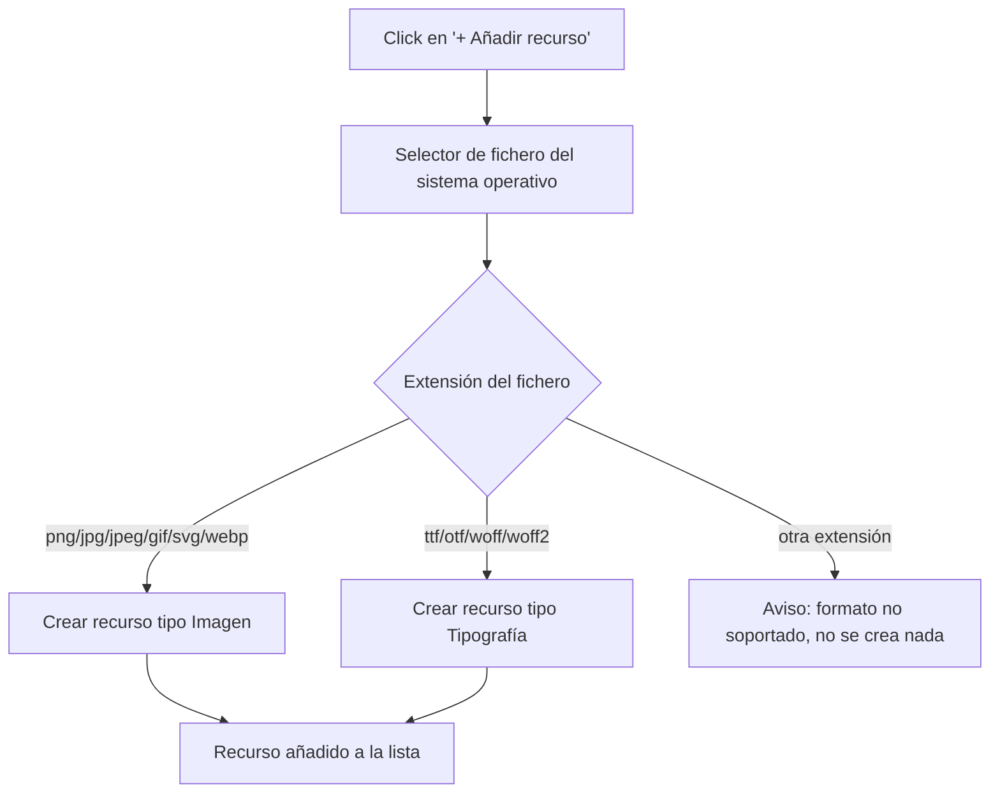
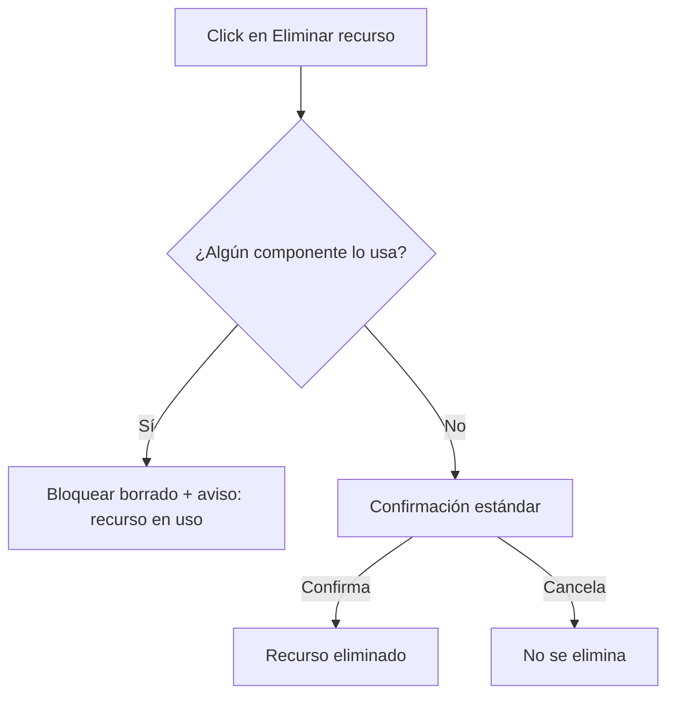

- **Nombre**: Galería de recursos (imágenes y tipografías)
- **Código**: 00017
- **Tipo**: change

## Prompt original del usuario

Añadir una galería de recursos (imágenes y tipografías) al modo edición:
- En modo edición debe haber otra ventana análoga a la lista de componentes llamada "Recursos", que muestra la lista de recursos almacenados como una lista con columnas: nombre del recurso, tipo (imagen o tipografía) y acciones de editar y borrar.
- El funcionamiento de esa ventana debe ser análogo al de la lista de componentes (movible, redimensionable, etc.).
- El botón de añadir recurso permite elegir un fichero y, según el fichero elegido, se crea como recurso de uno de los dos tipos (imagen o tipografía).
- El botón de editar recurso abre una modal específica según el tipo de recurso:
  - Imagen: permite editar el nombre del recurso en la lista, muestra una vista previa de la imagen y permite cambiarla por otra desde fichero. Botones: eliminar, cancelar, aceptar cambios.
  - Tipografía: permite ver un ejemplo de la tipografía. Botones: eliminar, cerrar ventana.

## Descripción completa

Se añade al modo edición una segunda ventana flotante, "Recursos", que convive con la ya existente ventana de "Componentes" y funciona de forma análoga a ella: se puede mover arrastrando su cabecera, redimensionar desde su esquina inferior derecha y colapsar/expandir. Su posición, ancho y estado de colapso se recuerdan de forma independiente a los de la ventana de Componentes.

La ventana muestra los recursos guardados en una lista con las columnas: Nombre, Tipo (Imagen o Tipografía) y Acciones (Editar, Eliminar). Si no hay ningún recurso todavía, se muestra un mensaje de lista vacía equivalente al que ya usa la lista de componentes.

Un botón "+ Añadir recurso" abre el selector de fichero del sistema operativo, restringido a las extensiones soportadas:
- Imagen: png, jpg, jpeg, gif, svg, webp
- Tipografía: ttf, otf, woff, woff2

Según la extensión del fichero elegido se crea automáticamente un recurso del tipo correspondiente, sin preguntar el tipo al usuario. Si el fichero no coincide con ninguna extensión soportada, se avisa y no se crea ningún recurso. El nombre inicial del recurso se propone a partir del nombre del fichero (sin extensión) y es editable después.

**Modal de edición — Imagen**: permite editar el nombre del recurso, muestra una vista previa de la imagen actual y permite sustituirla por otra eligiendo un nuevo fichero (mismas extensiones admitidas que al añadir), actualizando la vista previa antes de aceptar. Botones: Eliminar, Cancelar (descarta los cambios de nombre/imagen pendientes) y Aceptar cambios (los aplica).

**Modal de edición — Tipografía**: es de solo consulta, sin campos editables ni sustitución de fichero. Muestra un texto de ejemplo renderizado con esa tipografía, a modo de vista previa. Botones: Eliminar y Cerrar ventana.

**Borrado de un recurso** (desde la lista o desde su modal): antes de eliminar se comprueba si algún componente de la mesa está usando ese recurso actualmente.
- Si está en uso, se bloquea el borrado y se avisa al usuario; hay que dejar de usarlo antes de poder eliminarlo.
- Si no está en uso, se pide confirmación estándar (igual que al borrar un componente) y se elimina.

Nota de alcance: en este cambio los componentes todavía no tienen ninguna forma de "usar" un recurso de la galería (ver más abajo, fuera de alcance), así que en la práctica ningún recurso puede estar en uso todavía. La comprobación de uso se documenta y debe implementarse ya, para que exista en cuanto un cambio futuro conecte el consumo de recursos desde los componentes.

**Persistencia**: los recursos se guardan y recuperan exactamente igual que el resto del estado de la aplicación (los componentes de la mesa y la posición/tamaño de sus ventanas): se autoguardan según el usuario interactúa, y si el usuario descarga una copia de la página como fichero HTML autocontenido, esa copia lleva también sus propios recursos incluidos, de forma que sigue funcionando igual al abrirla en otro navegador o sesión.

**Recursos por defecto**: la galería no empieza vacía. Cualquier partida que todavía no tenga recursos propios recibe automáticamente, una única vez, 3 recursos de ejemplo (un icono y dos tipografías) — tanto si es una sesión totalmente nueva como si es un guardado ya existente de antes de que esta funcionalidad existiera. A partir de ese momento son recursos normales: el usuario puede editarlos o eliminarlos como a cualquier otro, y si los elimina no vuelven a aparecer en cargas posteriores.

**Alcance de uso**: la ventana de Recursos solo está disponible en modo edición, igual que la de Componentes — no aparece en modo juego. El proyecto no distingue roles ni usuarios (es un prototipo local de un solo perfil por navegador): los recursos guardados son visibles para cualquiera que abra esa misma partida/sesión guardada.

**Fuera de alcance de este cambio** (queda para un cambio futuro): conectar el uso de estos recursos desde los componentes de la mesa (p. ej. elegir una imagen o tipografía ya guardada en la galería al editar un componente). Este cambio cubre únicamente la gestión de la galería en sí: listar, añadir, editar y eliminar recursos.

### Añadir un recurso

### Eliminar un recurso

## Apuntes técnicos

- Ventana de Componentes ya existente y a replicar de forma análoga: [componentList.js](../../../src/ui/componentList.js), montada desde [editMode.js](../../../src/modes/edit/editMode.js). Su posición/ancho/colapso se gestionan como `panelState` en [state.js](../../../src/core/state.js) (`getPanelState`/`setPanelState`); para la nueva ventana de Recursos hace falta un estado de panel análogo pero independiente (otra clave, no reutilizar `panelState`).
- Patrón de redimensionado a reutilizar: `attachResizeHandle` en [resizeHandle.js](../../../src/ui/resizeHandle.js) (ya usado por `componentList.js`).
- Modal de referencia a seguir en estructura/estilo: [componentModal.js](../../../src/ui/componentModal.js) (overlay + modal + header + tabs/contenido + footer con botones `.btn-eliminar`/`.btn-cancel`/`.btn-accept`).
- Persistencia actual: autoguardado en `localStorage` vía [persistence.js](../../../src/core/persistence.js) (`saveState`/`loadState`, clave `errantes:state`, versionado por `CURRENT_VERSION`) y export a HTML autocontenido vía [fileExport.js](../../../src/core/fileExport.js) (`buildExportHtml`). Ambos deben ampliarse para incluir la nueva colección de recursos junto a `components`. `fileExport.js` hoy no incluye `panelState` en el JSON exportado (inconsistencia ya existente, no introducida por este cambio) — aprovechar el trabajo en este fichero para añadirlo también.
- El modelo de componente ([component.js](../../../src/core/component.js)) ya tiene un campo `image` sin usar en la UI; deliberadamente no se conecta con esta galería en este cambio (ver "Fuera de alcance").
- Build (`src/scripts/build.py`) ya soporta embeber imágenes/fuentes como data URI para assets estáticos del proyecto (`MIME_TYPES`); los recursos de la galería son datos de usuario en tiempo de ejecución, no assets de build, pero puede servir de referencia para los MIME types a usar en las data URL generadas en el navegador.
- Guía de estilo aplicable: [STYLE_BIBLE.md](../../../design/docs/STYLE_BIBLE.md) — BEM, tokens de color, botones (incl. `--danger` para acciones destructivas), z-index de overlays, patrón de resize handle y de icono de ayuda ya documentados.
- Los 3 recursos por defecto (un icono SVG y dos tipografías) viven embebidos como data URI en [defaultResources.js](../../../src/data/defaultResources.js). Se siembran en una sesión nueva y también, una única vez, en un guardado/semilla ya existente que no los tenga todavía — ver `resourcesSeeded` en [state.js](../../../src/core/state.js) y `backfillDefaultResourcesIfNeeded()` en [main.js](../../../src/main.js).
