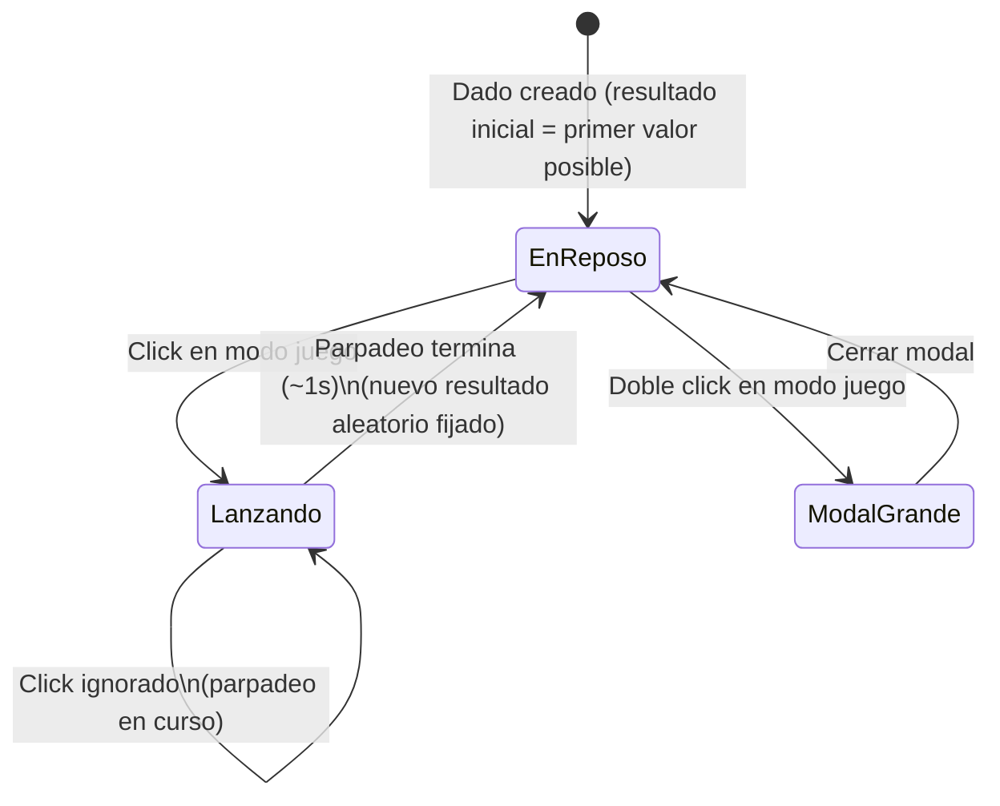

- **Nombre**: Nuevo tipo de componente "Dado"
- **Código**: 00020
- **Tipo**: change

## Prompt original del usuario

un nuevo elemento tipo dado para crear y añadir a la mesa:
- La representación visual es: cubo en vista isométrica (con un ángula pronunciado para que se vea sobre todo la cara superior) con una cara visible para el usuario con el resultado impreso en ella. El dado tiene un color (configurable) y sus aristas son de color negro con un borde fino.
- Un clic: se tira el dado y se obtiene uno de sus posibles resultados de manera aleatoria. 
- Efecto al tirar el dado: cuando se lanza el dado debe haber una animación de una secuencia muy rápida aleatoria de los posibles resultados del dado durante 1 seg. Luego se queda el resultado final.
- Doble clic: una modal con el resultado actual a mayor tamaño

Configuración:
- color del dado
- número de caras que tiene el dado. Dos opciones: 
  1. Número máximo de caras (mínimo 2, máximo 100). El dado dará un resultado aleatorio entre 1 y el número máximo (ambos inclusive)
  2. Una lista de posibles valores separados por comas. El usuario podrá introducir una lista de valores separados por comas y cada uno de esos valores será un posible resultado que debe verse en la cara del dado cuando salga. Ejemplos:
      - "*,1,2,3,4,@": un dado con 6 valores posibles
      - "alegría, tristeza, dolor": un dado con 3 valores posibles.
- tipo de fuente de los números de los resultados (a elegir en la lista de recursos)

---

Ajusta la representación de los dados: la cara con el resultado tiene que estar totalmente de cara al usuario así que debes ajustar la perspectiva de la vista para que sea más cenital.
En realidad, basta con una vista plana con un leve efecto de profundidad.

---

La representación visual para dados de 9 caras o más debe ser una figura de 10 lados iguales.
El efecto para la tirada: el dado da un giro rápido de 720°, con deceleración al final y mostrar el resultado

## Descripción completa

Se añade "Dado" como nuevo tipo de componente que se puede colocar sobre la mesa, junto a los ya existentes "Cuadro de texto" y "Tablero" (cambio 00019). Se crea, mueve y redimensiona en modo edición igual que cualquier otro componente, y se le puede aplicar la propiedad general "Bloqueado" (cambio 00018) para impedir que se arrastre en modo juego, sin ninguna particularidad adicional para este tipo.

### Alta del componente

Al crear un componente nuevo, el desplegable "Tipo" de la modal de creación (introducido en el cambio 00019) incorpora la opción "Dado" junto a "Cuadro de texto" y "Tablero". Al crear un dado se le asigna un tamaño por defecto y se coloca en la mesa sin solaparse con los componentes ya existentes, igual que el resto de tipos.

### Representación visual

Cada dado se representa con una vista frontal/cenital: la cara con el resultado se ve completamente de cara al usuario, sin ninguna distorsión de perspectiva (nada de vistas isométricas ni facetas laterales en ángulo). El efecto de profundidad es leve, conseguido con una silueta del mismo contorno en un tono más oscuro, ligeramente desplazada detrás de la cara frontal (misma familia de recurso ya usada en el bisel del borde del tablero del cambio 00019: tonos derivados del color base, sin gradientes ni sombra difuminada). Alrededor de la silueta frontal hay además un borde/contorno fino en un tono oscuro derivado del color del cuerpo (no es un color configurable aparte, es un detalle de acabado que separa visualmente el dado del fondo de la mesa). El resultado actual se imprime en números o texto grandes y legibles, centrados sobre la cara frontal, en el color de números configurado.

Existe una silueta dedicada y reconocible para cada uno de estos tipos de dado, según el número de resultados posibles configurado (el número máximo en el modo "Número máximo de caras", o la cantidad de valores introducidos en el modo "Lista de valores" — ver "Propiedades específicas del dado"). Cada silueta es la forma frontal plana asociada a ese sólido (sin distorsionar, sin perspectiva), y las de 4, 8 y "9 o más" resultados incluyen además una o varias líneas internas finas (mismo tono oscuro que el borde) que dividen la silueta en dos o más facetas planas de tono ligeramente distinto, para sugerir visualmente el sólido real que representa sin recurrir a ninguna perspectiva ni transformación 3D:

- **4 resultados posibles**: triángulo (pirámide/tetraedro), con una línea interna que sugiere su arista trasera, dividiéndolo en dos facetas.
- **6 resultados posibles**: cuadrado liso (cubo) — la cara de un cubo mirada de frente ya se ve, sin más, como un cuadrado, sin necesidad de ninguna línea interna.
- **8 resultados posibles**: rombo (octaedro), dividido por una línea horizontal en dos triángulos — las dos pirámides de base cuadrada que forman el octaedro, unidas por su "ecuador".
- **9 o más resultados posibles** (incluye 10, 12, y cualquier otro valor hasta 100): esfera facetada — la misma silueta de base (un decágono regular) dividida en un abanico de triángulos desde el centro hacia cada vértice del contorno, alternando dos tonos, como una bola de facetas de baja poligonización.

Cualquier cantidad de resultados posibles que no sea 4, 6, 8, ni esté dentro de "9 o más" (es decir, 2, 3, 5 o 7) también usa la silueta de esfera facetada, como forma genérica de respaldo.

Al redimensionar el dado en modo edición (mismo manejador de esquina que el resto de componentes), mantiene siempre su proporción (ancho = alto), coherente con representar un objeto 3D regular — no se puede convertir en una forma alargada.

### Lanzamiento (modo juego)

Con un click sobre el dado (solo disponible en modo juego, no en modo edición) se lanza: durante aproximadamente 1 segundo, la cara del dado muestra una secuencia muy rápida de resultados aleatorios entre los posibles (efecto de "parpadeo"), y al terminar se queda fijo el resultado final, también elegido al azar entre los posibles configurados — sin ningún giro ni rotación física del dado, solo el cambio rápido de los valores mostrados en la cara. Mientras dura la animación, nuevos clicks sobre el dado no inician otro lanzamiento (se ignoran hasta que termina y se fija el resultado final).

La propiedad general "Bloqueado" (cambio 00018) solo determina si el dado se puede arrastrar por la mesa; no afecta a la posibilidad de lanzarlo, que sigue disponible independientemente de su estado de bloqueo.

En modo edición, el click/doble click sobre el dado no lo lanza: siguen teniendo el comportamiento genérico ya existente para cualquier componente (selección, o abrir la modal de edición de propiedades).

### Ver resultado en grande

Con un doble click sobre el dado (solo en modo juego) se abre una modal mostrando el resultado actual con un tamaño mucho mayor, fácil de leer desde lejos. La modal se cierra igual que el resto de modales de la app.

### Casos límite

- **Resultado inicial**: al crear el dado se le asigna como resultado inicial el primer valor posible según su configuración vigente — "1" en modo "Número máximo de caras", o el primer valor de la lista en modo "Lista de valores" — para que nunca se muestre vacío ni indefinido, sin necesidad de lanzarlo antes.
- **Cambiar la configuración de caras tras crear el dado**: si el resultado actualmente mostrado deja de ser válido para la nueva configuración (se reduce el número máximo por debajo del resultado actual, se cambia de modo, o se edita la lista de valores y el resultado actual ya no está en ella), el resultado se reinicia al primer valor posible de la nueva configuración (mismo criterio que "Resultado inicial").
- **Lista de valores vacía o con un único valor**: el campo de lista requiere al menos 2 valores no vacíos (separados por comas, espacios en blanco alrededor de cada valor ignorados) para poder aceptar la configuración del dado — con menos de 2 no tendría sentido "tirar" el dado. Los valores vacíos entre comas consecutivas (p. ej. "a,,b") se ignoran.
- **Sin tipografías disponibles**: si no hay ninguna fuente disponible en la carpeta de recursos del proyecto, los números/texto del resultado se muestran con la tipografía por defecto de toda la app, sin impedir crear ni configurar el dado.

### Propiedades específicas del dado

- **Color del cuerpo**: color de fondo del dado (por defecto un gris neutro).
- **Color de los números**: color del resultado impreso en la cara visible, independiente del color del cuerpo (por defecto negro).
- **Configuración de caras**: selector entre dos modos, con la configuración de ambos conservada en paralelo al alternar entre ellos (igual criterio que el tipo de fondo del tablero — cambio 00019):
  1. **Número máximo de caras**: numérico, entre 2 y 100 (por defecto 6). El resultado de cada tirada es un número aleatorio entre 1 y ese máximo (ambos inclusive).
  2. **Lista de valores**: texto libre con los posibles resultados separados por comas (p. ej. `*,1,2,3,4,@` o `alegría, tristeza, dolor`). El resultado de cada tirada es uno de esos valores literales, elegido al azar — no tienen por qué ser números.
  
  En ambos modos, la cantidad de resultados posibles (el número máximo, o el número de valores de la lista) determina también qué silueta dedicada se usa (ver "Representación visual").
- **Tipo de fuente de los números**: se elige entre las fuentes tipográficas disponibles en la carpeta de recursos del proyecto, mediante un botón que abre una galería de selección (mismo patrón que la galería de imágenes ya prevista para el fondo tipo "Imagen" del tablero — cambio 00019), mostrando el nombre de cada fuente junto con una muestra de texto en esa propia tipografía. Si no hay ninguna fuente disponible, se usa la tipografía por defecto de toda la app (ver "Casos límite"). Aplica igual a resultados numéricos o de texto libre.

## Apuntes técnicos

- El cambio 00019 ("Tablero") ya está implementado y cerrado. El desplegable "Tipo" (`ui/componentTypeModal.js`, lista `{ value: 'texto', ... }, { value: 'tablero', ... }`) al que "Dado" debe sumarse como tercera opción ya existe.
- El sistema de recursos ya es genérico para imagen/tipografía, no hace falta construirlo: `core/resource.js` define `RESOURCE_TYPES = { IMAGE: 'imagen', FONT: 'tipografia' }` con el mapeo de extensiones (`.ttf`/`.otf`/`.woff`/`.woff2` → `FONT`), `ui/resourceModal.js` ya sabe crear/editar recursos de ambos tipos (con previsualización de texto de ejemplo en la propia tipografía vía `ui/fontFaceRegistry.js`, `fontFamilyFor(resourceId)`), y `ui/resourceList.js` ya distingue "Imagen"/"Tipografía" en el panel de Recursos. Lo que **no** existe todavía es un picker/galería de selección para tipografías análogo a `ui/boardImageModal.js` (que hoy filtra solo `RESOURCE_TYPES.IMAGE`): construir uno equivalente para `RESOURCE_TYPES.FONT` es el trabajo pendiente para el botón "Tipo de fuente" de esta entrada, siguiendo el mismo patrón (no reutilizando literalmente `boardImageModal.js`, que es específico de la propiedad `imagenResourceId` del tablero).
- `src/scripts/build.py` ya soporta embeber fuentes como data URI (mismo mecanismo que imágenes: `MIME_TYPES` incluye `.woff`/`.woff2`/`.ttf`/`.otf`, vía `@font-face` con `url()` en CSS, ver `ui/fontFaceRegistry.js`) — no requiere cambios.
- El resultado ya no es necesariamente numérico (en modo "Lista de valores" puede ser cualquier texto), a diferencia de una versión anterior de este documento que asumía siempre un número entre 1 y el número de caras — repasar al planificar cualquier sitio donde se calcule/valide el resultado para que contemple ambos modos.
- El bisel/sombreado de cada silueta (y el borde fino de acabado alrededor de ella) reutiliza la misma familia de recurso ya registrada como excepción explícita a `STYLE_BIBLE.md` sección 13 para el bisel del tablero (cambio 00019) — extenderla a este segundo tipo de componente al planificar/implementar, documentándolo en `STYLE_BIBLE.md`. El parpadeo de resultados durante ~1s no es una animación CSS (transform/keyframes) sino un cambio rápido y repetido del texto mostrado (temporizador en JS) — valorar al planificar si esto cae bajo la prohibición de "animaciones" de esa misma sección o no requiere excepción alguna.
- La silueta de "esfera facetada" (9 o más resultados posibles, y como forma de respaldo para cualquier cantidad sin silueta dedicada) usa como contorno base un decágono regular, sustituyendo a las siluetas específicas de "cometa" (d10) y pentágono (d12) usadas antes de esta ampliación: a partir de ahora solo 4, 6 y 8 resultados posibles tienen silueta propia distinta; el resto comparte una única forma (el mismo contorno, con el abanico de facetas triangulares descrito en "Representación visual").
- Se descartó una variante con 3D real (perspective + `transform-style: preserve-3d`, sólidos poliédricos genuinos) explorada y probada en las maquetas visuales: quedó descartada por decisión explícita del usuario ("es un desastre") a favor de mantener la representación 2D plana ya establecida, ahora con líneas internas de faceteado para mejorar el reconocimiento del sólido sin abandonar la vista frontal sin perspectiva.
- El manejador de redimensionado genérico (`ui/resizeHandle.js`, `attachResizeHandle`) soporta hoy `axis: 'both'` sin forzar proporción; mantener el dado siempre cuadrado requiere o bien un nuevo modo de `axis` que fuerce ancho=alto, o bien clampar en el propio `clamp()` que recibe la función — a decidir en el plan.
- Distinguir un click (lanzar/abrir modal) de un arrastre (mover, si no está "Bloqueado") ya es un patrón resuelto en `ui/componentRenderer.js` para el modo edición (`onToggleSelect` vía click simple convive con `onMove` vía arrastre sobre el mismo componente) — reutilizable como referencia para la interacción de lanzamiento en modo juego. Al planificar, considerar también que un doble click dispara `click` antes que `dblclick` en el navegador: decidir si hace falta alguna disambiguación para que un doble click (ver resultado en grande) no dispare también un lanzamiento de refilón.
- `modes/play/playMode.js` hoy llama a `renderComponentsOnTable` sin `onSelect`/`onToggleSelect` (sección 5 de `ARCHITECTURE.md`); el click/doble click de este cambio son interacciones nuevas específicas de modo juego, no relacionadas con la selección de modo edición.
- El resultado actual del dado (y su configuración de caras, colores y fuente) se guarda como cualquier otra propiedad de componente (`properties`), incluido en el autoguardado y la exportación a fichero ya existentes, sin mecanismo adicional.
