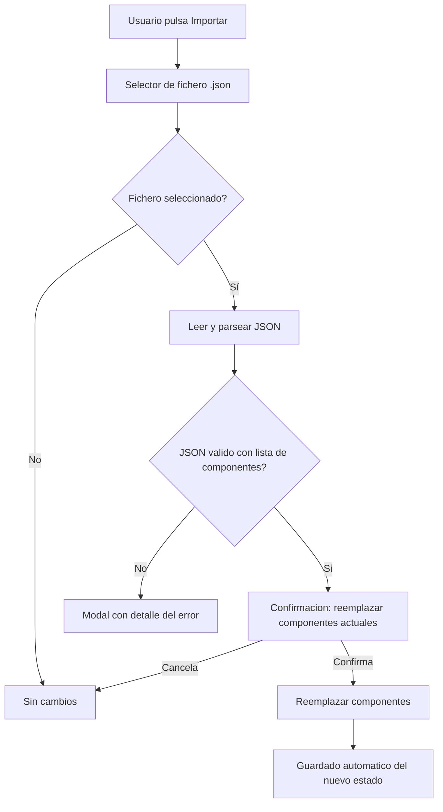
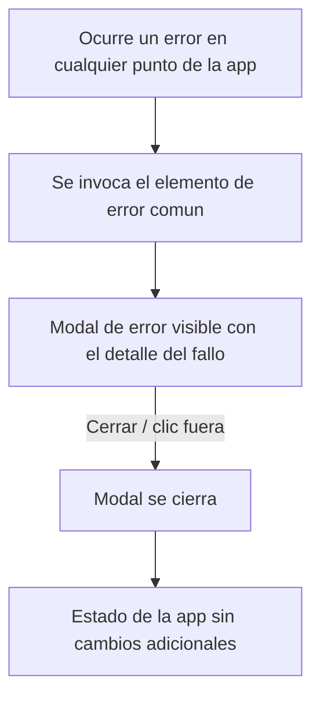

- **Nombre**: Exportar/importar componentes en JSON
- **Código**: 00024
- **Tipo**: change

## Prompt original del usuario

"incorporar botones para exportar/importar en formato json todo el estado del juego. El objetivo es que el usuario añada sus componentes, los exporte y luego los pueda volver a cargar cuando haya una nueva versión de la aplicación."

Aclaraciones posteriores confirmadas por el usuario:
- Al importar: reemplazo completo de los componentes actuales (no fusión).
- Cualquier error al importar se muestra en una ventana modal con el detalle del error (no un toast).
- El resto de propuestas iniciales (qué se exporta, disponibilidad solo en modo edición, confirmación previa antes de reemplazar, tolerancia a versión distinta al importar, selector de fichero, prompt de nombre al exportar) quedan confirmadas tal cual se propusieron.

Ampliación posterior: "el sistema de notificación de errores debe ser otro elemento común a toda la app. Cuando necesitemos mostrar cualquier error, deberían verse todos igual"

Aclaraciones confirmadas para la ampliación:
- Pasan a usar el nuevo modal de error común todos los errores existentes en la app hoy mostrados como toast: "no se ha podido recuperar el estado guardado", "formato de fichero no soportado" y "recurso en uso, no se puede eliminar" — además del error de importación ya descrito arriba. Los toasts de éxito/confirmación (p.ej. "Guardado como...") no son errores y se mantienen como están.
- El modal de error reutiliza el mismo patrón visual (overlay + modal) que el resto de modales de la app, pero con un acento visual de error (icono o color de alerta) que lo distinga a simple vista de un modal informativo normal.
- No aplica restricción de modo/rol: cualquier parte de la app puede mostrar un error con este elemento común.
- Es un elemento de UI transitorio: no se persiste ningún estado de error entre recargas o sesiones.

## Descripción completa

Se añaden dos botones nuevos, "Exportar" e "Importar", en la barra de herramientas del modo edición, junto al botón "Guardar" ya existente. El objetivo es que el usuario pueda exportar únicamente los datos de sus componentes (no la aplicación completa) a un fichero JSON, y volver a importarlos más adelante — típicamente en una versión más nueva de la aplicación — sin perder su trabajo.

**Diferencia con "Guardar" (ya existente):** "Guardar" descarga una copia completa de la aplicación (HTML) con el estado embebido, quedando fijada a la versión en la que se generó. Los botones nuevos exportan/importan solo los datos de los componentes en un JSON ligero, pensado explícitamente para sobrevivir a cambios de versión de la aplicación.

**Exportar:**
- Disponible solo en modo edición, junto a "Guardar".
- Al pulsar, se pide el nombre de fichero (mismo patrón que "Guardar"), precargado con un nombre por defecto (p.ej. `errantes-componentes.json`).
- Descarga un fichero JSON con los componentes actuales y la versión de la aplicación con la que se generó — sin incluir la configuración del panel flotante de edición, que no es contenido de partida.

**Importar:**
- Disponible solo en modo edición, junto a "Exportar".
- Al pulsar, abre un selector de fichero limitado a `.json`.
- El fichero seleccionado se valida: debe ser un JSON con la lista de componentes reconocible. **A diferencia de la comprobación que ya existe para el guardado automático del navegador, no se rechaza por venir de una versión distinta a la actual de la aplicación** — ese es precisamente el objetivo del cambio: poder cargar componentes exportados desde una versión anterior en una versión nueva.
- Si la validación falla (fichero vacío, JSON corrupto, estructura inesperada, o cualquier otro error durante la importación), se muestra una **ventana modal con el detalle del error**, para que el usuario pueda leer con calma qué ha fallado. No se usa un aviso breve tipo toast para este caso.
- Si la validación es correcta, se pide **confirmación previa** al usuario (mismo patrón que otras acciones destructivas de la aplicación, p.ej. borrar un componente), advirtiendo de que se van a reemplazar todos los componentes actuales.
- Si se confirma, los componentes actuales se **reemplazan por completo** (no se combinan/fusionan) por los del fichero importado, y el resultado queda guardado automáticamente igual que cualquier otro cambio de componentes.
- Si se cancela la confirmación, no se aplica ningún cambio.

**Flujo de importación:**

**Casos límite confirmados:**
- Fichero vacío, JSON corrupto, o sin lista de componentes válida → modal de error, sin tocar el estado actual.
- Versión del JSON distinta a la versión actual de la aplicación → se acepta igualmente (no es un error, es el caso de uso principal del cambio).
- Cancelar el selector de fichero o la confirmación → no se aplica ningún cambio, el estado actual permanece intacto.
- Ambos botones solo visibles/disponibles en modo edición, igual que "Guardar".

## Ampliación: notificación de errores común a toda la app

El error de importación descrito arriba deja de ser un caso particular: se generaliza a un **elemento de error común**, reutilizable desde cualquier punto de la aplicación, de forma que todos los errores se vean y se comporten igual (mismo formato, mismo tipo de ventana), en vez de que cada sitio decida por su cuenta si avisa con un toast o con un texto distinto.

**Qué cambia:**
- Se sustituyen los avisos de error que hoy usan el toast genérico (aviso breve no bloqueante) por el nuevo modal de error común, en los tres puntos donde ocurre actualmente en la app:
  - Al recargar la aplicación, si no se puede recuperar el estado guardado.
  - En modo edición, al añadir un recurso con un formato de fichero no soportado.
  - En modo edición, al intentar eliminar un recurso que está en uso por algún componente.
- El error de importación de componentes (definido más arriba en este mismo documento) usa este mismo elemento común, en vez de un modal de error específico solo para ese caso.
- Los toasts que no son de error (avisos de confirmación/éxito, como "Guardado como...") no cambian: siguen mostrándose como hasta ahora.

**Qué no cambia:**
- El modal de error reutiliza la misma base visual (overlay + ventana modal) que ya usan otros modales de la aplicación (ayuda, confirmaciones, edición de componentes), para no introducir un patrón visual nuevo — con la diferencia de que incorpora un acento visual de error (icono o color de alerta) para distinguirse a simple vista de un modal informativo o de confirmación normal.
- Se cierra igual que el resto de modales (botón "Cerrar" o clic fuera de la ventana).
- No se persiste ningún estado de error entre recargas o sesiones: es un aviso puntual sobre lo que acaba de fallar.

**Flujo general de un error en la app:**

## Apuntes técnicos

- `src/ui/editModeToggle.js`: `renderEditToolbar` construye la barra de edición (`.edit-toolbar`) con los botones "Salir del modo edición" y "Guardar" (este último vía `saveAs()`, que usa `buildExportHtml`/`downloadHtml` de `src/core/fileExport.js`). Los botones "Exportar"/"Importar" son candidatos a añadirse aquí, junto al de "Guardar".
- `src/core/fileExport.js` ya tiene el patrón de descarga de fichero (`downloadHtml`, `Blob` + `<a download>`); se puede reutilizar un patrón análogo para descargar el JSON de componentes.
- `src/core/persistence.js` (`parseState`) ya valida forma de un estado guardado (versión + `components` como array) para `localStorage`/semilla embebida, pero **rechaza si `parsed.version !== CURRENT_VERSION`** — la validación de importación deberá ser una función distinta (o una variante) que no aplique esa condición de versión, ya que el objetivo del cambio es justo tolerarla.
- `src/core/state.js`: `loadComponents(components)` ya reemplaza `state.components` por completo y emite `components:changed` — es la función a reutilizar para aplicar el reemplazo tras confirmar la importación; el autoguardado (`core/persistence.js`, suscrito a ese evento) se dispara solo.
- Patrón de modal ya existente en la app (`modal-overlay`/`modal`, botón "Cerrar") usado por `ui/helpIcon.js` y `ui/componentModal.js` — reutilizable para la modal de error de importación en vez de crear un patrón visual nuevo.
- Patrón de confirmación ya existente (usado, p.ej., al borrar un componente desde el panel o desde la modal) — reutilizable para la confirmación previa al reemplazo de componentes al importar.
- `src/ui/toast.js` (`showToast`) es hoy el único mecanismo de aviso no bloqueante de la app y se usa tanto para errores como para confirmaciones de éxito. Los usos actuales que son errores y deberán migrar al nuevo modal de error común:
  - `src/main.js:89` — `showToast('No se ha podido recuperar el estado guardado.')`.
  - `src/modes/edit/editMode.js:81` — `showToast('Formato de fichero no soportado.')`.
  - `src/modes/edit/editMode.js:95` — `showToast('El recurso "${resource.name}" está en uso y no se puede eliminar.')`.
  - `src/ui/editModeToggle.js:18` — `showToast('Guardado como "${filename}"')` es una confirmación de éxito, no un error: no migra.
- Candidato natural para el nuevo elemento común: un módulo `src/ui/errorModal.js` con una función tipo `showError(message)`, siguiendo el mismo patrón de construcción de `helpIcon.js` (`openHelpModal`) reutilizando las clases `modal-overlay`/`modal` ya existentes en `src/styles/main.css`.
