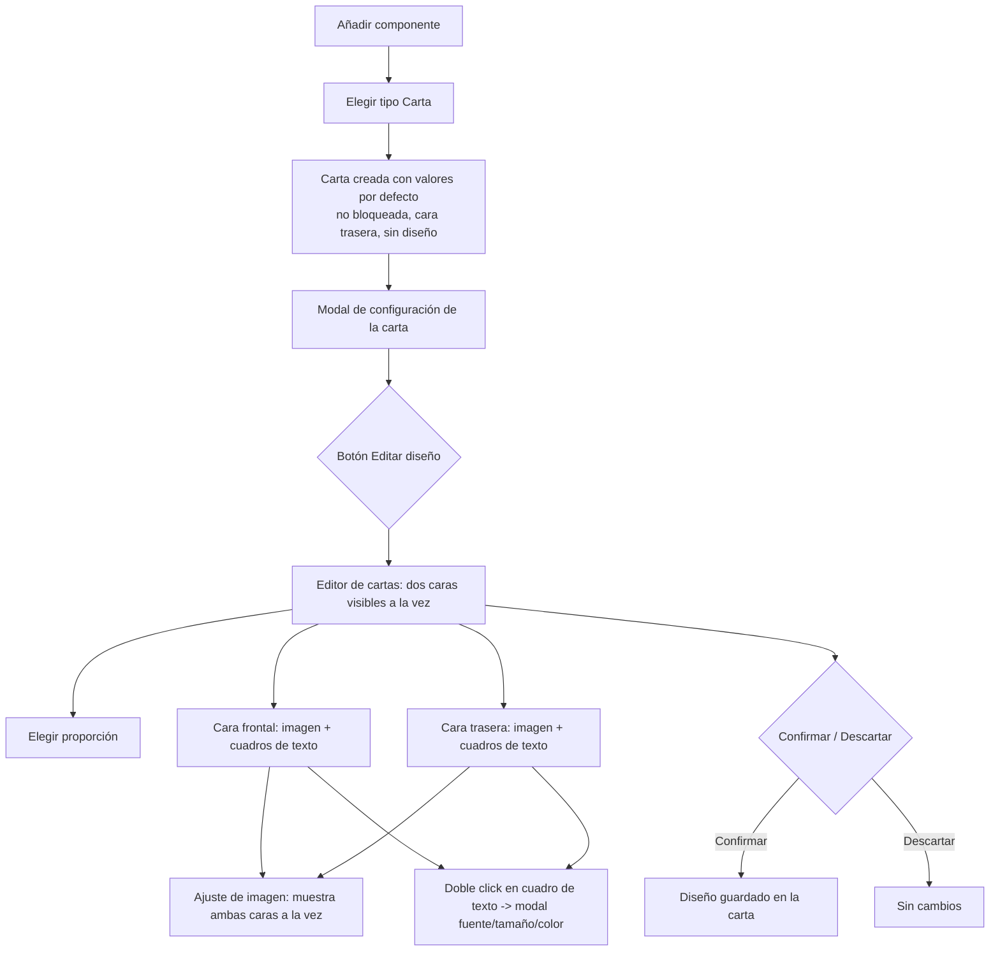
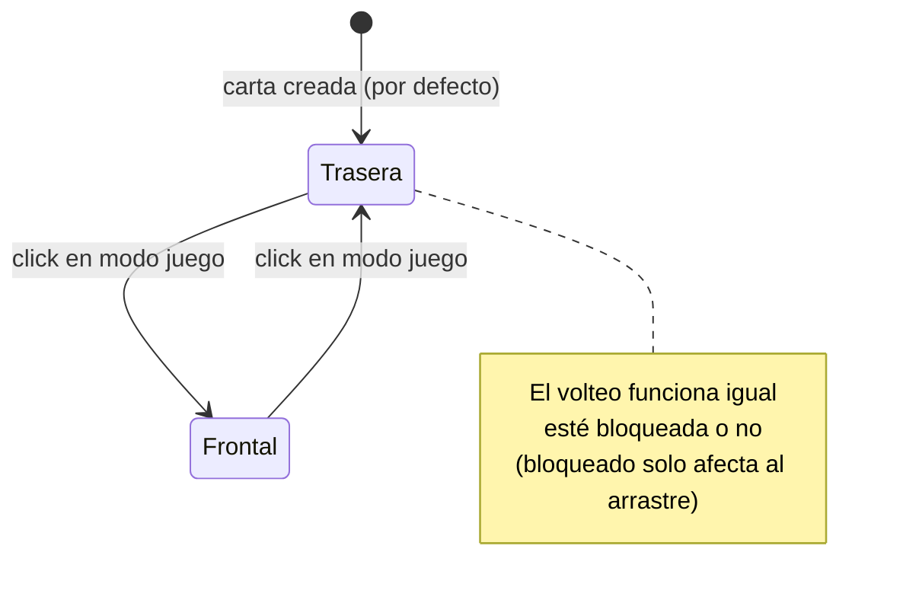

- **Nombre**: Componente "carta" + editor de cartas + mazos
- **Código**: 00053
- **Tipo**: change

## Prompt original del usuario

Idea original (venía de changes/todo/p9q2r):

"Nuevo elemento: cartas. Una forma rectangular que puede diseñarse con un editor de cartas. Son dos cambios importantes: Nuevo elemento carta / Editor de cartas.

El editor de cartas permite, en una ventana especial, diseñar las dos caras de un carta (frontal y trasera). Permitirá: seleccionar la proporción de la carta (desplegable con las más habituales: 1:1, 2:1 horizontal/vertical y otras frecuentes del mercado de juegos de cartas); editar las dos caras por separado, pero las dos visibles al mismo tiempo; añadir una imagen y editarla (mover, recortar, etc., reutilizando funcionalidad ya existente); añadir cuadros de texto, cada uno con su fuente/tamaño/color, editables con doble click en una modal; el diseño de las dos caras se almacena de la forma más adecuada, modificable siempre que el usuario quiera.

Propiedades específicas: Mazo(s) a los que pertenece — campo para elegir varios valores entre los ya existentes (como des/asignar etiquetas), con opción de crear uno nuevo; editar -> editor de cartas."

Aclaraciones acordadas con el usuario durante el análisis, que corrigen/precisan la idea original:
- Se documenta como un único change (no dos), cubriendo componente carta + mazos + editor.
- El editor de cartas es una modal grande, no una "ventana especial" a pantalla completa.
- "Mazo" es un campo de un único valor (no varios, a pesar de que la idea original decía "varios valores") — la carta pertenece como mucho a un mazo.
- Los mazos no tienen mecánica de juego en este change (se deja preparado el modelo de datos para el futuro, pero sin barajar/robar aquí).
- Volteo de cara con click en modo juego, cara trasera por defecto, independiente del bloqueo.
- Proporción de la carta fija salvo cambio explícito de la propiedad (el redimensionado en la mesa siempre la respeta).
- Bordes de la carta ligeramente redondeados.
- El ajuste de imagen (mover/zoom) dentro del editor de cartas muestra ambas caras a la vez, no solo la que se está ajustando.
- El error al intentar borrar un recurso en uso debe indicar el id del componente que lo usa.
- Un cuadro de texto se elimina desde un botón "Eliminar" en su propia modal de edición (abierta con doble click), no desde un botón flotante sobre el lienzo ni con la tecla Supr.

## Descripción completa

Se añade un nuevo tipo de componente, "carta", junto con un editor dedicado para diseñar su aspecto y un sistema de "mazos" para agruparlas.

### Componente "carta"

- Elemento rectangular con una relación de aspecto (proporción) configurada explícitamente. Al redimensionar en la mesa, el tamaño se ajusta siempre manteniendo esa proporción; la única forma de cambiarla es editando el valor de la propiedad, no arrastrando el manejador de redimensionado (igual que el componente "dado" siempre fuerza forma cuadrada, pero aquí con una proporción configurable en vez de fija a 1:1).
- Se crea con la opción "Bloqueado" desmarcada por defecto (igual que "ficha"), para poder moverse de inmediato en modo juego.
- Muestra siempre una de sus dos caras (frontal o trasera); tanto en modo juego como en modo edición empieza mostrando la cara **trasera** por defecto.
- **Volteo**: un click sobre la carta en modo juego alterna entre cara frontal y trasera. Esta interacción es independiente de si la carta está bloqueada o no: "Bloqueado" solo determina si se puede arrastrar/mover, nunca si se puede voltear — el volteo está siempre disponible.
- Sin diseño (antes de usar el editor de cartas, o si una cara se deja vacía), se muestra en blanco con la proporción configurada y las esquinas ligeramente redondeadas, sin ningún aviso adicional (mismo criterio que "Visor de documentos" vacío).
- Tiene una propiedad "Mazo" que referencia como mucho un mazo (o "Sin mazo"), ver más abajo.
- El alta sigue el patrón existente de la app: aparece como opción "Carta" en la lista de tipos al pulsar "+ Añadir componente", se crea con valores por defecto y se abre directamente la modal de configuración para ajustarla.
- La modal de configuración de una carta incluye: la proporción, el campo "Mazo", y un botón para abrir el editor de cartas.

### Sistema de "mazos"

- Un mazo es una entidad ligera e independiente (con nombre), gestionada en una colección propia — no un texto libre suelto en cada carta. Se modela así, en vez de como texto libre, porque a futuro está previsto que el mazo incorpore mecánica propia de juego (barajar, robar carta); este change deja la base lista para eso, pero esa mecánica futura queda fuera de su alcance.
- Cada carta referencia como mucho un mazo (campo de valor único, no una lista de etiquetas).
- El campo "Mazo" de la carta es un desplegable con los mazos ya existentes más la opción "Sin mazo" (valor por defecto), y permite escribir un nombre nuevo para crear un mazo al vuelo sin salir de la modal de la carta.
- Este change no incluye ningún panel de gestión dedicado a mazos (listar/renombrar/borrar mazos de forma independiente a las cartas) — igual que no lo pide la idea original; queda como posible ampliación futura.
- No se incluye ningún filtro por mazo en el panel de componentes en este change.

### Editor de cartas

- Se abre como una modal grande (sigue el patrón visual ya existente en la app de otros editores: overlay + modal, pero con más superficie de trabajo), no como una vista a pantalla completa separada. Solo disponible en modo edición.
- Muestra **las dos caras a la vez** (frontal y trasera, una junto a otra), y permite editar cada una por separado sin necesidad de cambiar de vista.
- Desplegable para elegir la proporción de la carta entre las más habituales del mercado de juegos de cartas (1:1, 2:1 horizontal, 2:1 vertical, y otras proporciones frecuentes). Cambiar la proporción no borra los elementos ya añadidos a ninguna cara, aunque puede dejar alguno fuera del lienzo visible si no se reposiciona a mano.
- Por cada cara, permite:
  - **Imagen de fondo**: una única imagen (no varias) elegida de la galería de recursos ya existente en la app, sin posibilidad de subir imágenes nuevas desde aquí (igual que en "tablero"/"ficha"). El ajuste de la imagen (mover/zoom) reutiliza el editor de ajuste de imagen ya existente en la app, pero mostrando **ambas caras de la carta a la vez** dentro de ese propio ajuste (no solo la cara que se está ajustando), igual que el editor de cartas en su conjunto.
  - **Cuadros de texto**: se pueden añadir varios sin límite por cara, cada uno con su propio contenido, tipo de fuente (de la galería de tipografías ya existente), tamaño y color. Se pueden mover y redimensionar arrastrando dentro del lienzo de esa cara (mismo patrón de arrastre/redimensionado ya usado en el resto de la app). Un doble click sobre un cuadro de texto abre una modal para editar sus parámetros (fuente, tamaño, color, contenido); esa misma modal incluye un botón "Eliminar" para borrar el cuadro de texto (mismo patrón que la modal de edición de un componente ya existente en la app).
- El diseño de ambas caras (imagen + ajuste + cuadros de texto) queda guardado como parte de esa carta en concreto — no hay plantillas compartidas entre cartas; cada carta tiene su propio diseño independiente, igual que "ficha" guarda su propio ajuste de imagen.
- Botones para confirmar o descartar los cambios del editor, mismo patrón que el resto de editores/sub-modales del proyecto.

### Convivencia con lo existente

- Al intentar borrar un recurso (imagen o tipografía) de la galería que esté en uso por el diseño de alguna carta, se bloquea el borrado igual que ya ocurre con tablero/ficha, y el mensaje de error debe indicar el id (o los ids, si son varias cartas) del componente que lo está usando — a diferencia del aviso genérico actual, que no identifica qué lo está usando.

### Diagramas de flujo

## Apuntes técnicos

- Tipos de componente existentes hoy (`core/component.js`, `ui/componentModal.js`, `ui/componentTypeModal.js`): `'texto'`, `'tablero'`, `'dado'`, `'documento'`, `'ficha'`. "Carta" sería el sexto, añadido a `ui/componentTypeModal.js` y con su rama en `ui/componentModal.js` (tab "Específicas") y en `ui/componentRenderer.js` (renderizado + interacción de click para voltear, análoga al click que lanza el dado en `modes/play/playMode.js`).
- El comportamiento de "'dado' siempre fuerza cuadrado al redimensionar" (`ui/resizeHandle.js`, `axis`/`clamp` con lógica en `ui/componentRenderer.js`) es el precedente directo a reutilizar/generalizar para forzar la proporción configurable de "carta" en vez de 1:1 fijo.
- `ui/imageAdjustModal.js` es el editor reutilizable de ajuste de imagen (mover/zoom sobre una forma) usado hoy por "ficha"; la idea es reutilizarlo para el ajuste de imagen de cada cara de la carta, pero habría que extenderlo (o envolverlo) para que muestre ambas caras a la vez en vez de una sola forma, ya que hoy `openImageAdjustModal({ shape, width, height, resource, adjustment, onAccept })` está pensado para una única forma.
- `core/resource.js` (`isResourceInUse`) ya recorre `component.image` y `component.properties` buscando coincidencias de id de recurso; hoy el aviso de bloqueo de borrado no identifica qué componente(s) lo usan — habría que extender esa función o el punto donde se usa (`modes/edit/editMode.js`) para devolver también los ids de los componentes en conflicto.
- No existe ningún concepto de "mazo" ni de agrupación/etiquetado en el modelo actual (`core/state.js` solo mantiene `components` y `resources`). El modelo de mazos propuesto (colección independiente, con nombre + id, análoga a `core/resource.js`/`resources` en `core/state.js`) es una pieza nueva, no una extensión de algo existente — necesitaría su propio `core/deck.js` (o similar), colección en `core/state.js` (`decks`, con su propio evento tipo `decks:changed`), y persistencia en `core/persistence.js`/`core/fileExport.js` (nuevo campo, con la misma tolerancia a `undefined`/no-array que ya aplica a `resources` para compatibilidad con guardados anteriores).
- No existe hoy ningún "editor" a modal grande con dos áreas de trabajo simultáneas (dos caras a la vez) ni con elementos internos arrastrables/redimensionables dentro de un lienzo (los cuadros de texto de cada cara). Esto es una pieza de UI nueva, sin precedente directo salvo el patrón general de modal (`modal-overlay`/`modal`, `STYLE_BIBLE.md`) y el patrón de arrastre/resize ya usado a nivel de componente en la mesa (`ui/resizeHandle.js`, lógica de arrastre de `ui/componentRenderer.js`), que habría que adaptar para operar dentro del lienzo de una cara en vez de sobre la mesa infinita.
- Redondeado de esquinas de "carta": ningún tipo actual usa `border-radius` salvo "ficha" en su variante circular (`border-radius: 50%`); un radio fijo y moderado para "carta" sería una convención nueva a documentar en `STYLE_BIBLE.md` si se considera relevante (a decidir en `ms-implement`).
