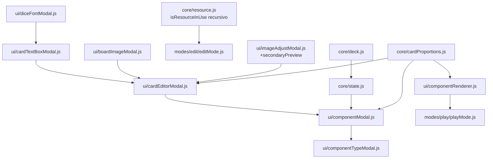

## (a) Anotaciones funcionales

**Fuera de alcance** (ya recogido en `description.md`, se reitera aquí para que quede junto al resto del plan):
- Mecánica de juego de mazos (barajar, robar carta) — solo se deja el modelo de datos preparado.
- Panel de gestión dedicado a mazos (listar/renombrar/borrar mazos de forma independiente a las cartas).
- Filtro por mazo en el panel de componentes.

**Dudas resueltas durante este análisis** (no requirieron confirmación del usuario — se han decidido por criterio de consistencia con patrones ya existentes en el proyecto; quedan documentadas en (b) para que cualquier revisión futura entienda el porqué):
- Catálogo concreto de proporciones a ofrecer en el desplegable (no lo fijaba `description.md` más allá de "1:1, 2:1 horizontal/vertical y otras frecuentes").
- Cómo representar internamente la posición/tamaño de los cuadros de texto de una cara para que sobrevivan a un redimensionado de la carta en la mesa.
- Cómo resolver que `isResourceInUse` (hoy solo recorre el primer nivel de `properties`) detecte un recurso usado dentro de `caraFrontal`/`caraTrasera`/`textBoxes`, que son objetos/arrays anidados — de no corregirse, se podría borrar una imagen o tipografía en uso por una carta sin bloquearlo, un bug de integridad de datos real introducido por este change si no se ataja.

## (b) Solución técnica

1. **`core/cardProportions.js`** (nuevo). Catálogo de proporciones de carta, análogo en espíritu a `data/defaultResources.js` (datos puros, sin dependencias de otras capas):
   - `CARD_PROPORTIONS`: lista `{ value, label, ratio }` (ratio = ancho/alto): `1:1` Cuadrada (1), `2:1-h` Horizontal ancha (2), `1:2-v` Vertical alargada (0.5), `2:3` Vertical estándar/tipo póker (2/3, **por defecto**), `3:2` Horizontal estándar (3/2), `5:7` Vertical clásica de coleccionables (5/7).
   - `getProporcionRatio(value)`: devuelve el `ratio` del catálogo (o el de `2:3` si `value` no coincide con ninguno, mismo criterio de tolerancia que el resto de `properties` con valores por defecto).
   - `CARD_DESIGN_WIDTH = 300`: ancho de referencia, en "unidades de diseño", en el que se guardan `x`/`y`/`width`/`height`/`tamañoFuente` de los cuadros de texto de una cara. Como la proporción de la carta es siempre fija salvo cambio explícito, `designHeight = CARD_DESIGN_WIDTH / ratio` es la única cifra que hace falta derivar — un único factor de escala (uniforme en ambos ejes) basta para pasar de "unidades de diseño" al tamaño real de la carta en cualquier punto (editor o mesa), igual que `ui/table.js` usa un único `zoom` para pan/zoom en vez de escalas independientes por eje.
   - `getDesignSize(proporcionValue)`: `{ width: CARD_DESIGN_WIDTH, height: CARD_DESIGN_WIDTH / getProporcionRatio(proporcionValue) }`.

2. **`core/deck.js`** (nuevo). Modelo mínimo de "mazo", análogo a `core/resource.js` pero sin `isResourceInUse` (no hace falta: no hay borrado de mazos en este change):
   ```js
   export function createDeck({ id, name = '' } = {}) {
     return { id: id || crypto.randomUUID(), name };
   }
   export function updateDeck(deck, changes) { return { ...deck, ...changes }; }
   ```

3. **`core/state.js`**: nueva colección `decks` (mismo patrón que `resources`): `getDecks()`, `addDeck(deck)` (emite `decks:changed`), `loadDecks(decks)` (emite `decks:changed`, usado al arrancar). No se añade `replaceDeck`/`removeDeck` — no hay edición/borrado de mazos en este change (crearlos al vuelo desde la carta es la única alta posible).

4. **`core/resource.js`**: generalizar el recorrido de `isResourceInUse` para que detecte también coincidencias anidadas (objetos/arrays dentro de `properties`), no solo valores de primer nivel — necesario porque `carta` guarda `imagenResourceId` dentro de `properties.caraFrontal`/`properties.caraTrasera`, y `fuenteResourceId` dentro de cada elemento de `textBoxes`. Se añade un helper local `collectDeepValues(value)` (recorre objetos y arrays recursivamente, acumulando los valores primitivos hoja) y se reescribe `isResourceInUse` para usarlo en vez de `Object.values(component.properties ?? {})`. Se añade además `getComponentsUsingResource(resourceId, components)`, que reutiliza el mismo recorrido y devuelve el array de ids de los componentes que lo usan (vacío si ninguno) — usada por el punto 13.

5. **`ui/componentTypeModal.js`**: añadir `{ value: 'carta', label: 'Carta' }` a `COMPONENT_TYPES`.

6. **`ui/componentModal.js`**:
   - `DEFAULT_CARTA_PROPERTIES`: `{ proporcion: '2:3', deckId: null, caraActual: 'trasera', caraFrontal: { imagenResourceId: null, ajusteImagen: { zoom: 100, posX: 50, posY: 50 }, textBoxes: [] }, caraTrasera: { imagenResourceId: null, ajusteImagen: { zoom: 100, posX: 50, posY: 50 }, textBoxes: [] } }`.
   - `createDefaultComponent('carta')`: tamaño inicial `180 × (180 / getProporcionRatio('2:3'))` = `180×270`, `bloqueado: false` (igual que `ficha`, para poder moverse/voltear de inmediato), `properties` clonadas en profundidad (mismo cuidado que ya tiene `ficha` con `ajusteImagen`, para que dos cartas no compartan el mismo objeto anidado).
   - Nueva `renderCartaSpecificFields(container)`, en la rama de `renderSpecificTab()`:
     - Desplegable "Proporción" (`CARD_PROPORTIONS`), cambia `props.proporcion` (no toca `caraFrontal`/`caraTrasera`, ver punto 9).
     - Campo "Mazo": `<select>` con "Sin mazo" + los mazos existentes (`getDecks()`) + una opción final "+ Crear nuevo mazo…"; al elegir esta última se muestra un campo de texto + botón "Crear" en línea (oculto el resto del tiempo) que, al confirmar, llama `addDeck(createDeck({ name }))`, fija `props.deckId` al nuevo id y refresca el desplegable con el mazo recién creado ya seleccionado.
     - Botón "Editar diseño de la carta" → abre `ui/cardEditorModal.js` (punto 9) pasándole `workingComponent` (proporción, tamaño real, y las dos caras); al aceptar, sustituye `props.caraFrontal`/`props.caraTrasera`/`props.proporcion` en el componente en edición.

7. **`ui/imageAdjustModal.js`**: extender `openImageAdjustModal({ shape, width, height, resource, adjustment, onAccept, secondaryPreview })` con un parámetro opcional `secondaryPreview: { shape, width, height, resource, adjustment }`. Si se pasa, se añade junto al "stage" interactivo existente un segundo "stage" de solo lectura (mismo marcado `mask`/`img`, sin listeners de arrastre, aplicando `applyImageAdjustStyle` con sus propios `resource`/`adjustment` fijos) con una etiqueta indicando que es la otra cara. Parámetro opcional: no cambia la llamada actual de `ficha`.

8. **`ui/cardTextBoxModal.js`** (nuevo). Modal de edición de un cuadro de texto de una cara (abierta con doble click desde `cardEditorModal`), sin tabs, mismo patrón visual que el resto de sub-modales:
   - Campos: contenido (`textarea`), tipografía (botón "Elegir tipografía" que reutiliza **tal cual** `openDiceFontModal` de `ui/diceFontModal.js` — su lógica ya es genérica para cualquier recurso `tipografia`, pese al nombre del fichero), tamaño (número, en unidades de diseño), color (input color).
   - Footer: "Eliminar" (quita el cuadro de texto de la cara y cierra), "Cancelar", "Aceptar".
   - Opera sobre una copia de trabajo del cuadro de texto; solo se aplica al array `textBoxes` de la cara si se acepta.

9. **`ui/cardEditorModal.js`** (nuevo). Modal grande (`openCardEditorModal({ component, onAccept })`), overlay/modal igual que el resto pero con más superficie:
   - Toolbar superior: desplegable de proporción (cambia la copia de trabajo de `proporcion`; no borra `textBoxes` de ninguna cara, solo recalcula el tamaño del canvas de cada cara en el siguiente repintado).
   - Cuerpo con dos columnas "cara" (frontal/trasera), cada una con:
     - Un `canvas` (`div`) de tamaño de previsualización (`PREVIEW_MAX_SIDE`-like, escalado desde `getDesignSize(proporcion)` con un único factor `previewScale`).
     - Fondo: imagen de la cara (si tiene `imagenResourceId`) pintada con `applyImageAdjustStyle` escalada por `previewScale`, o blanco si no hay.
     - Cuadros de texto de esa cara, posicionados con `previewScale` aplicado a sus coordenadas de diseño; cada uno arrastrable (mousedown/mousemove/mouseup local, mismo cálculo que el arrastre de componentes en `ui/componentRenderer.js` pero convirtiendo el delta de píxeles de pantalla a "unidades de diseño" dividiendo por `previewScale`, igual que el arrastre en mesa divide por el zoom) y redimensionable con `attachResizeHandle` (`getScale: () => previewScale`, mismo patrón que usa la mesa con `getWorldZoom`).
     - Doble click en un cuadro de texto → `openCardTextBoxModal` (punto 8).
     - Botón "Elegir imagen…" → reutiliza `openBoardImageModal` (con `title` personalizado) para elegir `imagenResourceId` de esa cara.
     - Botón "Ajustar imagen…" → `openImageAdjustModal` (extendido en el punto 7) pasando como `secondaryPreview` los datos de la OTRA cara, para verlas ambas a la vez.
     - Botón "+ Cuadro de texto" → añade un `textBox` nuevo (contenido vacío, tamaño/posición por defecto centrados) al array de esa cara.
   - Footer: "Cancelar" (descarta), "Aceptar" (llama a `onAccept({ proporcion, caraFrontal, caraTrasera })` con la copia de trabajo).

10. **`ui/componentRenderer.js`**: nueva rama `else if (component.type === 'carta')`:
    - `MIN_CARTA_WIDTH`/`MIN_CARTA_HEIGHT` (análogos a `MIN_FICHA_SIZE`).
    - Redimensionado: generaliza el patrón de `'dado'` (fuerza cuadrado) a una proporción configurable — `clamp: ({ width, height }) => { const ratio = getProporcionRatio(props.proporcion); let w = Math.max(width, height * ratio, MIN_CARTA_WIDTH); let h = w / ratio; if (h < MIN_CARTA_HEIGHT) { h = MIN_CARTA_HEIGHT; w = h * ratio; } return { width: w, height: h }; }` (mismo espíritu que el `clamp` de `'dado'`: usa el mayor de los dos ejes propuestos como referencia).
    - Esquinas ligeramente redondeadas: `border-radius: 8px` — reutiliza el valor ya existente en `STYLE_BIBLE.md` sección 5 ("radio de contenedores destacados: 8px"), sin introducir un token nuevo.
    - Fondo: si la cara actual (`props.caraActual`) tiene `imagenResourceId` con recurso existente, `` con `applyImageAdjustStyle` escalado por `renderScale = width / CARD_DESIGN_WIDTH` (uniforme, ver punto 1); si no, blanco liso (sin aviso, igual que "Visor de documentos" vacío).
    - Cuadros de texto de la cara actual, posicionados/redimensionados/coloreados según sus valores de diseño multiplicados por `renderScale` (incluido `tamañoFuente`), tipografía vía `fontFamilyFor` si tienen `fuenteResourceId`.
    - Selección/arrastre/redimensionado: mismo bloque `onSelect`/`onToggleSelect`/`onMove`/`onResize` que el resto de tipos (copiando el patrón ya usado por `'ficha'`).
    - Volteo: listener de `click` añadido **siempre que se pase `onCartaFlip`**, sin condicionarlo a si el componente es arrastrable — mismo patrón exacto que ya usa `'dado'` con `onDiceResult` (el click de lanzar el dado tampoco depende de si es arrastrable), para que "Bloqueado" nunca afecte al volteo: `dice.addEventListener('click', (e) => { e.stopPropagation(); onCartaFlip(component, props.caraActual === 'trasera' ? 'frontal' : 'trasera'); })`.
    - `COMPONENT_TYPE_LABELS.carta = 'Carta'`.

11. **`modes/play/playMode.js`**: pasar `onCartaFlip: (component, nuevaCara) => replaceComponent(component.id, updateComponent(component, { properties: { caraActual: nuevaCara } }))` a `renderComponentsOnTable` (mismo patrón que `onDiceResult`).

12. **`core/persistence.js`** y **`core/fileExport.js`**: añadir `decks` al guardado/exportación con la misma tolerancia que `resources` (`Array.isArray(parsed.decks) ? parsed.decks : []`), a `saveState`/`buildExportHtml`/`parseState`. `main.js` pasa `getDecks()`/`loadDecks()` igual que ya hace con recursos, y suscribe `persistState` a `decks:changed`. No hace falta backfill (un guardado antiguo sin `decks` simplemente arranca con `[]`, sin necesidad de sembrar nada por defecto).

13. **`modes/edit/editMode.js`**: `attemptDeleteResource` usa `getComponentsUsingResource(resource.id, getComponents())` en vez de solo `isResourceInUse`; si la lista no está vacía, el mensaje de error pasa a `El recurso "${resource.name}" está en uso por: ${ids.join(', ')} y no se puede eliminar.` (en vez del aviso genérico actual, que no identifica qué lo usa).

### Diagrama de dependencias de los módulos nuevos/tocados



## (c) Cambios de arquitectura

Actualizar `ARCHITECTURE.md`:
- Sección "Tipos de componente implementados": documentar `'carta'` (sexto tipo) con su modelo de `properties` (`proporcion`, `deckId`, `caraActual`, `caraFrontal`/`caraTrasera` con `imagenResourceId`/`ajusteImagen`/`textBoxes`), tamaño por defecto, `bloqueado: false` por defecto, y el redimensionado forzando la proporción configurable (generalización del precedente de `'dado'`).
- Nueva sección "Modelo de datos de mazo", análoga a la 4.1 de recursos: colección `decks` en `core/state.js`, modelo `{ id, name }`, sin edición/borrado en este change.
- Sección 4.1 (`isResourceInUse`): documentar que ahora recorre `properties` en profundidad (no solo el primer nivel), y la nueva `getComponentsUsingResource`.
- Sección 5 (capa UI): añadir `ui/cardEditorModal.js` y `ui/cardTextBoxModal.js` a la lista de módulos reutilizables, y documentar la extensión de `ui/imageAdjustModal.js` (`secondaryPreview`). Añadir `core/cardProportions.js` como módulo de datos puro (catálogo de proporciones + `CARD_DESIGN_WIDTH`).
- Sección 6.1 (persistencia): añadir `decks` a la lista de campos serializados junto a `components`/`resources`, con la misma tolerancia a ausencia/tipo inválido.

## (d) Cambios en estilo

Actualizar `STYLE_BIBLE.md`:
- Sección 13 ("Qué NO hacer"): la excepción ya documentada de bisel de `'tablero'`/`'dado'` queda como excepción de "profundidad"; añadir una nota separada indicando que `'carta'` usa el radio de esquina **ya existente** en la sección 5 (8px, "contenedores destacados") en vez de introducir un valor nuevo — no es una excepción a la regla de "no bordes redondeados grandes", es la reutilización de un radio moderado ya catalogado.
- Sección 12.2 (cursores): añadir `'carta'` como segundo ejemplo (junto al dado no bloqueado) de componente que admite simultáneamente arrastre (`move`) y una acción de click (volteo) — la regla genérica ya existente ("prevalece `move`") ya cubre el caso, solo se amplía el ejemplo para que quede documentado.
