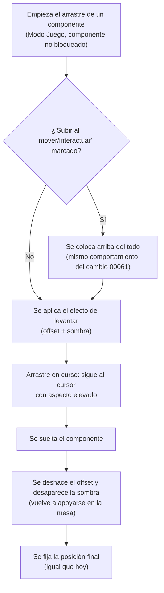

- **Nombre**: Efecto de "levantar" un componente al arrastrarlo en Modo Juego
- **Código**: 00062
- **Tipo**: change

## Prompt original del usuario

quiero dar al usuario un poco de feedback visual al mover elementos en el modo juego. Para ello, cuando se empiece a mover un elemento, quiero que simule que se levanta un poco de la mesa: moverlo un poco (offset) dibujar un sombra debajo de él. Al soltarlo,deshacer el offset y quitar la sombra, simulando que ha bajado de nuevo a la mesa

---

Corrección tras la primera propuesta de análisis:

1. Sí, es una excepción
5. En el caso de elementos con ese check marcado, primero colocarlos arriba y luego aplicar el efecto al mover

## Descripción completa

En Modo Juego, arrastrar un componente sobre la mesa da ahora una sensación visual de que el componente se despega y vuelve a apoyarse en la mesa, en vez de deslizarse pegado a ella como hasta ahora.

Comportamiento:

- Al empezar a arrastrar un componente (pulsar y comenzar a moverlo), este se desplaza ligeramente de su posición vertical habitual (un pequeño offset, como si se levantara) y aparece una sombra difusa justo debajo suyo, dando sensación de profundidad/elevación respecto al resto de la mesa.
- Mientras se mantiene el arrastre, el componente sigue al cursor conservando ese mismo aspecto elevado (offset + sombra).
- Al soltarlo, se deshace el offset (vuelve a su altura visual normal) y desaparece la sombra, dando sensación de que vuelve a apoyarse en la mesa; a partir de ahí queda fijado en su posición final, igual que hoy.
- Si el componente tiene marcada la propiedad "Subir al mover/interactuar" (cambio 00061), primero se coloca arriba del todo del resto de componentes (mismo comportamiento ya existente de ese cambio) y, ya colocado arriba, se aplica el efecto de levantar — de forma que el componente se ve elevado por encima de todos los demás desde el principio del arrastre, no solo al soltarlo. Esto adelanta el momento en que se aplica ese reordenamiento (antes ocurría al soltar; para esta interacción de arrastre en concreto, pasa a ocurrir al empezar a arrastrar). Las demás interacciones de "Subir al mover/interactuar" que no son arrastre (voltear una carta, lanzar un dado) no tienen efecto de levantar asociado y mantienen su comportamiento actual sin cambios.
- Aplica a todos los tipos de componente que se puedan arrastrar en Modo Juego (cualquiera con "Bloqueado" desmarcado), sin excepciones por tipo — incluidos "Tablero" y "Dado", pese a que ya tienen su propio lenguaje visual de profundidad (bisel/silueta): el efecto de levantar es una sombra adicional por debajo de todo el componente, no sustituye ni modifica ese bisel/silueta interno.
- Exclusivo de Modo Juego: en Modo Edición, arrastrar un componente no tiene ningún cambio de comportamiento.
- Es un efecto puramente visual y transitorio durante el propio gesto de arrastre: no se guarda en ningún sitio ni afecta a los datos reales del componente (la posición final se guarda al soltar, igual que ya ocurre hoy).
- Un componente bloqueado ("Bloqueado" marcado) ya no se puede arrastrar en Modo Juego (sin cambios), por lo que nunca dispara este efecto.
- El cambio introduce deliberadamente una excepción explícita y acotada a la guía de estilo del proyecto (que hasta ahora prohibía sombras fuera del modal y cualquier animación no catalogada): esta excepción se limita a este efecto de elevación durante el arrastre en Modo Juego, sin extenderse a ningún otro elemento de la interfaz. El efecto es un cambio instantáneo de aspecto (offset + sombra aplicados de golpe al empezar a arrastrar, y deshechos de golpe al soltar) sin transición ni animación suave — igual criterio que ya usa el temblor del dado al lanzarlo para no entrar en la prohibición general de animaciones CSS.

Diagrama de la secuencia de arrastre en Modo Juego con este efecto:

### Preguntas de alcance resueltas

- **¿Se introduce como excepción deliberada a la guía de estilo (que prohíbe sombras y animaciones fuera de casos ya catalogados)?** Sí, confirmado explícitamente por el usuario: es una excepción intencionada, acotada solo a este efecto.
- **¿Efecto instantáneo o con transición/animación suave?** Instantáneo (aplicado y deshecho de golpe), sin transición CSS, para no ampliar la excepción de estilo más de lo necesario — mismo criterio que ya usa el temblor del dado.
- **¿Qué pasa con componentes que tienen "Subir al mover/interactuar" marcado?** Primero se colocan arriba del todo y después se aplica el efecto de levantar, de forma que ya se ven elevados por encima de todos los demás desde el inicio del arrastre (confirmado por el usuario) — esto adelanta a "inicio del arrastre" el momento en que se dispara ese reordenamiento, que en el cambio 00061 ocurría al soltar.
- **¿A qué tipos de componente aplica?** A todos los que se puedan mover, sin excepción (confirmado por el usuario) — incluidos "Tablero" y "Dado", que ya tienen su propio lenguaje visual de profundidad (bisel/silueta); el nuevo efecto convive con ese bisel/silueta sin sustituirlo.
- **¿Aplica a interacciones que no son arrastre (voltear carta, lanzar dado)?** No, solo al gesto de arrastre.
- **¿Aplica en Modo Edición?** No, exclusivo de Modo Juego.
- **¿Se persiste este estado visual?** No, es puramente transitorio durante el gesto.

## Apuntes técnicos

- El arrastre de componentes en `ui/componentRenderer.js` (`renderComponentsOnTable`) está implementado hoy como **seis bloques mousedown/mousemove/mouseup casi idénticos**, uno por cada tipo de componente (texto, tablero, dado, documento, ficha, carta) — no hay ningún helper compartido de arrastre (a diferencia del redimensionado, que sí tiene uno genérico y reutilizado, `ui/resizeHandle.js`/`attachResizeHandle`). Al diseñar la solución, valorar si conviene extraer un helper análogo (p. ej. `ui/dragHandle.js`) para no duplicar la lógica del nuevo efecto seis veces, o si se replica en los seis bloques siguiendo el patrón de duplicación ya existente — decisión de `ms-implement`.
- Precedente directo de "estado visual transitorio durante una interacción, sin tocar el estado ni re-renderizar": el temblor del dado al lanzarlo (`ui/componentRenderer.js`, variable de cierre local `rolling`, `setInterval` que recalcula `transform: translate()` en cada tick y muta `style` directamente sobre el nodo DOM ya existente). El nuevo efecto de levantar puede seguir el mismo patrón (mutar `style`/`classList` directamente sobre el nodo en mousedown/mouseup), sin pasar por el ciclo de estado/re-render.
- `STYLE_BIBLE.md` sección 6 ("Sombra y elevación") y sección 13 ("Qué NO hacer") prohíben expresamente sombras fuera del modal y animaciones no catalogadas; sección 13 ya registra dos excepciones acotadas y explícitas (bisel de 'tablero'/'dado' vía tonos de color, sin sombra real; y el temblor del dado, aclarado explícitamente como "no es una animación CSS" por usar un `transform` recalculado en JS con temporizador, no `transition`/`@keyframes`). La solución de este cambio debe seguir ese mismo criterio para no entrar en la prohibición general: aplicar el offset como `transform`/posición calculada en JS de golpe (no vía `transition` CSS), y documentar la sombra como una nueva excepción explícita en la sección 13, análoga a las dos ya existentes.
- El cambio 00061 (`modes/play/playMode.js`, `onMove`) invoca hoy `reorderComponent(component.id, 1)` **después** de `replaceComponent` (es decir, al soltar/mouseup, con la posición final ya fijada). Este cambio requiere que, para el gesto de arrastre concretamente, ese reordenamiento pueda dispararse ya en el mousedown (inicio del arrastre) si `component.subirAlMoverInteractuar` es `true`, antes de aplicar el efecto visual de levantar — a diferencia de `onDiceResult`/`onCartaFlip` (sin gesto de arrastre ni efecto de levantar asociado), que mantienen su temporización actual sin cambios.
- No se ha detectado ninguna incongruencia entre `ARCHITECTURE.md`/`STYLE_BIBLE.md` y el código real durante este análisis — sí una tensión deliberada con una regla de estilo explícita (sección 13 de `STYLE_BIBLE.md`), ya resuelta arriba como excepción confirmada por el usuario.
