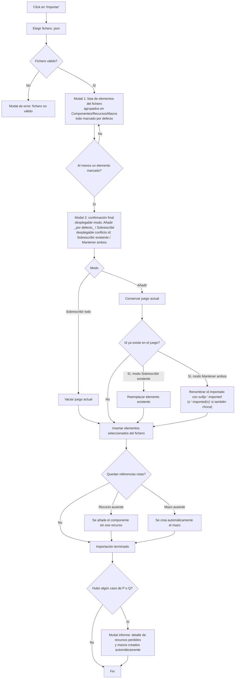

- **Nombre**: Selección de elementos al exportar/importar, con modal de confirmación de comportamiento en la importación
- **Código**: 00065
- **Tipo**: change

## Prompt original del usuario

"al exportar/importar debe poder elegirse de una lista los elementos que se quieren exportar y los que se quieren importar. Por defecto siempre todo seleccionado. Al confirmar los elementos a importar, pedir confirmación al usuario antes de importar en una modal: un desplegadble para preguntar al usuario si desea sobreescribir todo el juego con el contenido de la importación o añadir los elementos importados a los que ya existen. (añadir por defecto). Un desplegable para preguntar al usuario el comportamiento en caso de existir elementos con el mismo id: sobreescribir el viejo con el nuevo o mantener ambos (renombrando siempre el nuevo con el sufijo "-imported""

Aclaraciones del usuario tras la lista de dudas anticipadas por el análisis:

"1. cada bloque debe tener su propio check que des/marca todos los checks de los elementos dentro de él.
7. No. si se produce un error por falta de recurso: se añade el elemento sin recurso. Si se produce el error por falta de mazo: se crea el mazo que falta. Después de la importación, si hay algún error de los anteriores, se presenta al usuario un informe con el detalle."

## Descripción completa

Hoy, en modo edición, "Exportar" descarga siempre un fichero con absolutamente todos los componentes, todos los recursos y todos los mazos del juego, sin poder elegir un subconjunto. "Importar" es todo-o-nada: tras elegir el fichero se pide una confirmación simple (sí/no) y, si se acepta, se reemplaza por completo el contenido actual del juego por el del fichero.

Este cambio sustituye ambos flujos por uno con selección.

### Exportar

Al pulsar "Exportar" se abre una modal (en vez del cuadro de texto actual para el nombre de fichero) que combina el campo de nombre de fichero con una lista de todos los elementos del juego, agrupados en tres bloques: Componentes, Recursos y Mazos. Cada bloque tiene su propio checkbox de "seleccionar todo el bloque", que marca/desmarca de golpe todos los checkboxes de los elementos de ese bloque, y debajo el checkbox individual de cada elemento (identificado por su nombre/id). Todos los checkboxes empiezan marcados por defecto.

Si el usuario deselecciona algo y confirma, el fichero exportado solo contiene los elementos marcados. No se valida ni se avisa si queda algún componente exportado cuya referencia a un recurso o mazo no viaja en la selección (igual que hoy no se valida nada al exportar). Si no queda ningún elemento marcado, el botón de confirmar la exportación queda deshabilitado.

### Importar

Se sigue eligiendo el fichero igual que hoy (selector de fichero limitado a `.json`). Tras leerlo y validarlo (mismos errores de fichero inválido que hoy), se abre una primera modal con la misma lista agrupada en tres bloques (Componentes/Recursos/Mazos, cada uno con su checkbox de "todo el bloque") mostrando los elementos que trae el fichero, todos marcados por defecto. Si no queda ninguno marcado, el botón de confirmar esa lista queda deshabilitado.

Al confirmar la selección se abre una segunda modal, de confirmación final, con dos desplegables:

- **Modo de importación**: "Añadir a lo existente" (opción por defecto) o "Sobrescribir todo el juego". En ambos casos solo entran en juego los elementos marcados en la lista anterior (el resto del fichero se ignora). "Sobrescribir" borra primero todo el contenido actual (componentes, recursos y mazos) y deja el juego solo con lo seleccionado del fichero. "Añadir" conserva el contenido actual y le suma lo seleccionado del fichero, aplicando la regla de conflicto de id de abajo.
- **Comportamiento ante id duplicado** (solo aplica en modo "Añadir"; en "Sobrescribir" no puede haber duplicados porque se parte de vacío): "Sobrescribir el existente" (el elemento nuevo reemplaza al que ya existía con ese id) o "Mantener ambos". Con "Mantener ambos", el elemento importado se conserva con un id nuevo: el id original con el sufijo "-imported"; si ese id renombrado también coincide con uno ya existente (por ejemplo, se importa el mismo fichero dos veces), se sigue el mismo patrón que ya usa el clonado de componentes de la app (sufijo numérico incremental tipo "-imported(2)", "-imported(3)"...) hasta encontrar un id libre.

Este comportamiento (sobrescribir/mantener ambos) se aplica de forma independiente a cada elemento y cada tipo (un componente puede sobrescribir mientras un recurso con id duplicado mantiene ambos, según corresponda id a id, no una decisión global por tipo).

### Manejo de referencias tras importar

Si, tras aplicar la selección y la resolución de conflictos de id, un componente importado queda referenciando un recurso que no existe en el estado final del juego, el componente se añade igualmente pero sin ese recurso (referencia rota se descarta, igual que ya tolera hoy la app cuando se borra un recurso en uso). Si, en cambio, referencia un mazo que no existe en el estado final, se crea automáticamente ese mazo (con ese mismo id) para que la referencia quede resuelta, en vez de dejarla rota.

Si varios componentes de la misma importación referencian el mismo mazo ausente, el mazo se crea una única vez (al detectar la primera referencia rota a ese id): los componentes siguientes que referencien ese mismo id ya lo encuentran resuelto, con el mazo recién creado, y no disparan una creación adicional. El informe final, aun así, muestra una fila por cada componente afectado (no solo por el primero), ya que cada uno tenía originalmente esa referencia rota — la columna "Recurso/Mazo" repite el mismo nombre de mazo en todas esas filas.

Al terminar la importación, si se ha dado alguno de estos dos casos, se presenta al usuario un informe (modal) con una tabla de cuatro columnas, en este orden — "Componente afectado", "Error" (recurso no incluido / mazo no incluido), "Solución" (qué se hizo: se añadió el componente sin el recurso, o se creó el mazo automáticamente) y "Elemento erróneo/faltante" (el nombre del recurso o mazo referenciado) — con una fila por cada aviso. Un mismo componente puede aparecer en varias filas si genera más de un aviso.

### Flujo completo de importación

## Apuntes técnicos

- Hoy `ui/editModeToggle.js` usa `prompt()`/`confirm()` nativos para el flujo de exportar/importar; este cambio los sustituye por modales propias de la app siguiendo el patrón ya existente (`ui/errorModal.js`, `ui/componentModal.js`, etc.).
- `core/persistence.js` (`buildComponentsExport`/`parseImportedComponents`) y `core/fileExport.js` (`downloadJson`) son el punto de partida técnico para exportar/importar el JSON de componentes/recursos/mazos; deberán extenderse para aceptar/filtrar por selección.
- El patrón de renombrado por sufijo con numeración incremental ante colisión ya existe para clonado de componentes: `core/component.js` (`nextCloneId`), con sufijo `(n)`. El nuevo sufijo `-imported`/`-imported(n)` es análogo pero no reutiliza directamente esa función (opera sobre id de componente, recurso o mazo indistintamente, no solo componente).
- El aviso "no bloqueante" ya existente en importación (`getComponentsWithMissingResources`/`getComponentsWithMissingDeck` en `ui/editModeToggle.js`, mostrado con `showErrorModal`) es el precedente directo del nuevo "informe" tras importar — habrá que decidir en el plan si se reutiliza `errorModal.js` o conviene una modal de informe propia, dado que ahora incluye también los mazos autocreados (antes solo se avisaba de referencia incompleta; en el caso de mazo ya no queda incompleta porque se autocrea).
- Pendiente de confirmar en el plan técnico: cuál de los dos valores del desplegable de conflicto de id ("Sobrescribir el existente" / "Mantener ambos") aparece seleccionado por defecto al abrir la modal — el usuario no lo fijó explícitamente en el análisis funcional.
- La autocreación de mazo ante referencia rota debe comprobar primero si el mazo ya existe en el estado en construcción (incluido uno creado por esta misma importación momentos antes) antes de crear uno nuevo, para no generar un mazo duplicado cuando varios componentes importados referencian el mismo id de mazo ausente — mismo criterio idempotente que ya sigue `addResource`/`addComponent` frente a colisiones, aplicado aquí a la creación implícita.
