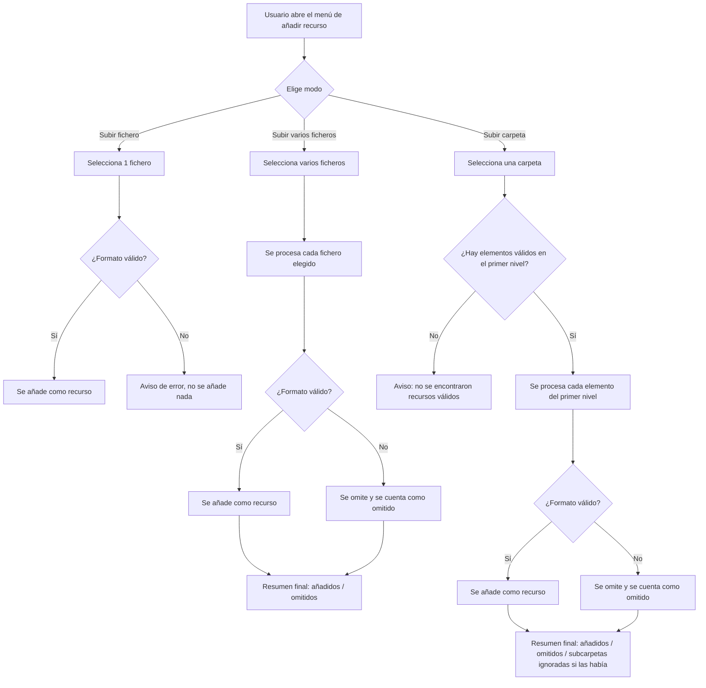

- **Nombre**: Subida múltiple y por carpeta de recursos en la galería
- **Código**: 00076
- **Tipo**: change

## Prompt original del usuario

"al añadir más recursos a la galería, además de subir de uno en uno, quiero también poder subir varios que seleccione y también el contenido de una carpeta indicada (los elementos válidos que haya en ella)"

## Descripción completa

Hoy, en el modo de edición, la galería de recursos solo permite añadir un recurso cada vez: se abre un selector de fichero y solo se puede elegir uno.

Se añaden dos formas nuevas de añadir recursos, conviviendo con la actual (que se mantiene igual):

1. **Selección de varios ficheros a la vez**: se pueden marcar varios ficheros en el mismo selector. Todos los ficheros válidos elegidos se añaden como recursos independientes, igual que si se hubieran subido uno a uno.
2. **Selección de una carpeta**: se puede elegir una carpeta del sistema de ficheros, y se añaden como recursos todos los ficheros válidos que estén directamente dentro de ella — **solo el primer nivel**, sin entrar en subcarpetas. Si la carpeta tiene subcarpetas, el contenido de esas subcarpetas se ignora.

Estas dos opciones nuevas se ofrecen junto a la opción actual de subir un único fichero, en el mismo punto donde hoy está el botón de añadir recurso, sin sustituir el flujo individual existente.

### Preguntas de alcance resueltas

- **¿La subida por carpeta debe explorar subcarpetas recursivamente?** No: solo se tiene en cuenta el primer nivel de la carpeta seleccionada, y se avisa al usuario de esta limitación junto a esa opción.
- El resto de puntos analizados (comportamiento ante ficheros no válidos, feedback tras el lote, duplicados, alcance de los datos y quién puede usarlo) se confirmaron sin cambios sobre la propuesta inicial — ver detalle más abajo.

### Casos límite resueltos

- **Fichero no válido dentro de una selección múltiple o de una carpeta**: a diferencia de la subida individual (que hoy corta con un aviso de error si el fichero no es válido y no sube nada), en una subida por lote se suben todos los ficheros válidos y se omiten los no válidos, mostrando al finalizar un resumen con el recuento de añadidos y, si los hay, de omitidos por formato no soportado (con sus nombres).
- **Carpeta sin ningún elemento válido en su primer nivel** (vacía, solo con subcarpetas, o con ficheros pero ninguno de formato soportado): se muestra un aviso informativo indicando que no se ha encontrado ningún recurso válido en la carpeta seleccionada, y no se añade nada.
- **Carpeta con subcarpetas**: se advierte al usuario de que solo se tendrá en cuenta el primer nivel de la carpeta (los elementos dentro de subcarpetas no se suben). Este aviso se muestra junto a la opción de subir carpeta, y también se refleja en el resumen final si efectivamente había subcarpetas cuyo contenido se ha omitido.
- **Duplicados por nombre**: no se comprueban (igual que hoy con la subida individual); cada fichero subido se añade como recurso nuevo aunque su nombre coincida con uno ya existente en la galería.
- **Feedback tras el lote**: se muestra siempre un resumen al terminar de procesar un lote (varios ficheros o carpeta), incluso cuando todo se sube correctamente (p.ej. "8 recursos añadidos"), para que quede claro que el lote se ha procesado por completo. No se implementa una barra de progreso durante la subida.

### Convivencia con lo existente

No sustituye la subida de un único recurso ya existente, que se mantiene igual. Se añaden como dos alternativas más en el mismo punto de entrada.

### Alcance de los datos

No cambia respecto a hoy: los recursos añadidos por cualquiera de las tres vías se guardan y persisten igual que los que se suben hoy de uno en uno. El proyecto no distingue usuarios ni sesiones, así que el resultado es el mismo para cualquiera que abra el proyecto guardado.

### Quién puede usarlo

Igual que hoy: disponible desde la galería de recursos en el modo de edición, sin ningún rol o restricción nuevo respecto a lo que ya existe.

### Definición visual de alto nivel

- El botón de añadir recurso del panel de galería pasa a desplegar un pequeño menú con tres opciones: "Subir fichero" (comportamiento actual, un único fichero), "Subir varios ficheros" (selector con selección múltiple) y "Subir carpeta" (selector de carpeta, con una nota junto a esta opción avisando de que solo se tendrán en cuenta los elementos del primer nivel).
- Tras procesar una subida múltiple o por carpeta, aparece un aviso resumen (con el mismo estilo que los avisos ya existentes) indicando cuántos recursos se han añadido y, si aplica, cuántos se han omitido (por formato no soportado o por estar en una subcarpeta) con el detalle de los nombres omitidos.
- Los recursos añadidos aparecen en la tabla de la galería igual que hoy, sin ninguna marca visual especial que distinga cómo se subieron.

## Apuntes técnicos

- Punto de entrada actual: `src/ui/resourceList.js` líneas ~216-221 (botón "+ Añadir recurso", callback `onAdd`) y `src/modes/edit/editMode.js` líneas 73-93 (creación del `<input type="file">` oculto `resourceFileInput`, sin `multiple`; handler `change` que hoy solo procesa `files[0]`).
- Validación de extensión: `resourceTypeForFileName` en `src/core/resource.js` líneas ~20-23, mapa `EXTENSION_TYPE_MAP`; hay que reutilizarlo por cada fichero del lote.
- `accept` actual del input: `.png,.jpg,.jpeg,.gif,.svg,.webp,.ttf,.otf,.woff,.woff2` — se mantiene igual para las tres vías.
- Selección de carpeta: no existe hoy en el repo ningún uso de `webkitdirectory` ni de `showDirectoryPicker` (File System Access API) — es funcionalidad nueva. El atributo `webkitdirectory` en un `<input type="file">` devuelve todos los ficheros de la carpeta incluyendo subcarpetas, con `file.webkitRelativePath`; para quedarse solo con el primer nivel hay que filtrar por que `webkitRelativePath` tenga exactamente un separador `/` (nombre de carpeta + nombre de fichero, sin más subniveles).
- Alta de recurso: `createResource` + `addResource` (`src/core/state.js` línea ~123) vía `FileReader.readAsDataURL`; para un lote habrá que encadenar/paralelizar estas lecturas asíncronas por cada fichero válido y acumular el resumen (añadidos/omitidos) antes de mostrar el aviso final.
- Aviso reutilizable existente: `showErrorModal('Error', mensaje)`, ya usado en `editMode.js:83` — candidato a reutilizar (o extender con un título distinto tipo "Resumen") para el resumen del lote.
