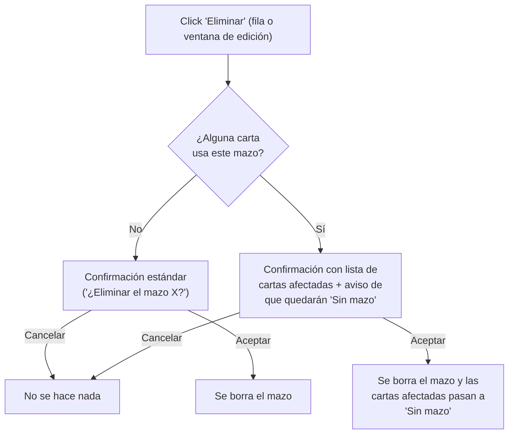

- **Nombre**: Nueva lista "Mazos" en modo edición, con edición de nombre y borrado
- **Código**: 00079
- **Tipo**: change

## Prompt original del usuario

En el modo edición añadir una nueva lista llamada Mazos que liste la lista de mazos. Permite editar (solo cambiar el nombre) y eliminar.
También incluye el resto de funcionalidades de las otras listas.

Al preguntar por el borrado de un mazo en uso: "si el mazo está siendo usado, debe aparecer una ventana de confirmación con la lista de cartas que lo usan. Si el usuario acepta, se borra el mazo y las cartas afectadas se actualizan sin mazo. Si cancela, no hace nada."

## Descripción completa

Hoy existe el concepto de "mazo" (agrupación de cartas) en el juego, pero sin ningún panel de gestión propio: el único alta posible es crear un mazo al vuelo desde el desplegable "Mazo" de la configuración de una carta, sin poder editarlo ni eliminarlo después.

Este cambio añade, en modo edición, una tercera ventana flotante "Mazos", con el mismo lenguaje visual y funcionalidades que ya tienen las ventanas flotantes de "Componentes" y "Recursos":

- Panel flotante colapsable, arrastrable por su cabecera, y redimensionable en ancho (mismo mínimo/máximo que los otros dos paneles). Su posición, ancho y estado colapsado/expandido se recuerdan automáticamente y se recuperan al recargar la página, igual que los otros paneles — con su propio estado independiente (no comparte posición/ancho con Componentes ni Recursos). Aparece apilada por defecto debajo de "Recursos" en la posición inicial de los paneles.
- Título con contador de elementos, "Mazos (n)", igual que ya hacen "Recursos (n)" y "Componentes".
- Listado en tabla con columnas **Nombre** y **Acciones** (sin columna "Tipo": los mazos no tienen tipo). Sin cuadro de filtro de texto (a diferencia de Recursos, que sí lo tiene por el volumen de imágenes que puede llegar a haber) y sin acción de clonar (no se pide) ni fila seleccionable/resaltado sobre ninguna mesa (los mazos no tienen representación visual en la mesa de juego, a diferencia de los componentes).
- Botón "+ Añadir mazo" en el pie del panel, que abre una ventana mínima con un único campo "Nombre" y botones Aceptar/Cancelar.
- Botón "Editar" en cada fila, que abre una ventana igual de mínima, con el campo "Nombre" ya relleno con el valor actual (único campo editable, tal como se pide) y botones Aceptar/Cancelar; incluye además un botón "Eliminar" dentro de la propia ventana (mismo doble camino de borrado — desde la fila y desde dentro de la ventana de edición — que ya ofrecen Componentes y Recursos).
- Botón "Eliminar" en cada fila (y en la ventana de edición, ver arriba): comprueba primero si el mazo está siendo usado por alguna carta.
  - Si **no** está en uso: pide la confirmación estándar ya usada en el resto de la app ("¿Eliminar el mazo X?") y, si se acepta, borra el mazo directamente.
  - Si **está en uso**: se muestra una ventana de confirmación con la lista de las cartas afectadas (sus identificadores), avisando de que se borrará el mazo y esas cartas quedarán sin mazo asignado. Si el usuario acepta, se borra el mazo y las cartas afectadas pasan a "Sin mazo"; si cancela, no se hace ningún cambio.

Diagrama del flujo de borrado de un mazo:

### Casos límite y estados

- Panel vacío (sin ningún mazo creado todavía): mensaje "No hay mazos todavía." (mismo criterio que el resto de listas vacías de la app).
- Nombre vacío al crear o editar un mazo: no se acepta (validación de no-vacío), mismo criterio que otros campos de nombre obligatorios en la app.
- El mazo puede seguir creándose al vuelo desde la ventana de configuración de una carta, exactamente igual que hoy: esta nueva ventana es un camino adicional de gestión, no un reemplazo de esa vía.
- Renombrar un mazo no afecta a ninguna carta: solo cambia el nombre visible, la carta sigue apuntando al mismo mazo.

### Convivencia con lo existente

- El desplegable "Mazo" de la ventana de configuración de una carta sigue funcionando exactamente igual, listando y permitiendo crear mazos al vuelo; ahora además esos mazos pueden editarse/eliminarse desde este nuevo panel.
- La función de exportar/importar en fichero ya trata "Mazos" como un bloque propio hoy — no se ve afectada por esta funcionalidad.

### Alcance de los datos

Los mazos, igual que los componentes y los recursos, son parte del estado único de la partida que se autoguarda en el navegador; el proyecto no distingue usuarios ni sesiones independientes.

### Quién puede usarlo

Solo disponible en modo edición, igual que el resto de listas/paneles de gestión (Componentes, Recursos).

## Apuntes técnicos

- Modelo ya existente: `core/deck.js` (`createDeck`, `updateDeck`, sin ningún equivalente a `isResourceInUse`) y `core/state.js` (`decks`, `getDecks`, `addDeck`, `loadDecks`, evento `decks:changed` — actualmente sin `replaceDeck`/`removeDeck`, habrá que añadirlos).
- Habrá que añadir en `core/state.js` (o módulo afín) una función para saber qué cartas usan un mazo dado (equivalente a `getComponentsUsingResource` de `core/resource.js`, pero mirando `component.properties.deckId` en componentes de tipo `'carta'`) y una función para actualizar en bloque el `deckId` de esas cartas a `null` al borrar el mazo en uso.
- Patrón de referencia directo: `ui/resourceList.js` + `ui/resourceModal.js` (panel análogo, con `onEdit`/`onRemove`, botón "+ Añadir recurso" en el pie) y su cableado en `modes/edit/editMode.js` (`resourcePanelState`, `getResourcePanelState`/`setResourcePanelState`). El nuevo panel de mazos necesita su propio estado de panel persistido, análogo a `panelState`/`resourcePanelState` (p.ej. `deckPanelState` en `core/state.js`).
- A diferencia de Recursos, el borrado en uso aquí no bloquea sino que pide confirmación con detalle y permite continuar: hace falta un nuevo tipo de modal de confirmación con lista, distinto del modal de error de bloqueo ya existente (`showErrorModal`) — puede inspirarse en el patrón de "modal de informe" con tabla ya usado en `ui/importReportModal.js`, o en un modal de confirmación simple con la lista embebida en el mensaje.
- No hay un `design_*.html` de maqueta para este cambio: visualmente reutiliza tal cual el patrón ya existente de `ui/resourceList.js`/`ui/componentList.js` (panel flotante + tabla + botones), sin ningún elemento visual nuevo que requiera boceto propio.
