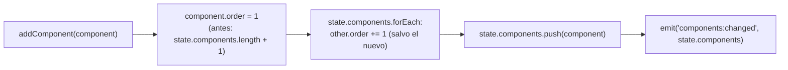

- **Código**: 00082

## (a) Anotaciones funcionales

Sin dudas que resolver con el usuario ni anotaciones adicionales fuera de lo ya cubierto en `description.md`: el cambio queda acotado exclusivamente al `order` asignado por `addComponent()` al crear un componente nuevo.

## (b) Solución técnica



1. **`src/core/state.js` — `addComponent(component)` (línea ~51)**: cambiar la asignación de `order` para que el componente nuevo quede siempre en la posición más alta de la pila (`order = 1`), desplazando en +1 el `order` de todos los componentes ya existentes antes de añadir el nuevo y emitir el evento. No usar `compactOrders` aquí (no hace falta renormalizar: ya se parte de una lista contigua 1..n y solo se desplaza en bloque).

   ```js
   export function addComponent(component) {
     state.components.forEach((c) => { c.order += 1; });
     component.order = 1;
     state.components.push(component);
     emit('components:changed', state.components);
   }
   ```

2. Ningún otro punto de la solución requiere cambios: `main.js` y `modes/edit/editMode.js` solo invocan `addComponent(newComponent)` y no asumen nada sobre el orden resultante; el renderizado (`ui/componentRenderer.js:287`) ya ordena por el campo `order` (no por posición en el array), así que el nuevo componente aparecerá visualmente encima sin tocar `componentRenderer.js`. `compactOrders`, `removeComponent`, `reorderComponent` e `insertComponentAfter` no se ven afectados, tal como ya señalaba `description.md`.

## (c) Cambios de arquitectura

`design/docs/ARCHITECTURE.md` línea 70 describe el comportamiento actual de `addComponent`:

> `addComponent(component)` le asigna el último puesto (`order = n + 1`) antes de añadirlo.

Actualizar esa línea tras implementar, para reflejar el nuevo comportamiento, por ejemplo:

> `addComponent(component)` le asigna el primer puesto (`order = 1`) antes de añadirlo, desplazando en +1 el `order` de los componentes ya existentes.
