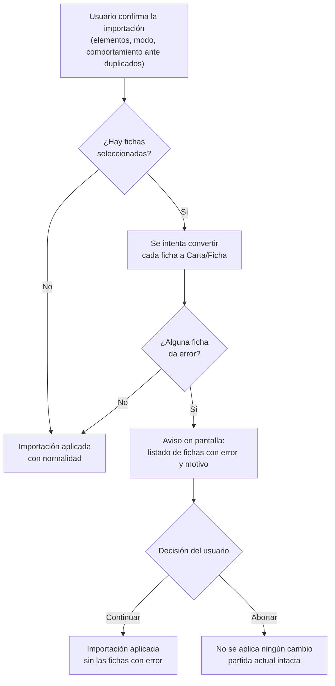

- **Nombre**: Eliminar tipo "Ficha" y renombrar "Carta" a "Carta/Ficha"
- **Código**: 00087
- **Tipo**: change

## Prompt original del usuario

"eliminar el tipo de elemento ficha y renombrar las cartas a cartas/fichas"

"cualquier tipo de error detectado al convertir fichas muéstralo en pantalla y el usuario decide si seguir con la importación o abortar"

## Descripción completa

Se elimina el tipo de componente "Ficha" del prototipo. Su caso de uso (piezas/tokens simples, cuadrados o circulares, con borde y fondo configurables) queda cubierto por el tipo "Carta", que desde el cambio 00071 ya admite una proporción "Circular" con redimensionado libre (igual que tenía "Ficha"). Por eso, junto con la eliminación, se renombra la etiqueta visible del tipo "Carta" a "Carta/Ficha" en toda la interfaz, para dejar claro que ahora sirve para representar tanto cartas de juego como fichas/tokens.

**Alcance del renombrado**: solo cambia el texto mostrado al usuario (modal de elegir tipo al crear un componente, columna "Tipo" del panel flotante de componentes, etiqueta identificativa al pasar el ratón "Tipo: id", cualquier ayuda contextual o texto de la documentación funcional que mencione "Carta"/"Ficha" como tipos). El tipo, a nivel de datos, sigue siendo el mismo que ya usa "Carta" hoy — no se renombra a nivel de datos, para no romper la compatibilidad con partidas ya guardadas que usan cartas.

**Migración de componentes "Ficha" ya existentes** (partidas guardadas en el navegador, ficheros HTML exportados con estado embebido, ficheros JSON exportados/importados): al cargar cualquiera de estos guardados, cualquier componente de tipo "Ficha" se convierte automáticamente y en silencio al tipo "Carta/Ficha" (mismo criterio ya usado en el proyecto para migrar datos de versiones anteriores sin intervención del usuario), con este mapeo:

- La forma de la ficha (cuadrada/circular) se traduce a la proporción de la carta resultante: "circular" se mantiene como proporción "Circular"; "cuadrada" pasa a la proporción "Cuadrada" (1:1).
- El color/grosor de borde de la ficha se traslada tal cual al borde de la cara frontal de la carta resultante.
- Si la ficha tenía una imagen de fondo, esa imagen y su ajuste (zoom/posición) se trasladan tal cual a la imagen de fondo de la cara frontal.
- Si la ficha tenía un texto centrado configurado, ese texto se traslada como un único cuadro de texto que ocupa toda la carta, centrado, con el color de fondo que tuviera la ficha.
- Si la ficha solo tenía un color de fondo sólido configurado (sin imagen ni texto), ese matiz no tiene equivalente exacto en el modelo de carta (que no tiene un color de fondo plano propio) y se pierde en la migración: la carta resultante queda en blanco con el borde migrado, sin aviso al usuario (mismo criterio que ya sigue el proyecto con "carta sin diseño": se muestra en blanco sin ningún aviso).
- Como la ficha no distinguía cara frontal/trasera, el mismo diseño migrado se copia a ambas caras de la carta resultante, y la carta migrada se muestra empezando por la cara "frontal" (en vez de la "trasera" en blanco que es el comportamiento por defecto al crear una carta nueva), para que la migración se note de inmediato sin tener que voltearla.
- La carta resultante no queda asociada a ningún mazo.

### Ampliación: aviso de errores al convertir fichas durante una importación

Lo descrito arriba sobre la migración de "Ficha" a "Carta/Ficha" sigue aplicando tal cual para el arranque de la aplicación (carga desde el guardado del navegador o desde un HTML exportado con estado embebido): sigue siendo una migración silenciosa, sin ningún aviso, incluida la pérdida sin aviso del color de fondo sólido cuando la ficha no tenía imagen ni texto.

Se añade un comportamiento nuevo, solo para la acción explícita "Importar" (importación de un fichero JSON de componentes sobre una partida ya abierta): si al convertir alguna de las fichas incluidas en el fichero se detecta un error — un dato de la ficha corrupto o inesperado que impide aplicar el mapeo ya descrito arriba (por ejemplo, la forma de la ficha no es ni "cuadrada" ni "circular", o falta información imprescindible para reconstruir su diseño) — la importación no se completa en silencio. En su lugar, antes de aplicar ningún cambio a la partida actual, se muestra en pantalla un aviso con el listado de las fichas afectadas y el motivo de cada error, y el usuario decide cómo seguir:

- **Continuar**: la importación se completa igual que si no hubiera pasado nada, salvo que las fichas con error quedan excluidas — no se importan. El resto de componentes, recursos y mazos seleccionados para importar sí se incorporan con normalidad.
- **Abortar**: no se aplica ningún cambio a la partida actual. Ni las fichas con error ni el resto de lo seleccionado para importar se incorporan — es como si el usuario hubiera cancelado la importación desde el principio.

La pérdida ya documentada del color de fondo sólido (ficha sin imagen ni texto) no cuenta como error a efectos de este aviso: sigue resolviéndose en silencio, tanto en la importación como en el arranque.

No hay ningún elemento visual nuevo que diseñar para la parte original de este cambio (retirada de tipo y cambio de etiqueta): es un cambio sobre la interfaz ya existente. La ampliación sí introduce un elemento visual nuevo: el aviso de errores de conversión descrito arriba (ver `design_aviso-errores-conversion-fichas.html`).

### Preguntas de alcance resueltas

- **¿Se elimina también a nivel de datos (identificador interno del tipo), o solo la etiqueta visible?** Solo la etiqueta visible — el identificador interno sigue siendo el que ya usa "Carta", para no requerir ninguna migración de las cartas ya existentes ni romper compatibilidad hacia atrás.
- **¿Qué pasa con los componentes "Ficha" ya guardados al eliminar el tipo?** Se migran automáticamente a "Carta/Ficha" al cargarse (ver mapeo detallado arriba), en vez de perderse o dejar de renderizarse.
- **¿Qué cara se muestra tras migrar una ficha?** La frontal (con el diseño migrado), no la trasera en blanco por defecto de una carta nueva, para que el resultado de la migración sea visible de inmediato.
- **¿A qué vías de conversión ficha→carta afecta el aviso de errores?** Solo a la importación explícita vía JSON ("Importar"). El arranque de la app (guardado en el navegador o HTML exportado con estado embebido) no tiene una "partida en curso" a la que volver si se aborta, así que mantiene el criterio original: migración silenciosa, sin aviso.
- **¿Qué cuenta como error frente a la pérdida ya documentada y silenciosa del color de fondo sólido?** Un dato de la ficha corrupto o inesperado que impide aplicar el mapeo documentado (forma con un valor no reconocido, estructura de imagen/texto rota, etc.). La pérdida del color de fondo sólido sin imagen ni texto no es un error: sigue sin avisar, en importación y en arranque por igual.
- **¿Qué pasa con el resto de la importación si el usuario elige "Continuar"?** Se completa con normalidad; solo quedan excluidas las fichas con error.
- **¿Qué pasa con la partida actual si el usuario elige "Abortar"?** Queda intacta, como si se hubiera cancelado la importación desde el principio (ni las fichas con error ni el resto de lo seleccionado se importan).

## Apuntes técnicos

- Las etiquetas de tipo están centralizadas en `COMPONENT_TYPE_LABELS` (`src/ui/componentRenderer.js`) y en el array de `src/ui/componentTypeModal.js` (`{ value: 'ficha', label: 'Ficha' }` / `{ value: 'carta', label: 'Carta' }`) — el renombrado y la eliminación de la entrada `'ficha'` pasan por ahí.
- La migración silenciosa de datos de versión anterior ya tiene precedente en el proyecto: `loadComponents()` en `core/state.js` migra el campo `order` de guardados antiguos sin pedir confirmación (ver `ARCHITECTURE.md` sección 4). El mismo patrón (migrar en `loadComponents` o equivalente, al cargar) es el punto natural para migrar `type: 'ficha'` → `'carta'`.
- Comprobar también los puntos de importación JSON (Exportar/Importar componentes) y el fichero HTML embebido con estado (Guardar a fichero), ya que ambos pueden traer componentes `'ficha'` de versiones anteriores y deben pasar por la misma migración, no solo el autoguardado de `localStorage`.
- Hay tres entradas ya en `changes/inProgress` que mencionan "ficha" en su documentación (00080, 00086, 00052) sin proponer eliminarla — no bloquean este cambio, pero quedarán con texto desactualizado una vez implementado este cambio (p. ej. 00086 lista "ficha" como tipo en las columnas de un CSV a exportar); conviene revisarlas al planificar o después de implementar.
- `isResourceInUse` (`core/resource.js`) ya recorre `properties` en profundidad para cualquier tipo, así que no necesita cambios para seguir detectando recursos usados por cartas migradas desde ficha.
- Flujo real de "Importar" (`ui/editModeToggle.js`, función `importComponentsFromFile`): `parseImportedComponents` (fichero inválido → `showErrorModal`) → `openImportSelectionModal` (elegir qué importar) → `openImportConfirmModal` (modo `add`/`overwrite` + comportamiento ante duplicados) → `mergeImportedGame` (`core/importMerge.js`, calcula el estado final y un `report` de referencias rotas resueltas automáticamente) → `loadComponents`/`loadResources`/`loadDecks` (aplica el resultado) → si `report.length > 0`, `openImportReportModal(report)` (solo informativo, se muestra **después** de aplicar el resultado, sin opción de deshacer). El aviso nuevo de esta ampliación es distinto: debe evaluarse **antes** de `loadComponents`/`loadResources`/`loadDecks` (para que "Abortar" tenga sentido — nada se ha aplicado todavía), y necesita dos botones de acción en vez del único "Cerrar" que ya tienen `showErrorModal`/`openImportReportModal`.
- Patrones visuales ya existentes reutilizables para el aviso nuevo: `ui/errorModal.js` (cabecera con icono de alerta, `STYLE_BIBLE.md` sección 12.1) y `ui/importReportModal.js` (tabla `.import-report-modal__table`, clase de modal ancha `.import-report-modal` con `max-width: 640px`, sección 12.4). Ninguno de los dos ofrece hoy un patrón de "dos acciones, continuar o abortar" — la modal más parecida en intención es `ui/deckDeleteConfirmModal.js` (confirmar una acción con consecuencias, en vez de un simple aviso con "Cerrar"), aunque no comparte su dominio ni su tabla.
