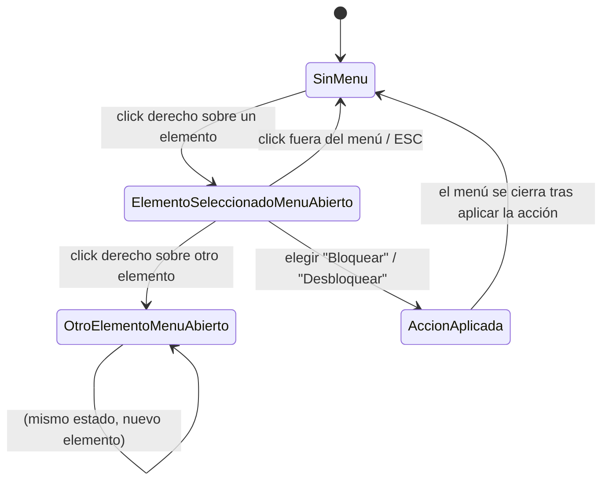

- **Nombre**: Menú contextual de elementos en modo juego (click derecho)
- **Código**: 00088
- **Tipo**: change

## Prompt original del usuario

solo para el modo juego:
- al pulsar el botón derecho del ratón estando sobre un elemento, seleccionarlo y abrir un menú contextual.
- este menú contextual tendrá dos partes diferenciadas por un separador: parte general (todos los elementos la tienen) y específica (según el tipo de elemento)
- Cada linea de este menú tendrá un botón la estructura: icono + texto de la acción.

no implementes lo de mover al frente/fondo. solo lo de des/bloquear

En modo edición:
- muestra el candado en el elemento si está bloqueado

En modo juego:
- no muestres nada aunque esté bloqueado

## Descripción completa

En modo juego, al pulsar el botón derecho del ratón sobre un elemento de la mesa, ese elemento queda seleccionado (resaltado con el mismo contorno discontinuo que ya usa el modo edición para su selección) y se abre, junto al cursor, un menú contextual.

El menú contextual tiene una única sección por ahora, la parte general, común a todos los tipos de componente (cuadro de texto, tablero, dado, visor de documentos, ficha y carta):

- **"Bloquear" / "Desbloquear"**: alterna si el componente está bloqueado, sin tener que entrar en modo edición; el texto de la fila refleja la acción disponible según el estado actual (si está bloqueado, la fila dice "Desbloquear"; si no, dice "Bloquear").

**Fuera de alcance de esta entrada**: "Traer al frente" / "Enviar al fondo" se propusieron inicialmente como parte de esta sección general, pero el usuario ha confirmado que no se implementan por ahora — quedan descartadas de esta entrada, no como acción pendiente para más adelante dentro de la misma.

El menú queda preparado estructuralmente para admitir en el futuro una parte específica por tipo de componente, separada de la general por un separador visual, pero esta entrada no añade ninguna acción específica todavía: si no hay ninguna acción específica que mostrar, esa parte del menú simplemente no aparece (no se dibuja un separador huérfano).

Cada fila del menú combina icono + texto de la acción (no solo texto).

**Indicador visual de bloqueo sobre el propio elemento**: además del menú, todo componente con `bloqueado` activo muestra un pequeño icono de candado superpuesto sobre el propio elemento, pero solo en modo edición — hoy no existe ningún indicador así en ningún modo, y el bloqueo es invisible salvo entrando en la modal de configuración. En modo juego no se muestra nada, ni siquiera para componentes bloqueados: el estado de bloqueo solo se percibe ahí a través del menú contextual (que indica "Bloquear" o "Desbloquear" según corresponda) y de si el componente se puede arrastrar o no.

### Casos límite y comportamiento acordado

- Click derecho sobre un elemento ya seleccionado: mantiene la selección, abre el menú.
- Click derecho sobre otro elemento con un menú ya abierto: cierra el menú anterior, cambia la selección al nuevo elemento y abre el menú sobre este.
- Click derecho sobre la mesa vacía (fuera de cualquier elemento): sin cambios respecto a hoy, fuera de alcance de este cambio.
- Cerrar el menú: al hacer click fuera de él, al pulsar ESC (mismo criterio que el resto de atajos de teclado ya documentados en modo edición), o al elegir una de las acciones disponibles.
- Elemento bloqueado: el menú se abre igual — el bloqueo hoy solo afecta a si el componente se puede arrastrar, nunca a si se puede seleccionar o interactuar con él; el propio menú permite desbloquearlo.
- El click izquierdo y sus interacciones actuales (arrastre, lanzar dado, voltear carta) no cambian: el menú contextual es una vía adicional, no sustituye nada de lo existente.
- La selección introducida en modo juego (el resaltado del elemento bajo el menú) es estado transitorio de la sesión de juego en curso: no se persiste, se pierde al recargar la página — mismo criterio que la selección ya existente en modo edición.
- Disponible únicamente en modo juego; el modo edición no se modifica, salvo por el nuevo indicador de candado sobre elementos bloqueados descrito arriba.
- El candado se muestra/oculta en modo edición de forma reactiva al alternar "Bloqueado" desde la modal de configuración del componente, igual que hoy reacciona el resto del renderizado a `components:changed`.

### Preguntas de alcance resueltas

Se propuso inicialmente incluir también acciones específicas por tipo (p. ej. "Lanzar dado"/"Ver resultado grande" para el dado, "Voltear carta" para la carta). El usuario confirmó que, por ahora, el menú solo debe implementar las dos acciones generales indicadas ("Traer al frente"/"Enviar al fondo" y "Bloquear"/"Desbloquear"), dejando la estructura preparada para añadir acciones específicas más adelante.

### Definición visual de alto nivel

- El menú aparece junto al punto donde se hizo click derecho, ajustando su posición para no salirse de los límites de la pantalla.
- Estructura: lista vertical de filas seleccionables, cada una con un icono a la izquierda y el texto de la acción a la derecha.
- Mismo lenguaje visual que el menú desplegable ya existente en la app (botón "+ Añadir recurso" del panel de Recursos en modo edición): fondo azul claro, cada fila con hover en azul sólido y texto claro en ese estado, sombra de nivel de overlay.
- El icono de candado sobre el elemento bloqueado (solo modo edición) es una pequeña insignia superpuesta en una esquina del componente, sin taparlo por completo, con contraste suficiente sobre cualquier fondo/imagen del propio componente (p. ej. círculo oscuro de base con el trazo del candado en claro).

### Diagrama de flujo de la interacción

## Apuntes técnicos

- No existe hoy ningún concepto de selección en modo juego (`modes/play/playMode.js` no gestiona selección; `core/state.js` no tiene ningún campo de selección de modo juego). Habrá que introducir ese estado transitorio, análogo al que ya usa `modes/edit/editMode.js` a nivel de módulo (fuera de `renderEditMode`, para sobrevivir a un refresco de `components:changed`).
- El resaltado de selección reutiliza las clases `--selectable`/`--selected` ya existentes por tipo en `ui/componentRenderer.js` (p. ej. `dice--selected`, `carta--selected`, etc.), aplicadas hoy solo en modo edición.
- El único menú desplegable ya existente en la app (`ui/resourceList.js`, `createAddMenu`) es la referencia visual e interactiva más cercana (apertura/cierre, fondo, hover) — no hay ninguna librería de iconos en el proyecto: cualquier icono para las filas del menú tendrá que crearse como SVG inline, mismo estilo que el único SVG ya existente (`ui/editModeToggle.js`, botón de "Ajustar zoom": `stroke="currentColor"`, `viewBox 0 0 24 24`).
- "Bloquear"/"Desbloquear" alterna `component.bloqueado` vía `updateComponent`/`replaceComponent`, mismo patrón ya usado en `modes/play/playMode.js` para otras interacciones (`onMove`, `onDiceResult`, `onCartaFlip`).
- Descartado de esta entrada (fuera de alcance): `reorderComponent(id, 1)` / `reorderComponent(id, n)` de `core/state.js`, que habría servido de base para "Traer al frente"/"Enviar al fondo", queda sin usar por ahora.
- El indicador de candado sobre el elemento es puramente de renderizado: no existe hoy en `ui/componentRenderer.js` ningún overlay condicionado a `component.bloqueado` (solo se lee ese campo en `modes/play/playMode.js` para `canMove` y en `ui/componentModal.js` para el checkbox "Bloqueado"). Habrá que añadirlo ahí, condicionado también al modo activo (edición sí, juego no).
