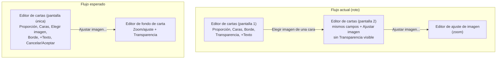

- **Nombre**: Unificar el editor de cartas en una única pantalla y mover la transparencia al editor de ajuste de imagen
- **Código**: 00090
- **Tipo**: fix

## Prompt original del usuario

cuando abro el editor de cartas (captura 1) y luego elijo la imagen de una cara, paso a otra pantalla también llamada editor de cartas (captura 2) que es la misma que la anterior pero con el slider de transparencia y el botón de ajustas imagen (zoom).
- El slider de transparencia debería estar en la misma pantalla que al ajustas el zoom de la imagen (editor de fondo de carta)
- lo demás debería estar en una única pantalla.

## Descripción completa

Al abrir el editor de cartas, el usuario ve una pantalla con: selector de proporción, cara frontal (con su imagen, botón "Elegir imagen…" y su borde), control de transparencia, botón "+ Texto", y cara trasera (con su imagen, botón "Elegir imagen…" y su borde), además de los botones Cancelar/Aceptar.

Al pulsar "Elegir imagen…" para cualquiera de las dos caras, la aplicación navega a otra pantalla que también se titula "Editor de cartas" y que muestra prácticamente los mismos controles (proporción, cara frontal, cara trasera, borde de cada cara, "+ Texto" de cada cara), pero con las miniaturas de imagen vacías y un botón adicional "Ajustar imagen…" al final, sin el control de transparencia visible. Al tener el mismo título y una disposición muy similar a la pantalla anterior, el usuario no percibe que ha cambiado de pantalla, y da la sensación de que la elección de imagen ha "roto" o duplicado el editor.

Comportamiento esperado:
- El control de transparencia debe estar en la misma pantalla en la que se ajusta el zoom/posición de la imagen (el editor de fondo/ajuste de imagen de la carta), ya que ambos controles actúan sobre la misma imagen de fondo y tiene sentido ajustarlos juntos.
- El resto de los controles del editor de cartas (proporción, cara frontal, cara trasera, elegir imagen, borde, "+ Texto", Cancelar/Aceptar) deben vivir en una única pantalla del editor de cartas, sin que elegir una imagen provoque una navegación a una segunda pantalla percibida como duplicada.

### Flujo actual vs. esperado

## Apuntes técnicos

No se conoce todavía la causa raíz en código (por ejemplo, si son dos componentes/modales distintos, o el mismo componente renderizado con distinto estado según si ya hay imagen elegida). Corresponde a `ms-how` analizarlo en detalle y limitar la solución estrictamente a este bug.
