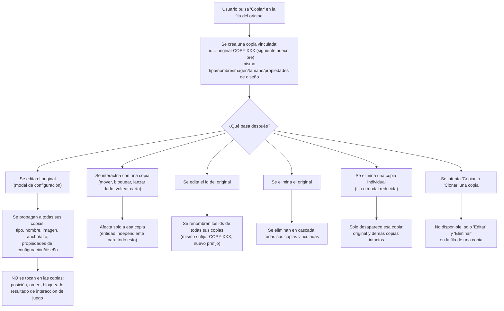

- **Nombre**: Nuevo tipo de elemento "Copia" — elementos vinculados y sincronizados con un original
- **Código**: 00097
- **Tipo**: change

## Prompt original del usuario

quiero crear un nuevo tipo de elemento llamado "copia":
- Un elemento de tipo Copia es una copia de otro elemento de cualquier tipo que queda vinculado al original.
- El id de un elemento tipo copia siempre es el mismo que el del elemento original con el sufijo "-COPY-XXX"
- Los elementos de tipo Copia no pueden editarse de ninguna manera, sino que siempre están sincronizados con el original.
- Cuando se abre la ventana de propiedades de un elemento tipo copia, debe mostrase solo el id, un aviso de que es una copia de otro elemento, el id del elemento original y los botones de Eliminar, Cancelar y Aceptar.
- Cuando se modifica un elemento (cualquiera de sus propiedades, el tamaño, etc) deben actualizarse automáticamente todas sus copias si las tiene.
- En la lista de componentes debe añadirse una columna nueva llamada "Copia" (bool)

Respuestas del usuario a las dudas de alcance planteadas (ver más abajo), incluyendo estas correcciones explícitas a la propuesta inicial:

"- Si el elemento original cambia su id, renombra los ids de todas las copias vinculadas
- tampoco el estado de bloqueo, que debe ser independiente para cada uno
- Cada copia es una entidad independiente, así que cada interacción se realiza sobre la copia indicada, sin afectar al original"

## Descripción completa

Se añade una nueva forma de duplicar un componente: la "Copia". A diferencia de "Clonar" (que ya existe y crea una copia totalmente independiente y editable), una Copia queda permanentemente vinculada a su elemento original y se sincroniza automáticamente con él.

**Creación**: en el panel flotante de componentes (modo edición), cada fila gana un nuevo botón "Copiar" en su columna de Acciones (junto a Editar/Clonar/Eliminar), que crea de inmediato una copia vinculada del componente de esa fila, sin ninguna modal previa — mismo patrón inmediato que "Clonar".

**Identificador**: el id de una copia es siempre el id del elemento original con el sufijo `-COPY-XXX`, donde XXX es un número de 3 dígitos (el primer hueco libre entre las copias existentes de ese original: si hay `-COPY-001` y `-COPY-002`, la siguiente es `-COPY-003`; si se borra `-COPY-001` y no queda otra copia con ese hueco, se reutiliza). Si el id del elemento original cambia, se renombran automáticamente los ids de todas sus copias vinculadas, conservando el mismo número de sufijo y sustituyendo solo el prefijo.

**Qué se sincroniza automáticamente**: cualquier cambio en el original (tipo visual, nombre, imagen, ancho/alto, y todas las propiedades específicas de configuración/diseño del tipo — color, fondo, proporción, mazo asignado, diseño de caras de una carta, configuración de caras de un dado, contenido de un documento/texto, etc. — es decir, todo lo editable desde la modal de configuración del elemento) se propaga de inmediato a todas sus copias vinculadas.

**Qué NO se sincroniza** (independiente por copia): la posición en la mesa (x/y), el orden de apilado, el estado de "Bloqueado", y el resultado de cualquier interacción de juego propia del tipo (el resultado actual de un dado, la cara mostrada de una carta). Cada copia es una entidad independiente en la mesa para todo esto: se puede mover, bloquear/desbloquear, lanzar su propio dado o voltear su propia carta de forma independiente, sin afectar al original ni a otras copias de ese mismo original.

**Restricciones de edición**: una copia no puede editarse de ninguna manera a través de su modal de configuración (no tiene pestañas "Generales"/"Específicas"). Al abrir su modal (desde el botón "Editar" de su fila, o haciendo click/doble click sobre su representación en la mesa) se muestra una modal reducida con: el id de la copia (solo lectura), un aviso indicando que es una copia de otro elemento, el id del elemento original, y tres botones: "Eliminar" (borra solo esa copia, pidiendo la misma confirmación estándar ya usada en el resto de la app), "Cancelar" y "Aceptar" (estos dos simplemente cierran la modal sin cambios, ya que no hay nada editable que confirmar — se mantienen por consistencia con el resto de modales de la app).

**No se puede copiar ni clonar una copia** (para evitar cadenas de copias de copias): los botones "Copiar" y "Clonar" no aparecen en la fila de un componente de tipo Copia en el panel de componentes; solo están disponibles "Editar" y "Eliminar".

**Borrado en cascada**: al eliminar el elemento original, se eliminan automáticamente todas sus copias vinculadas (para no dejar copias huérfanas apuntando a un id inexistente). Eliminar una copia individual (desde su fila o desde su modal reducida) no afecta al original ni a las demás copias.

**Alta de componentes**: "Copia" no es un tipo seleccionable en la modal previa "+ Añadir componente" (esa lista sigue siendo Cuadro de texto/Tablero/Dado/Visor de documentos/Carta-Ficha) — una copia solo puede nacer copiando un elemento ya existente con el nuevo botón "Copiar".

**Listado de componentes**: la tabla del panel flotante de componentes gana una nueva columna "Copia" (booleana) que indica si esa fila es una copia de otro elemento; la columna "Tipo" existente sigue mostrando el tipo visual real del componente (p. ej. "dado", "carta"), sin cambios.

### Flujo de vida de una copia

## Apuntes técnicos

- El modelo de componente actual (`core/component.js`, `core/state.js`) no distingue dentro de `properties` entre "propiedades de configuración/diseño" (deben sincronizarse) y "estado resultante de interacción de juego" (`resultadoActual` de dado, `caraActual` de carta — no debe sincronizarse). `ms-how` deberá decidir el mecanismo técnico para separar ambos conjuntos por tipo al implementar la sincronización.
- El clonado existente (`cloneComponent`/`nextCloneId` en `core/component.js`) usa un sufijo `(n)` para el id; el nuevo sufijo `-COPY-XXX` es un patrón distinto y no debe confundirse ni colisionar con el de clones.
- El id de un componente es editable por el usuario (ver `ARCHITECTURE.md` sección 4); la vinculación copia-original no puede basarse solo en "mi id termina en -COPY-XXX del id de otro componente" de forma frágil, sino que probablemente conviene una referencia explícita (p. ej. un campo `copyOf`) que se actualice también al renombrar el original, además de renombrar el propio id de la copia.
- No existe hoy ningún mecanismo de sincronización en vivo entre componentes (el único parecido, `deckId`, es una referencia estática, no sincronización de propiedades). Esta funcionalidad introduce un concepto nuevo en la capa `core`.
- Panel de componentes (`ui/componentList.js`): la tabla ya tiene columnas `orden`/`id`/`tipo`/`acciones`; añadir `copia` implica tocar `COMPONENT_LIST_COLUMNS`, `headLabels` y el renderizado de fila, además de condicionar qué botones de acción se muestran para una fila de tipo Copia.
- Modal de propiedades (`ui/componentModal.js`, `openComponentModal`): hoy siempre construye las pestañas "Generales"/"Específicas"; para una copia habría que desviar a una modal reducida distinta (nueva o una rama muy diferente dentro de la misma función).
