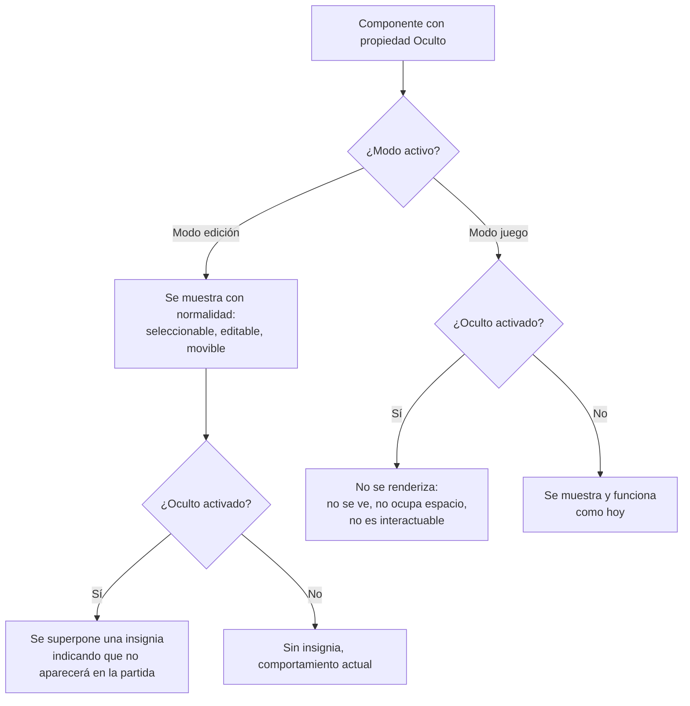

- **Nombre**: Propiedad general "Oculto" en componentes
- **Código**: 00100
- **Tipo**: change

## Prompt original del usuario

añade una propiedad general a todos los elementos llamada "Oculto":
- true = el elemento solo aparece en modo edición, no en modo juego
- false (por defecto) = el elemento aparece en todos los modos

## Descripción completa

Se añade una nueva propiedad general "Oculto" a los componentes del proyecto (aplica a los cinco tipos existentes — texto, tablero, dado, documento, carta —, no a recursos ni a mazos, que no tienen representación propia en modo juego).

- Valor por defecto: desactivado (visible en todos los modos, sin ningún cambio respecto al comportamiento actual).
- Cuando "Oculto" está activado en un componente, ese componente deja de aparecer por completo en modo juego: no se ve en la mesa, no ocupa espacio, no se puede seleccionar ni interactuar con él, ni aparece en ningún listado de ese modo — se comporta exactamente como si no existiera para quien está jugando.
- En modo edición, en cambio, un componente marcado como "Oculto" se sigue mostrando con total normalidad: aparece en la mesa y en el listado de componentes, se puede seleccionar, mover, redimensionar y editar igual que cualquier otro. La marca de "Oculto" no restringe nada en modo edición, solo afecta a si aparece o no en la partida.
- Para poder distinguir a simple vista, en modo edición, qué componentes están marcados como "Oculto" (y por tanto no se verán al jugar), cada uno de esos componentes muestra sobre la mesa una pequeña insignia identificativa — igual que ya ocurre hoy con los componentes "Bloqueados", que muestran un candado. En modo juego esta insignia no aplica (el componente, al no mostrarse, no puede llevarla).
- La propiedad se edita con un checkbox "Oculto" en el formulario general de edición de un componente, junto a los demás ajustes generales ya existentes, con su misma ayuda contextual explicando el efecto. Orden de los checkboxes en ese formulario: Bloqueado, **Oculto**, Mostrar tooltip, Subir al mover/interactuar — el nuevo checkbox va en segundo lugar, justo después de "Bloqueado", no al final.
- Se guarda junto con el resto de datos del componente: sobrevive a recargar la página, y se incluye en la exportación/importación de la partida, igual que el resto de propiedades generales. Un componente guardado con una versión anterior del proyecto, que todavía no tenga esta propiedad, se comporta como si estuviera desactivada (visible en todos los modos), sin ningún efecto sorpresa.

### Puntos de alcance resueltos con el usuario

- **¿A qué elementos aplica?** Solo a componentes (los dibujados en la mesa). No aplica a recursos de la galería ni a mazos, que no tienen presencia visual propia en modo juego.
- **¿Se ve distinto en modo edición?** Sí: se ve con normalidad y editable, pero con una insignia visual que indica que no aparecerá en la partida (mismo criterio que ya existe para "Bloqueado").
- **¿Qué pasa en modo juego?** El componente no se renderiza en absoluto: no ocupa espacio ni es interactuable, como si no existiera.

## Diagrama de flujo

## Apuntes técnicos

- El campo nuevo (`oculto`, booleano) va al mismo nivel que `bloqueado`/`mostrarTooltip`/`subirAlMoverInteractuar` en el modelo de componente (`core/component.js`), no dentro de `properties`. Por defecto `false`.
- Checkbox nuevo en la pestaña "Generales" de `ui/componentModal.js`, mismo patrón que los checkboxes ya existentes (incluyendo `ui/helpIcon.js` asociado).
- El indicador visual en modo edición debe reutilizar el patrón ya existente de `showLockIndicator`/`createLockBadge` en `ui/componentRenderer.js` (parámetro nuevo análogo, p.ej. `showHiddenIndicator`, con su propio helper de insignia) en vez de crear un mecanismo distinto.
- El filtrado en modo juego debe aplicarse en el/los punto(s) donde `modes/play/playMode.js` obtiene la lista de componentes a pasar a `renderComponentsOnTable` (y a cualquier otro listado de ese modo, si lo hubiera), no dentro de `ui/componentRenderer.js` — para no tener que tocar la lógica de renderizado genérica compartida con modo edición.
- Pendiente de decidir en `ms-how`: si `oculto` debe sincronizarse entre una Copia vinculada (`copyOf`) y su original, o quedar independiente por copia (como `bloqueado`, `x`/`y` y `order`). Antes de decidirlo, confirmar leyendo `core/component.js` (`syncCopyWithOriginal`, `NON_SYNCED_PROPERTY_KEYS`) qué campos generales de primer nivel se sincronizan hoy realmente, ya que `ARCHITECTURE.md` no lo detalla con precisión completa para todos los campos generales.
