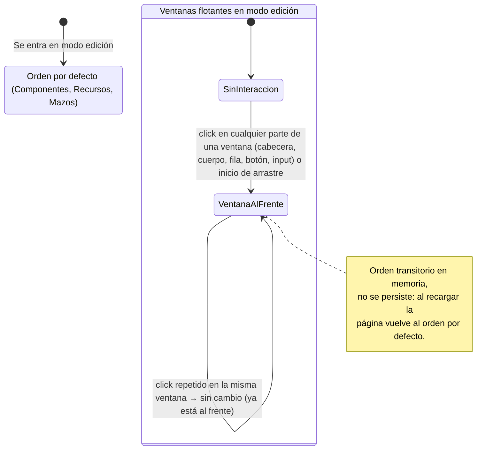

- **Nombre**: Traer al frente la ventana flotante usada en modo edición
- **Código**: 00101
- **Tipo**: change

## Prompt original del usuario

al seleccionar o usar una ventana en el modo edición (recursos, mazos, componentes), esa ventana debe pasar automáticamente a primer plano, sobre todo lo demás

## Descripción completa

En el modo edición hay varias ventanas flotantes independientes (actualmente: Componentes, Recursos y Mazos), cada una con su propia posición, tamaño y estado de colapso, que el usuario puede mover libremente por la pantalla y que a menudo terminan solapándose. Hoy el orden en el que se solapan es siempre el mismo (Componentes, luego Recursos, luego Mazos) y no cambia nunca, independientemente de con cuál esté interactuando el usuario en cada momento.

Con este cambio, en cuanto el usuario interactúa de cualquier forma con una de estas ventanas —haciendo click en cualquier parte de ella (su cabecera, su contenido, una fila de su listado, un botón, un campo) o empezando a arrastrarla para moverla— esa ventana pasa automáticamente a mostrarse por encima de todas las demás ventanas flotantes del modo edición, sin necesidad de ninguna acción adicional para "traerla al frente".

Este comportamiento es un mecanismo general del modo edición, no algo específico de Componentes, Recursos o Mazos: cualquier ventana flotante nueva que se incorpore más adelante a ese modo se comporta igual automáticamente.

### Casos límite y comportamiento resuelto

- **Ventana ya en primer plano**: si el usuario vuelve a interactuar con la ventana que ya está delante de las demás, no hay ningún cambio visible (ya estaba en primer plano).
- **Ventana colapsada**: una ventana colapsada (solo con su cabecera visible) sigue pudiendo traerse al frente haciendo click en esa cabecera.
- **Persistencia**: este orden es transitorio, solo dura mientras la página está abierta — no se guarda en el autoguardado ni se recuerda entre sesiones. Al recargar la página, el orden vuelve siempre al orden por defecto actual (Componentes, Recursos, Mazos).
- **Modales de edición** (la ventana de configurar un componente, un recurso o un mazo, etc.): siguen mostrándose por encima de todas las ventanas flotantes, como ya ocurre hoy; no forman parte de este mecanismo y no se ven afectadas por él.
- **Sin relación con el apilado de componentes sobre la mesa**: este cambio afecta únicamente al orden en el que se solapan las ventanas flotantes del modo edición entre sí. No tiene relación con el orden de apilado visual de los componentes del juego dibujados sobre la mesa (ese orden ya existe hoy de forma independiente y no se modifica).
- **Alcance de uso**: esto solo aplica en modo edición, que es donde existen estas ventanas flotantes; el modo juego no tiene ventanas equivalentes.

### Diagrama de flujo

## Apuntes técnicos

- Las tres ventanas (`ui/componentList.js`, `ui/resourceList.js`, `ui/deckList.js`) se montan como paneles hermanos en `modes/edit/editMode.js` (funciones `renderTable`/`renderList`, `renderResourcePanel`, `renderDeckPanel`), cada una con su propio `panelState`/`resourcePanelState`/`deckPanelState` en `core/state.js` para posición/ancho/alto/colapso/columnas — pero sin ningún campo de orden de apilado (z-index) hoy.
- El CSS fijo actual (`src/styles/main.css`) da `z-index: 15` a `.component-panel-container`, `.resource-panel-container` y `.deck-panel-container` (mismo valor los tres), por lo que hoy el "quién gana" al superponerse depende solo del orden de inserción en el DOM.
- El arrastre de cada ventana se inicia con un listener `mousedown` en la cabecera (`header.addEventListener('mousedown', ...)`, ver `ui/componentList.js` línea 222 y análogos en `ui/resourceList.js`/`ui/deckList.js`), y cada componente de panel expone callbacks `onPanelMove`/`onPanelResize`/`onToggleCollapse` hacia `editMode.js`. Traer al frente con "cualquier click" implica añadir un listener a nivel del contenedor del panel (captura o el propio `mousedown`/`click`), no solo al `mousedown` de la cabecera.
- El estado de "ventana al frente" encaja con el patrón ya usado para la selección transitoria de fila (`selectedComponentId` en `editMode.js`/`playMode.js`): variable de módulo fuera de `renderEditMode`, para sobrevivir a los remontados por `components:changed`, `resources:changed`, `decks:changed`, y no persistida en `core/state.js`.
