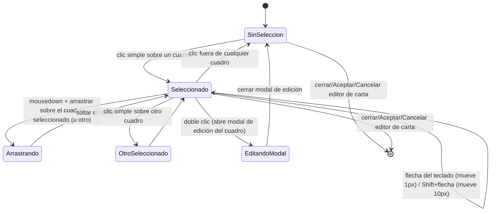

- **Nombre**: Selección de cuadros de texto y movimiento con flechas del teclado en el editor de cartas
- **Código**: 00104
- **Tipo**: change

## Prompt original del usuario

Los cuadros de texto que se añadan a una carta en el editor, si están seleccionados, deben poder moverse usando los cursores del teclado para un ajuste fino

Añade una ayuda completa en la ventana del editor de cartas con todas sus funcionalidades: icono de ayuda + modal informativa

## Descripción completa

Se añade a los cuadros de texto de las caras de una carta (los que se editan/mueven dentro del editor de cartas) la posibilidad de seleccionarlos y, estando seleccionados, moverlos con las flechas del teclado para un ajuste fino de su posición.

Hoy el editor de cartas no tiene ningún concepto de "cuadro de texto seleccionado": al hacer clic y arrastrar sobre un cuadro, el arrastre empieza directamente, y el doble clic abre la modal de edición de ese cuadro. No existe un estado de selección persistente ni una marca visual de "esto está seleccionado". Este cambio introduce esa selección desde cero, como base necesaria para el movimiento por teclado.

- **Selección**: un clic simple (sin arrastrar) sobre un cuadro de texto lo selecciona. Solo puede haber un cuadro seleccionado a la vez por cara. Se deselecciona al hacer clic fuera de él (en el lienzo o sobre otro cuadro, que pasa a ser el nuevo seleccionado), al abrir su modal de edición mediante doble clic, o al cerrar/aceptar/cancelar el editor de carta.
- **Indicador visual de selección**: un cuadro seleccionado muestra un contorno de resaltado alrededor de su área, visualmente distinto del borde propio de su contenido (que sigue funcionando igual y de forma independiente).
- **Movimiento con flechas**: con un cuadro seleccionado y el foco fuera de cualquier campo de texto/input de la modal, las flechas del teclado (↑ ↓ ← →) mueven el cuadro 1px (de diseño) por pulsación, en la dirección correspondiente. Combinado con Shift, el paso pasa a ser de 10px por pulsación, para desplazamientos más rápidos.
- **Convivencia con el arrastre por ratón**: el arrastre con ratón sigue funcionando exactamente igual que hoy; mover con teclado es una forma adicional de ajustar la posición, no la sustituye. Arrastrar un cuadro con el ratón también lo selecciona (si no lo estaba ya).
- **Límites de movimiento**: igual que ya ocurre hoy al arrastrar con ratón (que no limita la posición a los bordes de la carta), mover con flechas tampoco limita la posición — se mantiene la misma libertad que ya existe, sin introducir una restricción nueva.
- **Alcance**: aplica igual en ambas caras de la carta (frontal y trasera). No afecta al tipo de componente genérico "Texto" que se coloca suelto sobre la mesa (fuera del editor de cartas), que queda fuera de este cambio.
- **Persistencia**: mover con flechas actualiza la posición del cuadro en el editor al instante (igual que el arrastre con ratón), pero el cambio solo se guarda de verdad en el componente si el usuario pulsa "Aceptar" en la modal del editor de carta; si pulsa "Cancelar" o cierra sin aceptar, el movimiento no se conserva (mismo comportamiento ya existente para cualquier ajuste hecho dentro de esta modal).

### Ampliación: ayuda completa del editor de cartas

Se añade un icono de ayuda ("?") en la cabecera del editor de cartas, junto al título "Editor de cartas". Al pulsarlo, se abre una ventana informativa que explica, en un listado breve, todas las funcionalidades disponibles en esta ventana:

- Elegir la proporción/forma de la carta.
- Elegir una imagen para cada cara (frontal/trasera) y ajustarla (zoom, posición, transparencia).
- Configurar el borde de la carta (color y grosor), de forma independiente por cara.
- Añadir un cuadro de texto nuevo a una cara.
- Mover un cuadro de texto arrastrándolo con el ratón.
- Redimensionar un cuadro de texto arrastrando su esquina.
- Editar el contenido y el estilo de un cuadro de texto (haciendo doble clic sobre él).
- Seleccionar un cuadro de texto con un clic y moverlo con precisión usando las flechas del teclado, tal y como añade este mismo cambio.
- Aceptar o cancelar los cambios hechos en el editor.

Esta ayuda es puramente informativa (no hay acciones ni configuración dentro de ella) y no depende de que haya ningún cuadro de texto seleccionado ni de la cara que se esté viendo — siempre muestra el mismo contenido completo.

### Preguntas de alcance resueltas

- ¿Paso mayor con Shift+flecha? Sí: flecha sola mueve 1px, Shift+flecha mueve 10px.
- ¿Límite a los bordes de la carta? No, se mantiene la misma libertad que ya tiene el arrastre con ratón hoy (que tampoco limita).
- ¿Dónde va el icono de ayuda de la ampliación? Junto al título "Editor de cartas", en la cabecera — es la primera ayuda de este proyecto que cubre una ventana entera en vez de un campo concreto.

### Diagrama de flujo (selección → movimiento → deselección)

## Apuntes técnicos

- Fichero principal a modificar: `src/ui/cardEditorModal.js`, función `renderTextBox(caraKey, textBox, previewScale)` (línea ~337), que hoy ya gestiona el `mousedown`/`mousemove`/`mouseup` de arrastre (línea ~372-398) y el `dblclick` de apertura de modal (línea ~356-370), pero no mantiene ningún estado de selección ni escucha `keydown`.
- No existe hoy ningún manejador de teclado dentro de `cardEditorModal.js`. El único manejador de teclado global relevante es `src/ui/globalShortcuts.js` (`initGlobalShortcuts`), que escucha `keydown` a nivel de `document` para Escape/Enter/Delete sobre modales genéricas (patrón `.modal-overlay`/`.modal__footer`) — no conoce nada específico de cuadros de texto ni de "seleccionado", y no debería tocarse para este cambio; el manejador de flechas de este cambio es independiente y local al editor de carta.
- Precedente de manejo de teclado a nivel de campo (no de lienzo): `imageAdjustModal.js` solo escucha `keydown` en inputs de texto concretos (Enter para confirmar); no hay precedente de mover un elemento del lienzo con flechas en ningún otro sitio del proyecto — este es el primer caso.
- El arrastre con ratón actual (`handleMouseMove`, línea ~377-382) no aplica ningún clamping de `textBox.x`/`textBox.y` a los límites de la carta; el movimiento por teclado debe seguir ese mismo criterio (sin clamping).
- El modelo de datos `TextBox` (sección 4 de `ARCHITECTURE.md`) no necesita campos nuevos: el cambio es puramente de interacción (selección + teclado) sobre los campos `x`/`y` ya existentes.
- No se ha detectado ninguna incongruencia entre la documentación técnica (`ARCHITECTURE.md`, `STYLE_BIBLE.md`) y el código real de `cardEditorModal.js` en lo referente a este cambio.
- Precedente visual ya existente en `src/styles/main.css` (fuera del editor de cartas, para el componente "Texto" suelto sobre la mesa): `.text-box--selectable`/`.text-box--selected`, con `outline: 3px dashed var(--accent-blue); outline-offset: 4px` para el estado seleccionado, y `outline: 2px dashed var(--accent-blue)` para `:hover`. El editor de cartas ya tiene su propio `.card-editor-modal__textbox:hover { outline: 1px dashed var(--accent-blue); }` (línea ~1127), por lo que el nuevo indicador de "seleccionado" debe distinguirse claramente de ese hover ya existente (p. ej. outline sólido en vez de discontinuo, o mayor grosor/offset) — a decidir en detalle por `ms-how`.
- Ayuda del editor: reutilizar `createHelpIcon`/`openHelpModal` de `src/ui/helpIcon.js` (patrón ya existente en el proyecto), pasándole `html` (el contenido supera el umbral de 200 caracteres que hace que se muestre como modal en vez de tooltip, `MODAL_THRESHOLD` en ese mismo fichero). Insertarlo en `openCardEditorModal` (`cardEditorModal.js`, línea ~35-38), junto al `header` que hoy solo tiene `header.textContent = 'Editor de cartas'` — hay que pasar de texto plano a un contenedor con el título más el icono. Hasta ahora todo uso de `createHelpIcon` en el proyecto (`componentModal.js`) es junto a un campo/checkbox concreto con `text` corto (tooltip); este es el primer caso de una ayuda global de ventana completa con contenido largo (modal).
