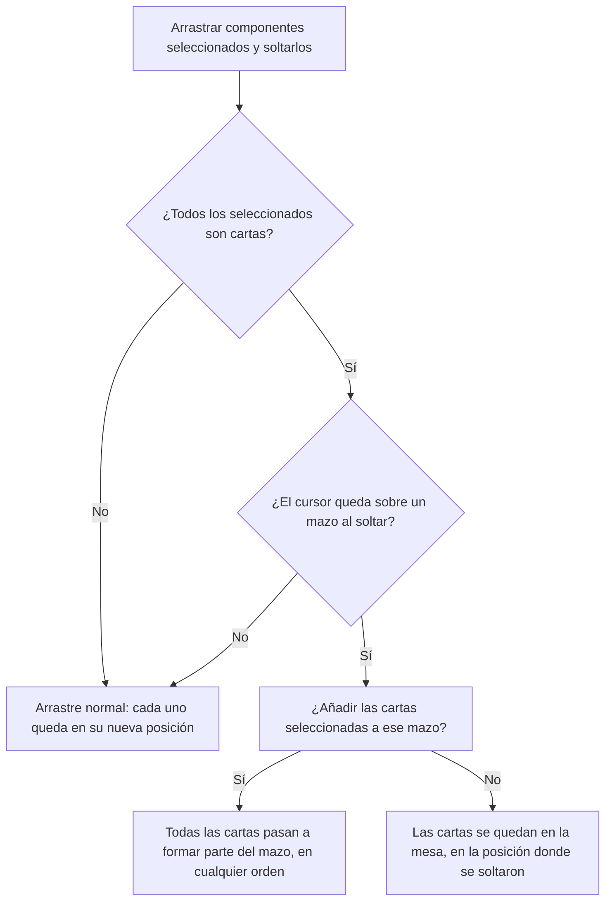
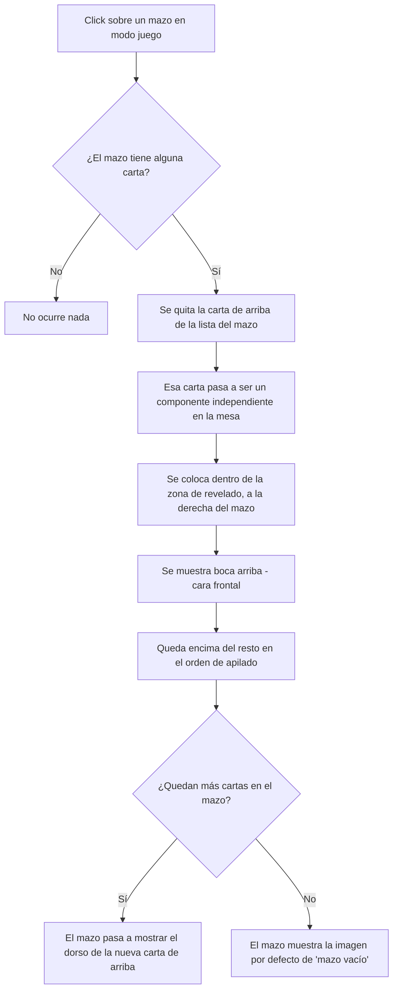
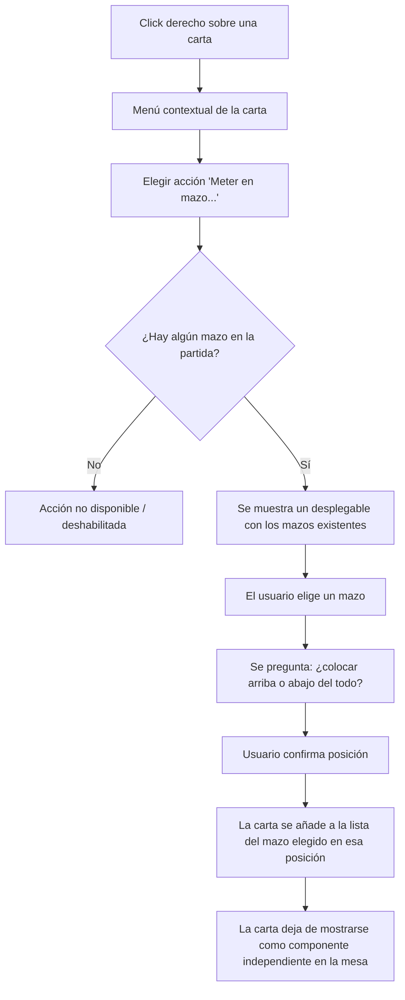

- **Nombre**: Elemento "Mazo" (pila de cartas) y acción "Meter en mazo..." desde las cartas
- **Código**: 00106
- **Tipo**: change

## Prompt original del usuario

quiero implementar un nuevo elemento que es el "mazo":
- visualmente son cajas llenas de elementos carta en la que se ve el dorso de la carta que esté arriba del todo. Si el mazo está vacío, muestra una imagen por defecto
- contienen elementos cartas ordenados y siempre bocabajo
- Al hacer clic sobre un mazo: saca del mazo la carta colocada arriba del todo y la colca al lado, boca arriba
- En el menú contextual de los mazos:
    - añadir el número de cartas que contiene
    - añadir la acción barajar, para barajar las cartas que contiene el mazo

Otras cosas:
- en el menú contextual de la cartas añadir ahora una acción llamada "Meter en mazo..." para permitir elegir un mazo de un desplegable con los mazos disponibles -> entonces pregutna si la quieres colocar arriba o abajo y luego la carta se mete en el mazo

Añade en el menú contextual del mazo en el modo juego una opción para ver el contenido del mazo. Entonces abre una modal con una vista de la cara frontal de cada carta, su id y la posibilidad de sacarla del mazo (entonces aparecerá en la mesa).

En el modo edición el botón para ver el contenido del mazo debe estar en las propiedades del mazo

Añade a la representación visual del mazo una zona a la derecha (enmarcada) dónde se va a revelar la carta, para que el usuario sepa dónde aparecerá.

Añade también una propiedad específica del mazo (modo edición) para indicar si debe representarse en vertical (por defecto) o en horizontal. Crea mockups para validar todas las opciones

[Elegida opción A: la zona de revelado va siempre a la derecha del mazo, con su misma altura, tanto en vertical como en horizontal. Texto de la zona simplificado a "Carta revelada".]

En el modo edición implementa una nueva funcionalidad:
-Cuando arrastremos una o más cartas seleccionadas, SOLO si todos los elementos seleccionados con cartas y, al soltarlas, el cursor está sobre un mazo, pregunta al usuario si desea añadir todas las cartas seleccionadas a ese mazo.
    - Sí: las cartas se añaden a ese mazo en cualquier orden
    - No: las cartas se quedan en la mesa de juego en su nueva posición.

[Aclarado: la selección múltiple de componentes que esta funcionalidad necesita no existe todavía y se está desarrollando aparte, en otro cambio — queda documentada aquí pero depende de esa otra funcionalidad.]

## Descripción completa

Se añade un nuevo tipo de componente, "Mazo", que representa visualmente una caja/pila de cartas boca abajo.

- Un mazo contiene una lista ordenada de cartas (componentes de tipo "Carta/Ficha" ya existentes en la partida), siempre boca abajo mientras están dentro. Mientras una carta pertenece a un mazo, no se muestra como componente independiente en la mesa: solo existe "representada" a través del mazo.
- El aspecto visual del mazo es el diseño de la cara trasera de la carta que esté arriba del todo en cada momento (cambia si se saca esa carta o si se baraja el mazo), escalado al tamaño de la caja del mazo. Si el mazo está vacío (sin ninguna carta dentro), se muestra en su lugar una imagen/gráfico neutro por defecto, no dependiente de ningún recurso subido por el usuario.
- El mazo es un componente más de la mesa: tiene su propia posición, tamaño y el resto de propiedades generales de cualquier componente (bloqueado, oculto, grupo, etc.), y se da de alta/edita/borra igual que el resto de tipos, desde el modo edición (modal previa de tipo "+ Añadir componente", modal de configuración con sus propias propiedades específicas).
- **Solo en modo juego**: un click sobre el mazo saca la carta que esté arriba del todo (la quita de la lista del mazo) y la coloca como componente independiente en la mesa, dentro de la "zona de revelado" marcada junto al mazo (ver más abajo), mostrando su cara frontal y quedando por encima del resto en el orden de apilado.
- **Menú contextual del mazo (modo juego)**: añade, en la sección específica del tipo, una fila informativa con el número de cartas que contiene actualmente, y una acción "Barajar" que reordena aleatoriamente las cartas dentro del mazo (sigue sin verse ningún cambio salvo que la carta de arriba —y por tanto el dorso mostrado— cambie).
- **Menú contextual de una carta (modo juego)**: añade una nueva acción "Meter en mazo...", que abre una ventana con un desplegable de los mazos existentes en la partida (si no hay ninguno creado, la acción no debe ofrecerse o debe quedar deshabilitada) y, tras elegir uno, pregunta si la carta se coloca arriba o abajo del todo en ese mazo. Al confirmar, la carta pasa a formar parte de la lista de ese mazo (arriba o abajo, según lo elegido) y deja de mostrarse como componente independiente en la mesa.
- **Borrado de un mazo** (solo posible en modo edición, como el resto de componentes): al eliminar un mazo, las cartas que contuviera dejan de estar asociadas a él y vuelven a mostrarse en la mesa como componentes independientes, en su última posición conocida — no se eliminan.
- En modo edición, el mazo se comporta como cualquier otro componente (selección, arrastre, redimensionado, edición), sin la interacción de "sacar carta", que es exclusiva de modo juego.

### Ampliación: ver el contenido de un mazo

Se añade una forma de consultar y gestionar el contenido completo de un mazo, no solo la carta de arriba:

- **Desde el menú contextual del mazo (modo juego)**: nueva acción "Ver contenido...", junto a "Barajar". Abre una ventana con la lista de todas las cartas que contiene el mazo en ese momento, en el mismo orden en que están apiladas (la de arriba primero). Cada fila muestra una miniatura con el diseño real de la cara frontal de esa carta, su identificador, y un botón "Sacar".
- **Desde el modo edición**: la misma ventana se abre desde un botón "Ver contenido del mazo" en la pestaña de propiedades específicas del mazo (sustituye a un simple contador de cartas).
- **Sacar una carta desde esta ventana**: se puede sacar cualquier carta de la lista, no solo la de arriba del todo. Al pulsar "Sacar" en una fila, esa carta deja el mazo y aparece en la mesa dentro de la zona de revelado del mazo (ver más abajo), boca arriba — mismo resultado que hacer click directamente sobre el mazo, pero aplicable a cualquier carta de la pila, no solo a la primera. La acción se aplica al momento sobre la partida en curso, tanto si la ventana se abrió desde modo juego como desde modo edición (no queda pendiente de aceptar/cancelar ninguna otra modal).
- **Mazo vacío**: la ventana se abre igualmente y muestra un mensaje indicándolo, en vez de una lista vacía.
- **Actualización en vivo**: al sacar una carta con la ventana abierta, su fila desaparece de la lista al momento, sin cerrar la ventana; si era la última, la lista pasa a mostrar el mensaje de mazo vacío. La ventana no se cierra sola en ningún caso, incluido al vaciarse el mazo.

### Diagrama de flujo — ver contenido de un mazo y sacar una carta cualquiera

```mermaid
flowchart TD
    A["Ver contenido..." del mazo\n(menú contextual en juego, o\nbotón en propiedades en edición)] --> B{¿Tiene cartas el mazo?}
    B -- No --> C[Se muestra "Este mazo no tiene cartas"]
    B -- Sí --> D[Lista de cartas: miniatura + id + botón Sacar,\nen el mismo orden de la pila]
    D --> E[Usuario pulsa "Sacar" en una fila]
    E --> F[Esa carta se quita de la lista del mazo]
    F --> G[Aparece en la mesa junto al mazo, boca arriba]
    G --> H{¿Quedan más cartas?}
    H -- Sí --> D
    H -- No --> C
```

### Ampliación: zona de revelado y orientación del mazo

- **Zona de revelado**: junto al mazo se muestra siempre un recuadro punteado ("Carta revelada") que marca dónde va a aparecer la carta al sacarla — tanto con el click directo sobre el mazo como desde "Ver contenido...". Es parte de la propia representación del mazo (no un componente aparte, no seleccionable ni interactuable) y se muestra en los dos modos (edición y juego), aunque sacar cartas solo sea posible en modo juego — en edición sirve como referencia para maquetar la mesa. Va siempre pegada al lado derecho del mazo, con su misma altura, tanto si el mazo está vacío como si tiene cartas. Si se sacan varias cartas seguidas sin mover la anterior fuera de la zona, se apilan unas encima de otras en el mismo sitio, igual que ya pasa con el resto de piezas de la mesa.
- **Orientación del mazo**: nueva propiedad específica del mazo, editable solo en modo edición, con dos valores — "Vertical" (por defecto, caja más alta que ancha) u "Horizontal" (caja más ancha que alta). Cambia únicamente la forma de la caja del mazo; la zona de revelado sigue la misma regla en ambos casos (siempre a la derecha, con la misma altura que el mazo en cada orientación).

### Ampliación: arrastrar cartas seleccionadas sobre un mazo (modo edición)

> Esta funcionalidad **depende de la selección múltiple de componentes**, que todavía no existe en el proyecto y se está desarrollando aparte, en otro cambio distinto a este. Queda documentada aquí igualmente para no perder la petición, pero no puede implementarse hasta que esa selección múltiple exista.

En modo edición, al arrastrar un grupo de componentes seleccionados (selección múltiple) y soltarlos:

- Si **todos** los componentes seleccionados son cartas, y al soltar el cursor queda sobre un mazo, se pregunta al usuario si quiere añadir todas esas cartas a ese mazo.
  - **Sí**: todas las cartas seleccionadas se añaden a ese mazo (en cualquier orden interno, sin que el usuario elija posición para cada una) y dejan de mostrarse como componentes independientes en la mesa, igual que cualquier otra carta metida en un mazo.
  - **No**: las cartas se quedan en la mesa como componentes independientes, en la nueva posición donde se soltaron (el arrastre no se deshace).
- Si la selección mezcla cartas con algún otro tipo de componente, o si al soltar el cursor no queda sobre ningún mazo, no se pregunta nada: el arrastre se comporta como uno normal (cada componente queda en su nueva posición).
- Aplica igual con una única carta seleccionada que con varias.

### Diagrama de flujo — arrastrar cartas seleccionadas sobre un mazo



### Preguntas de alcance resueltas

- **¿Qué pasa con las cartas al borrar un mazo?** Un mazo solo puede borrarse en modo edición. Al borrarlo, sus cartas dejan de estar asociadas a él y vuelven a mostrarse en la mesa como componentes independientes (no se eliminan). En modo juego no es posible borrar un mazo, así que este caso no se da nunca durante la partida.
- **¿Cuándo se ve una carta en la mesa?** Regla general confirmada: en modo juego, si una carta está dentro de un mazo no se ve hasta que sale de él (con el click del mazo, o si el mazo se borra); si la carta no está en ningún mazo, se ve en la mesa con normalidad.
- **¿Las cartas dentro de un mazo se ven en modo edición?** No: tampoco se dibujan en la mesa en modo edición (misma regla que en modo juego). Siguen apareciendo con normalidad en el panel flotante de Componentes (por id/tipo), que es la vía para localizarlas y editar su diseño sin sacarlas antes del mazo.
- **¿"Ver contenido del mazo" es la misma ventana en los dos modos?** Sí, y "Sacar" funciona igual en ambos, aplicándose de inmediato a la partida.

### Diagrama de flujo — sacar una carta de un mazo (modo juego)



### Diagrama de flujo — "Meter en mazo..." desde el menú contextual de una carta (modo juego)



## Apuntes técnicos

- El cambio 00105 (a fecha de este análisis presente en el repo como cambios sin commitear: ficheros `core/deck.js`, `ui/deckList.js`, `ui/deckModal.js`, `ui/deckDeleteConfirmModal.js` borrados y `core/group.js`, `ui/groupList.js`, `ui/groupModal.js`, `ui/groupDeleteConfirmModal.js` nuevos) sustituyó el antiguo concepto "Mazo" (entonces una propiedad de "Carta", pensada como base para una futura mecánica de barajar/robar) por "Grupo", puramente organizativo y sin intención de mecánica de juego. Este cambio reintroduce esa mecánica, pero como un tipo de componente independiente ("Mazo"), sin reutilizar "Grupo" ni revertir esa generalización — ambos conceptos conviven sin relación entre sí.
- Modelo de datos propuesto para "Mazo": una lista ordenada de ids de carta en sus propiedades específicas (equivalente conceptualmente al extinto `properties.deckId` de las cartas, pero invertido: ahora el mazo referencia a las cartas, no la carta al mazo).
- Mientras una carta esté referenciada por un mazo, debe excluirse del renderizado normal de componentes en la mesa (efecto visible similar a "oculto", pero derivado automáticamente de su pertenencia a un mazo, no de un checkbox propio) — a revisar junto con `ui/componentRenderer.js` y los puntos transversales de `ARCHITECTURE.md` sección 8 (persistencia, detección de uso de recursos, etc., si aplican).
- El menú contextual actual (`ui/contextMenu.js`) no admite un desplegable embebido en una fila de acción — "Meter en mazo..." debe abrir una ventana/modal aparte, no un `<select>` dentro del menú.
- La selección en modo edición hoy es de un único componente (`selectedComponentId` en `modes/edit/editMode.js`, con toggle) — no existe selección múltiple ni arrastre conjunto de varios componentes a la vez. La funcionalidad "arrastrar cartas seleccionadas sobre un mazo" no se puede planificar en detalle ni implementar hasta que esa selección múltiple exista (en desarrollo en otro cambio, fuera del alcance de este). `ms-how` debe dejar esta parte fuera del plan de implementación de 00106 mientras esa dependencia no esté resuelta, o replanificarla cuando lo esté.
