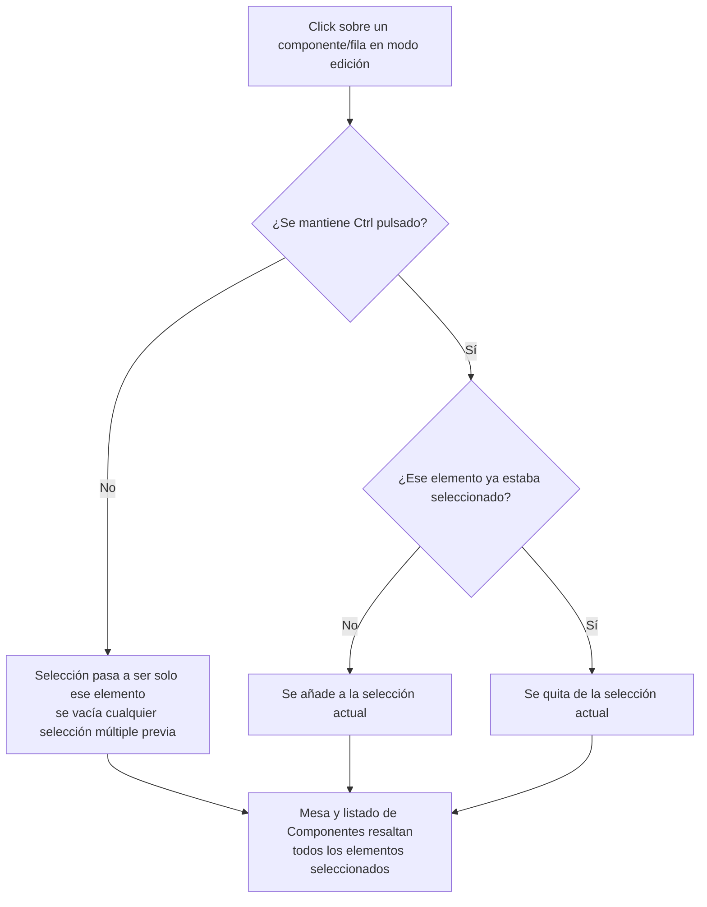
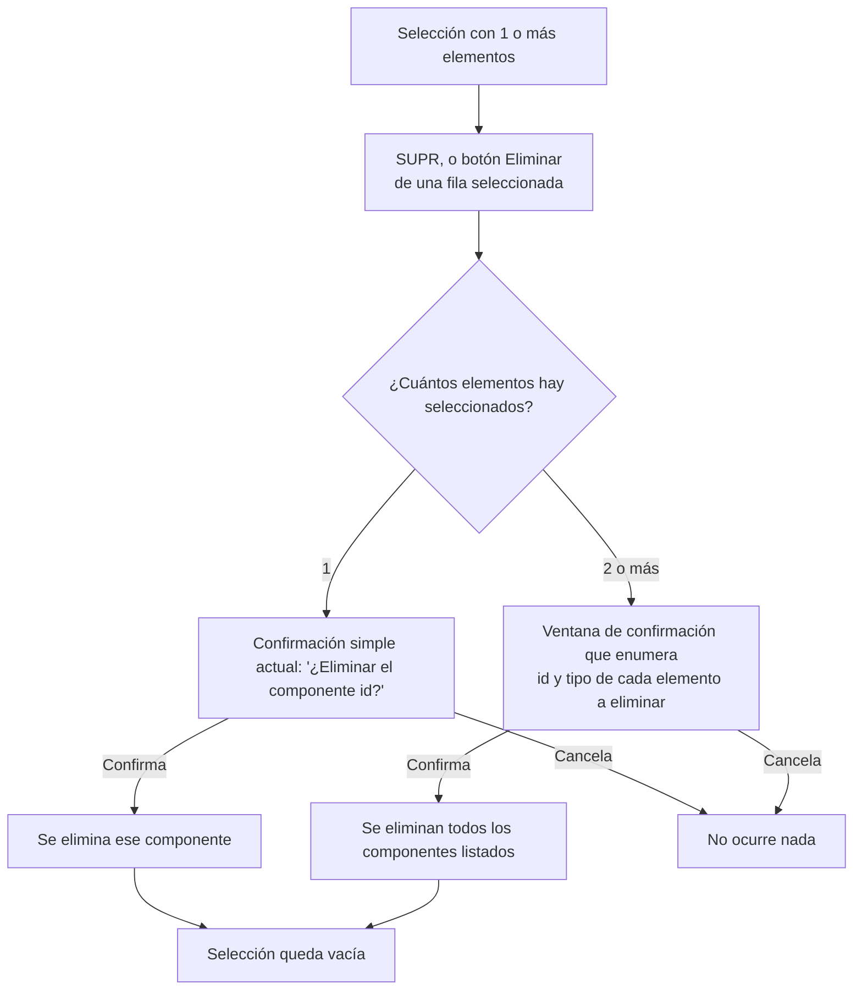
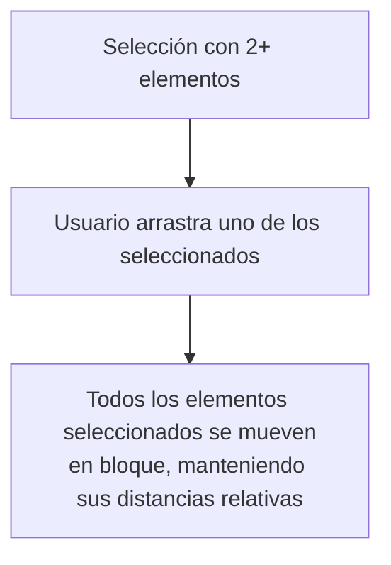

- **Nombre**: Selección múltiple de componentes con Ctrl en modo edición
- **Código**: 00108
- **Tipo**: change

## Prompt original del usuario

en el modo edición permite seleccionar varios elementos usando la tecla Ctrl.
Las acciones actuales sobre un elemento seleccionado se aplican igual sobre todos los elemento seleccionados, enumerando en la ventana de confirmació la lista de elementos que se van a eliminar

### Aclaraciones del usuario tras la propuesta de dudas de alcance

1. Si se hace Ctrl+clic sobre un elemento ya seleccionado, este se deselecciona.
2. Solo la acción de eliminar pasa a aplicarse en bloque sobre toda la selección.
3. Al seleccionar elementos, se actualiza el listado de Componentes para reflejar todos los que están seleccionados.
4. Al arrastrar un elemento con varios seleccionados, se mueven todos en bloque, manteniendo sus distancias relativas.

## Descripción completa

En el modo edición se añade la posibilidad de seleccionar varios componentes a la vez manteniendo pulsada la tecla Ctrl, tanto haciendo clic sobre los componentes dibujados en la mesa como sobre las filas del listado flotante de "Componentes" — ambos sitios comparten ya hoy el mismo estado de selección, y lo seguirán compartiendo con varios elementos.

- **Clic normal (sin Ctrl)** sobre un componente o una fila: selecciona únicamente ese elemento, vaciando cualquier selección múltiple que hubiera antes (comportamiento actual, sin cambios).
- **Ctrl+clic sobre un elemento que no está seleccionado**: lo añade a la selección actual, sin quitar los que ya estaban seleccionados.
- **Ctrl+clic sobre un elemento que ya está seleccionado**: lo saca de la selección (se deselecciona solo ese elemento; el resto de la selección se mantiene tal cual).
- El listado de "Componentes" se actualiza en todo momento para resaltar todos los elementos que forman parte de la selección, no solo uno.
- Sobre la mesa, todos los componentes seleccionados muestran el mismo resaltado visual (contorno discontinuo) que ya se usa hoy para la selección de un único elemento.

### Acciones sobre una selección múltiple

De las acciones que ya existen hoy sobre un componente seleccionado, únicamente **Eliminar** pasa a aplicarse sobre toda la selección a la vez:

- Se puede disparar tanto con la tecla SUPR como con el botón "Eliminar" de cualquier fila del listado que forme parte de la selección múltiple.
- Antes de borrar, se muestra una ventana de confirmación que enumera (identificador y tipo) todos los elementos que se van a eliminar, para que quede claro el alcance de la acción antes de confirmarla.
- Si en ese momento solo hay un elemento seleccionado, el comportamiento no cambia: se sigue pidiendo la confirmación simple de un único elemento, como hasta ahora.
- Al confirmar, se eliminan todos los elementos enumerados y la selección queda vacía. Al cancelar, no se elimina nada y la selección se mantiene igual que estaba.

Las demás acciones del listado de Componentes (Editar, Clonar, Copiar) no cambian de comportamiento: siguen aplicándose solo al componente concreto de la fila donde se pulsa el botón correspondiente, sin verse afectadas por que haya, además, una selección múltiple activa en ese momento.

### Arrastre en bloque

Si hay varios elementos seleccionados y el usuario arrastra uno de ellos sobre la mesa, todos los elementos seleccionados se mueven a la vez, manteniendo entre sí la misma distancia relativa que tenían antes de empezar a arrastrar.

El redimensionado de un componente sigue estando disponible únicamente cuando hay exactamente un elemento seleccionado, igual que hoy: con selección múltiple no se ofrece ningún control de redimensionado.

### Alcance

- Esta selección múltiple es exclusiva del modo edición. El modo juego mantiene su propio comportamiento de selección de un único componente (ligado a su menú contextual), sin ningún cambio.
- Los elementos bloqueados (que no se pueden mover en modo juego) se incluyen igual que cualquier otro en el borrado en bloque, sin ningún caso especial: el bloqueo solo restringe el movimiento en modo juego, nunca el borrado en modo edición.

### Diagrama de flujo — selección con Ctrl

### Diagrama de flujo — eliminar en bloque

### Diagrama de flujo — arrastre en bloque

## Apuntes técnicos

- Estado actual: `modes/edit/editMode.js` mantiene `selectedComponentId` (string|null, un único id) a nivel de módulo, compartido entre `renderTable`/`renderComponentsOnTable` (prop `selectedId`, resaltado `--selected` por tipo en `ui/componentRenderer.js`) y `renderList`/`renderComponentList` (prop `selectedId`, resaltado de fila en `ui/componentList.js`). El toggle de selección único vive en `toggleSelect(component)` (línea ~317 de `editMode.js`). Este cambio debe generalizar ese estado a una colección de ids seleccionados (p.ej. `selectedComponentIds: Set<string>`), y todas las comparaciones `component.id === selectedId` que hoy se hacen en `ui/componentRenderer.js` (todas las ramas por tipo: texto, tablero, dado, documento, carta) y en `ui/componentList.js` pasan a comprobar pertenencia al conjunto.
- El borrado con SUPR hoy vive en `deleteSelectedComponent()` (`editMode.js`, línea ~58), exportada y conectada desde `main.js` vía `initGlobalShortcuts({ onDeleteSelected })`; debe generalizarse a la selección completa y usar una modal de confirmación que enumere los elementos, siguiendo el mismo patrón visual que `ui/groupDeleteConfirmModal.js` (lista de afectados con id y tipo), reservando el `confirm()` nativo actual para cuando la selección tiene un único elemento.
- El botón "Eliminar" por fila en `ui/componentList.js` (línea ~149-157) hoy siempre actúa sobre esa única fila con un `confirm()` propio; debe pasar a comprobar si esa fila pertenece a la selección múltiple actual y, si es así, disparar el borrado en bloque de toda la selección en vez del borrado individual de esa fila.
- El redimensionado en `ui/componentRenderer.js` ya está condicionado a `component.id === selectedId` (comparación de igualdad simple, controla si se muestra el control de resize); al pasar a colección, debe condicionarse además a que la selección tenga tamaño exactamente 1.
- El arrastre en bloque es funcionalidad nueva: hoy `onMove(component, x, y)` en `ui/componentRenderer.js` actualiza la posición de un único componente arrastrado; para moverlos en bloque manteniendo distancias relativas, `editMode.js` necesita, al recibir ese callback con selección múltiple activa, calcular el delta respecto a la posición anterior del componente arrastrado y aplicar ese mismo delta al resto de componentes de la selección.
