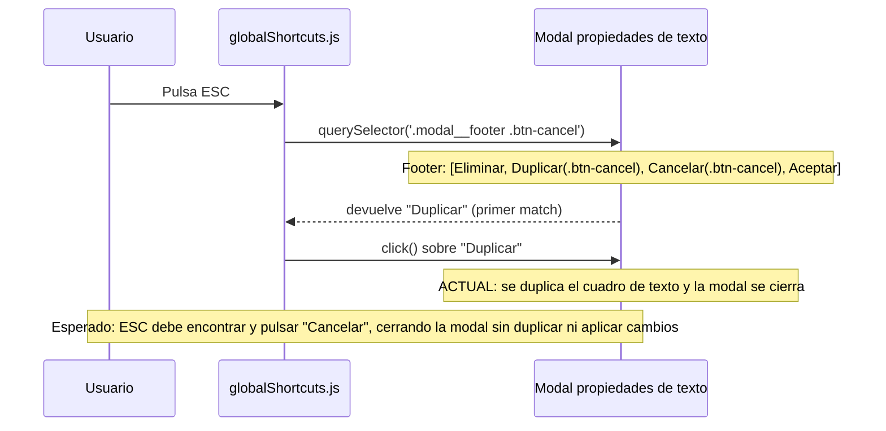

- **Nombre**: ESC duplica el cuadro de texto en vez de cancelar en el editor de cartas
- **Código**: 00111
- **Tipo**: fix

## Prompt original del usuario

en el editor de cartas, en la ventana de propiedades de un texto: si pulso la tecla ESC, me duplica el texto (como si hubiera usado el botón duplicar), en lugar de simplemente cerrar la modal sin aplicar cambios

## Descripción completa

En el editor de cartas, al abrir la ventana de propiedades de un cuadro de texto y pulsar la tecla ESC, en lugar de cerrarse la ventana sin aplicar ningún cambio (comportamiento esperado, equivalente a pulsar el botón "Cancelar"), el cuadro de texto se duplica, exactamente como si se hubiera pulsado el botón "Duplicar".

**Cómo reproducir:**
1. Entrar en el editor de una carta.
2. Abrir la ventana de propiedades de un cuadro de texto existente (doble clic sobre él).
3. Pulsar la tecla ESC.

**Comportamiento actual:** se crea una copia del cuadro de texto (desplazada respecto al original) y la ventana se cierra.

**Comportamiento esperado:** la ventana se cierra sin aplicar ningún cambio ni crear ninguna copia — mismo resultado que pulsar el botón "Cancelar".

## Apuntes técnicos

Contexto reunido por `ms-internal-tech-analysis` (no se detectaron incongruencias entre `ARCHITECTURE.md`/`STYLE_BIBLE.md` y el código):

- El footer de `ui/cardTextBoxModal.js` tiene, en este orden, cuatro botones: Eliminar (`btn-eliminar`), Duplicar (`btn-cancel`), Cancelar (`btn-cancel`) y Aceptar (`btn-accept`).
- El botón "Duplicar" usa la clase `btn-cancel` únicamente por su estilo visual neutro/secundario (patrón reutilizado en muchos otros botones de la app que no son "Cancelar"; esa clase no tiene significado semántico de "cancelar").
- El manejador global de teclado `ui/globalShortcuts.js` (`initGlobalShortcuts`) resuelve la acción de ESC con `topOverlay.querySelector('.modal__footer .btn-cancel')` y hace click en el primer elemento que encuentra, asumiendo que esa clase identifica de forma única al botón Cancelar dentro del footer de la modal activa.
- Como "Duplicar" precede a "Cancelar" en el DOM y ambos comparten la clase `btn-cancel`, `querySelector` devuelve el botón "Duplicar", y ESC lo activa en su lugar.
- Es el único footer de modal de todo el proyecto con dos botones que comparten la clase `btn-cancel`; el resto de modales del proyecto solo tienen un botón con esa clase en su footer, por lo que no reproducen el bug.

Diagrama de la secuencia actual y la esperada al pulsar ESC:

