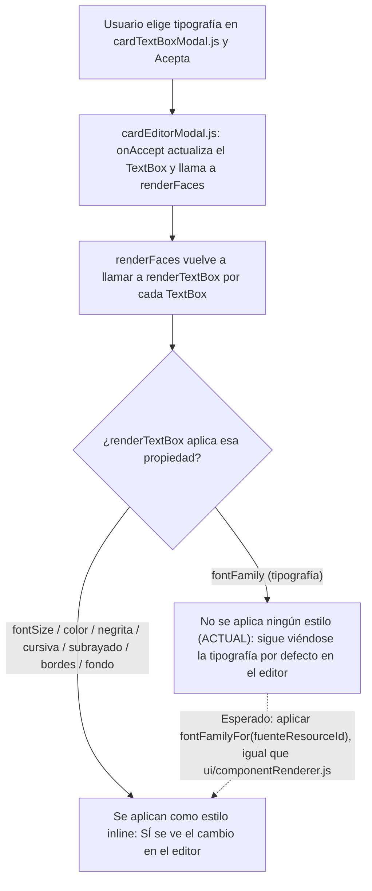

- **Nombre**: la tipografía de un cuadro de texto no se refleja en el editor de cartas hasta reabrirlo
- **Código**: 00112
- **Tipo**: fix

## Prompt original del usuario

cuando cambio la tipografía de un texto en el editor de cartas, no se actualiza. Tengo que aceptar y volver a entrar en el editor para ver el cambio

## Descripción completa

En el editor de cartas, al cambiar la tipografía de un cuadro de texto desde su ventana de propiedades y aceptar ese cambio, la vista previa del editor no llega a mostrar nunca la tipografía elegida — sigue mostrando la tipografía por defecto. El resto de propiedades del cuadro de texto (tamaño, color, negrita/cursiva/subrayado, alineación, bordes, fondo...) sí se actualizan con normalidad en la misma vista previa nada más aceptar.

**Cómo reproducir:**
1. Entrar en el editor de una carta.
2. Abrir la ventana de propiedades de un cuadro de texto y elegir una tipografía distinta de la de por defecto.
3. Aceptar los cambios de esa ventana.

**Comportamiento actual:** la vista previa del cuadro de texto dentro del editor de cartas sigue mostrando la tipografía por defecto, no la elegida.

**Comportamiento esperado:** en cuanto se acepta el cambio de tipografía, la vista previa del cuadro de texto dentro del editor de cartas debe mostrar inmediatamente la tipografía elegida, igual que ya ocurre con el resto de propiedades del cuadro de texto.

## Apuntes técnicos

Contexto reunido por `ms-internal-tech-analysis` (no se detectaron incongruencias entre `ARCHITECTURE.md`/`STYLE_BIBLE.md` y el código):

- `ui/fontFaceRegistry.js` expone `fontFamilyFor(resourceId)`, que da el nombre de `font-family` (`resource-font-<id>`) registrado vía `@font-face` para cada recurso de tipo tipografía. Es el mecanismo ya usado en el resto de la app para aplicar una tipografía de recurso a un elemento.
- `ui/componentRenderer.js` (la carta ya colocada en la mesa, fuera del editor) importa y usa `fontFamilyFor` para aplicar la tipografía elegida de cada `TextBox` — ahí sí se ve correctamente.
- `ui/cardEditorModal.js`, en su función `renderTextBox` (la que pinta cada cuadro de texto en el lienzo del editor), aplica por estilo inline `fontSize`, `color`, `fontWeight`, `fontStyle`, `textDecoration`, borde y fondo del `TextBox` — pero **nunca** aplica `fontFamily`, ni importa `fontFamilyFor`/`ui/fontFaceRegistry.js`. Por eso la vista previa del editor no refleja nunca la tipografía elegida, mientras que el resto de propiedades sí se actualiza al instante porque si están cableadas en esa misma función.
- La solución consiste en aplicar en `renderTextBox` de `ui/cardEditorModal.js` el mismo `fontFamily` que ya calcula `fontFamilyFor(textBox.fuenteResourceId)` en `ui/componentRenderer.js`, con el mismo criterio de "tipografía por defecto" cuando `fuenteResourceId` es `null` o el recurso ya no existe.

Diagrama de la situación actual y la esperada:

