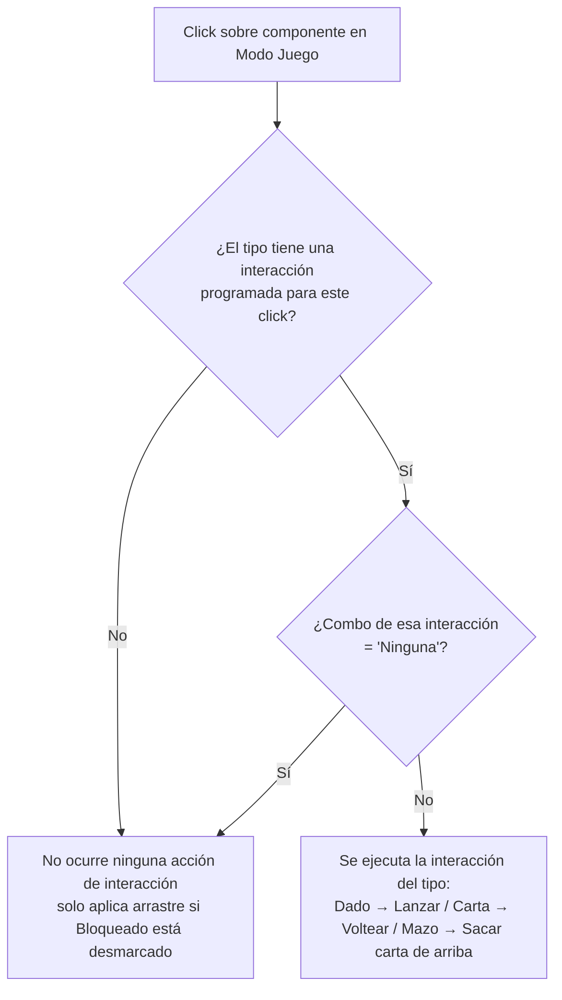

- **Nombre**: Sección "Interacciones programadas" en propiedades generales, con desactivación por combo
- **Código**: 00115
- **Tipo**: change

## Prompt original del usuario

añade en el modo edición, en las propiedades generales de los elementos, una sección con las interacciones programadas y la posiblidad de cambiarlas con un combo en cada caso.
A todas las interacciones que hay ahora programadas, añade una opción "Ninguna" para desactivarla o elegir alguna de las disponibles.

## Descripción completa

En Modo Edición, dentro de la pestaña "Generales" de la modal de configuración de un componente, se añade una nueva sección "Interacciones programadas" que muestra, para el tipo de componente que se está editando, cada interacción que ese tipo tiene programada hoy en Modo Juego (el efecto de hacer click sobre el componente), con un desplegable (combo) por cada una que permite dejarla activa o elegir "Ninguna" para desactivarla.

**Interacciones programadas existentes hoy**, una por tipo (comportamiento actual al hacer click sobre el componente en Modo Juego):

- **Dado**: "Lanzar dado" (tirada aleatoria).
- **Carta/Ficha**: "Voltear carta" (frontal/trasera).
- **Mazo**: "Sacar carta de arriba".
- **Cuadro de texto**, **Tablero** y **Visor de documentos** no tienen ninguna interacción de este tipo hoy.

**Ubicación**: la sección nueva se sitúa en la pestaña "Generales", justo después del desplegable "Grupo" (última sección actual de esa pestaña). Solo se muestra si el tipo de componente que se está editando tiene alguna interacción programada; para "Cuadro de texto", "Tablero" y "Visor de documentos" la sección no aparece en absoluto.

**El combo por interacción**: cada interacción programada del tipo tiene su propio combo con dos opciones — "Ninguna" y el nombre de la interacción (p. ej. "Lanzar dado") —, con esta última seleccionada por defecto (mismo comportamiento que existe hoy, sin cambios, mientras no se toque el combo).

**Efecto de elegir "Ninguna"**: en Modo Juego, el click sobre ese componente deja de disparar esa acción concreta — el dado no se lanza, la carta no voltea, el mazo no saca carta. No afecta a nada más:

- El arrastre (gobernado por el checkbox "Bloqueado", ya existente) sigue funcionando igual, sin relación con este ajuste.
- Para el mazo y la carta, las acciones del menú contextual de Modo Juego (Barajar, Ver contenido..., Meter en mazo...) siguen disponibles igual, no dependen de este ajuste.
- El doble-click sobre el dado, que abre la modal con el resultado a tamaño grande, sigue funcionando igual esté o no desactivada "Lanzar dado" — es una acción de visualización del resultado, no la interacción en sí.
- En Modo Edición no hay ningún efecto: el click sobre un componente nunca ha disparado estas acciones ahí, solo en Modo Juego.

**Flujo de resolución de un click sobre un componente en Modo Juego**, con el nuevo ajuste incorporado:

**Compatibilidad con partidas guardadas**: un componente guardado antes de este cambio (sin este dato) se comporta como si su interacción estuviera activa — mismo criterio de compatibilidad que el resto de checkboxes/ajustes nuevos ya existentes en el proyecto ("Oculto", "Mostrar tooltip", "Subir al mover/interactuar"...).

**Elementos tipo Copia**: este ajuste se sincroniza automáticamente entre una Copia y su original, igual que el resto de propiedades de configuración/diseño (como "Grupo" o "Mostrar tooltip") — a diferencia del estado transitorio de partida (el resultado actual de un dado, la cara mostrada de una carta), que permanece siempre independiente por copia.

**Preguntas de alcance resueltas con el usuario**:

- *¿Qué se considera "interacción programada"?* El efecto de un click sobre el componente en Modo Juego, específico de cada tipo (confirmado: Lanzar dado / Voltear carta / Sacar carta de arriba; ningún otro tipo tiene interacción de este tipo hoy).
- *¿Dónde se ubica la sección?* Al final de la pestaña "Generales", tras "Grupo" (confirmado).
- *¿Cuántas opciones tiene cada combo?* Dos: "Ninguna" y el nombre de la interacción, ya que hoy cada tipo solo tiene una interacción posible (confirmado).
- *¿Afecta el menú contextual, el arrastre o el doble-click del dado?* No, quedan fuera de este ajuste y siguen funcionando igual (confirmado).
- *¿Compatibilidad con componentes ya guardados?* Se comportan como interacción activa, igual que el resto de ajustes nuevos del proyecto (confirmado).
- *¿Se sincroniza con las Copias?* Sí, igual que el resto de propiedades de configuración/diseño (confirmado).

## Apuntes técnicos

- Interacciones actuales disparadas por click en Modo Juego, en `src/ui/componentRenderer.js` (`renderComponentsOnTable`): `onDiceResult` (tipo `'dado'`), `onCartaFlip` (tipo `'carta'`), `onMazoDraw` (tipo `'mazo'`).
- La pestaña "Generales" de la modal de componente vive en `src/ui/componentModal.js`; el desplegable "Grupo" (última sección actual) está sobre la línea 299 en adelante — la nueva sección se añadiría justo después, siguiendo el mismo patrón de `label` + `select` ya usado ahí, y el mismo patrón de checkbox + `createHelpIcon` usado por "Bloqueado"/"Oculto"/"Mostrar tooltip"/"Subir al mover/interactuar" si se decide añadir ayuda contextual.
- El resto de checkboxes de "Generales" (`bloqueado`, `oculto`, `mostrarTooltip`, `subirAlMoverInteractuar`) usan el patrón de "ausente en el objeto = valor por defecto" para compatibilidad con guardados antiguos (`workingComponent.xxx ?? valorPorDefecto`) — el nuevo campo debería seguir el mismo patrón.
- La sincronización con Copias vive en `core/component.js` (`syncCopyWithOriginal`), que propaga explícitamente una lista de campos (`type`, `name`, `image`, `width`, `height`, `mostrarTooltip`, `subirAlMoverInteractuar`, `grupoId`, más las `properties` de diseño); las claves exceptuadas de sincronización están en `NON_SYNCED_PROPERTY_KEYS`. El nuevo campo tendría que añadirse a la lista de campos sincronizados, no a `NON_SYNCED_PROPERTY_KEYS`.
