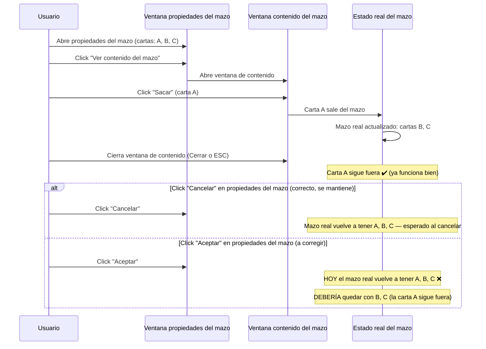

- **Nombre**: Aceptar en propiedades del mazo revierte cartas ya sacadas
- **Código**: 00119
- **Tipo**: fix

## Prompt original del usuario

en el modo edición, al ver el contenido de un mazo, saco una o varias cartas. Si pulso el botón ESC se cierra la modal y la/s carta/s quedan fuera: Ok. Pero si pulso el botón Cerrar de ese modal, la carta vuelve a quedarse dentro del mazo.

## Descripción completa

En modo edición, al abrir las propiedades de un mazo y desde ahí pulsar "Ver contenido del mazo", se abre una ventana con el listado de sus cartas y un botón "Sacar" junto a cada una. Sacar una carta la retira del mazo de inmediato — esta parte ya funciona correctamente, y cerrar esa ventana de contenido (con su propio botón "Cerrar" o con ESC) no revierte nada, también correcto.

El problema aparece al cerrar después la ventana de propiedades del mazo (la que tiene pestañas y los botones "Cancelar"/"Aceptar"):

- Si se pulsa **"Aceptar"**, cualquier carta que se hubiera sacado momentos antes **vuelve a aparecer dentro del mazo**. Esto es incorrecto: "Aceptar" debería guardar los cambios hechos en las pestañas de propiedades sin deshacer las cartas que ya se sacaron.
- Si se pulsa **"Cancelar"**, la carta también vuelve a aparecer dentro del mazo — pero este caso se considera **comportamiento correcto**: cancelar debe descartar todo lo hecho durante esa sesión de edición, incluidas las cartas sacadas mientras la ventana estaba abierta.

### Preguntas de alcance resueltas

- Pregunta: ¿el revertido ocurre en la ventana de "Contenido del mazo" (su propio botón "Cerrar") o en la ventana de propiedades del mazo (Aceptar/Cancelar)?
  Respuesta del usuario: ocurre en la ventana de propiedades del mazo. Al sacar una carta y cerrar la ventana de "Contenido del mazo", la carta se queda fuera correctamente. Luego, en la ventana de propiedades: pulsar "Cancelar" revierte la carta (correcto, esperado), pero pulsar "Aceptar" también la revierte (incorrecto).

### Comportamiento esperado

Solo "Aceptar" debe dejar de revertir las cartas ya sacadas del mazo. El resto de comportamiento actual (botón "Cerrar" y ESC de la ventana de contenido, y "Cancelar" de la ventana de propiedades) se mantiene tal cual está.

## Apuntes técnicos

- `src/ui/componentModal.js`: `workingComponent = { ...component }` es una copia superficial tomada al abrir la ventana de propiedades del mazo, antes de sacar ninguna carta. El botón "Ver contenido del mazo" abre `ui/mazoContentModal.js` pasando `onSacar: (cartaId) => sacarCartaDeMazo(workingComponent.id, cartaId)`.
- `src/core/state.js`, `sacarCartaDeMazo(mazoId, cartaId)`: llama a `replaceComponent(mazo.id, updateComponent(mazo, { properties: changes.mazoProperties }))`, que sustituye la entrada del mazo en `state.components` por un objeto completamente nuevo (con `properties` regenerado sin la carta sacada). El objeto `workingComponent` capturado al abrir la ventana de propiedades sigue apuntando al `properties` antiguo (con la carta todavía en `cartaIds`), porque `sacarCartaDeMazo` nunca actualiza esa copia.
- El botón "Aceptar" de `componentModal.js` invoca `onAccept(workingComponent, isNew)`, que en `src/modes/edit/editMode.js` (`openEditModalFor`) hace `replaceComponent(component.id, updated)` — sobrescribe el mazo (ya actualizado correctamente por "Sacar") con la copia desactualizada de `workingComponent`, reintroduciendo la carta en `cartaIds`.
- El botón "Cancelar" de `componentModal.js` no llama a `onAccept` ni escribe estado (solo `overlay.remove()`); el usuario confirma que, aun así, observa la reversión al cancelar, y la da por buena — es coherente con la semántica esperada de "descartar todo lo tocado en esta sesión".
- No se ha detectado ninguna incongruencia entre `ARCHITECTURE.md` y el código explorado.
