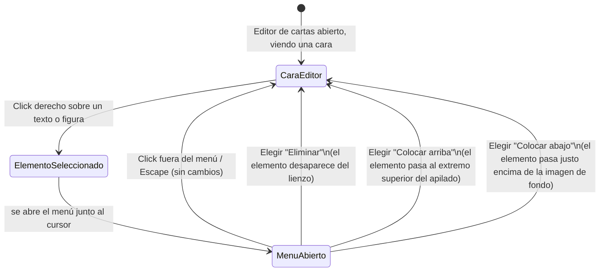

# Navegación — menú contextual de elemento en el editor de cartas

Notas:
- El click derecho selecciona el elemento si no lo estaba ya (mismo elemento que quedaría seleccionado con un click izquierdo).
- Las tres opciones cierran el menú al elegirse, igual que un click fuera o Escape.
- "Colocar arriba"/"Colocar abajo" no abren ninguna pantalla ni modal adicional: el resultado se ve directamente en el lienzo de la cara al cerrarse el menú.
