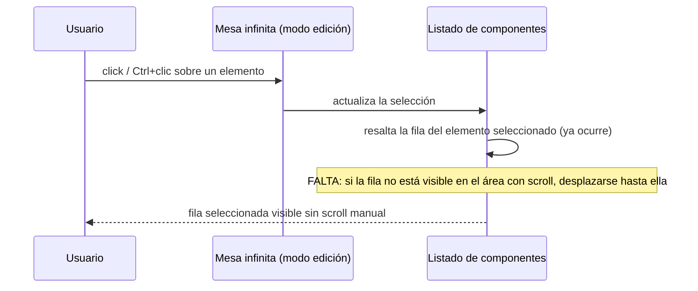

- **Nombre**: Auto-scroll de la lista de componentes hasta el elemento seleccionado
- **Código**: 00125
- **Tipo**: fix

## Prompt original del usuario

cuando selecciono un elemento en el modo edición, la lista de componentes debería selecionarlo también (esto ya ocurre correctamente) y debería moverse hasta la posición del elemento seleccionado (falta)

## Descripción completa

En modo edición, al seleccionar un elemento sobre la mesa (clic normal, o Ctrl+clic para selección múltiple), el listado lateral de componentes ya resalta correctamente la fila correspondiente a ese elemento — esta parte funciona bien y no hay que tocarla.

Lo que falta: si esa fila resaltada no está visible dentro del área con scroll del listado (por ejemplo, porque hay muchos componentes y la fila queda más abajo o más arriba del recorte visible), el usuario tiene que desplazarse manualmente para verla. Se espera que, al seleccionar un elemento, el listado se desplace automáticamente hasta dejar visible la fila del elemento seleccionado, sin que el usuario tenga que buscarla a mano.

### Casos límite a respetar

- Selección múltiple (Ctrl+clic): al añadir un elemento a una selección ya existente, el desplazamiento debe llevar a la vista el elemento recién añadido/tocado, no forzar la vista a otro de los ya seleccionados.
- No debe romper el comportamiento ya existente de recordar la posición de scroll del listado entre refrescos del panel cuando la selección no cambia (por ejemplo, al mover o redimensionar un componente ya seleccionado).
- Si el elemento seleccionado ya es visible dentro del área de scroll, no debe producirse ningún desplazamiento visible (evitar saltos innecesarios).

## Apuntes técnicos

- El resaltado de selección ya funciona vía `selectedIds` en `src/ui/componentList.js` (clase `component-list__row--selected`), alimentado desde `selectedComponentIds` en `src/modes/edit/editMode.js` (`toggleSelect`).
- El contenedor con scroll es `.component-panel__body` (`renderComponentList` en `src/ui/componentList.js`), que ya guarda y restaura `scrollTop` entre remontados (`previousScrollTop`) para no perder la posición de scroll en cada re-render — cualquier solución debe convivir con ese mecanismo, no sustituirlo.
- No existe hoy ningún uso de `scrollIntoView` en el proyecto (comprobado en `src/ui` y `src/modes`): no hay un patrón ya establecido que reutilizar, es una interacción nueva a introducir.
- El listado completo se destruye y reconstruye en cada `renderComponentList` (`container.innerHTML = ''`), así que cualquier desplazamiento automático debe aplicarse después de insertar las filas en el DOM.
