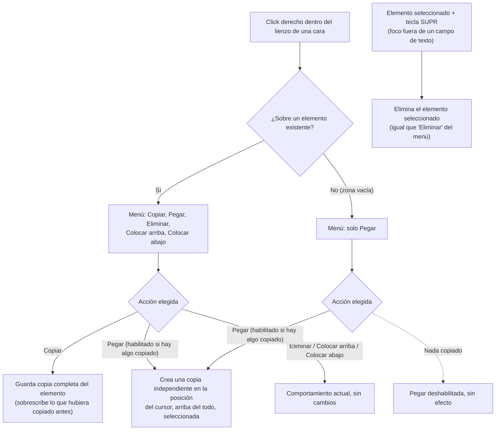

- **Nombre**: Copiar y pegar elementos en el editor de cartas
- **Código**: 00127
- **Tipo**: change

## Prompt original del usuario

en el editor de cartas, añade al menú contextual de los elementos de la carta una opción Copiar (copia el elemento actual, con toda su configuración) y Pegar (saca una copia del elemento que ha sido pegado y lo colca en la posición que tenga el cursor).
solo se permite un elemento copiado. si se copia uno y ya se ha copiado uno antes, nos quedamos solo con el último

(Ampliación posterior del usuario, tras revisar la propuesta inicial:)
4. Pero el menú solo debe aparecer si se pulsa el botón dentro de los límites de una de las dos caras de la carta.
5. Si aparece la opción Pegar siempre, pero deshabilitada.
También implementa el poder borrar el elemento seleccionado con la tecla SUPR.

## Descripción completa

En el editor de cartas, cada cara (frontal y trasera) puede contener elementos — cuadros de texto y figuras geométricas — que hoy se pueden mover, redimensionar, editar, eliminar y reordenar en el apilado (colocar arriba/abajo) mediante un menú que se abre con click derecho sobre el propio elemento. Se añade a ese menú la posibilidad de copiar y pegar elementos, y se añade también el borrado del elemento seleccionado con la tecla SUPR.

### Menú contextual (click derecho)

El click derecho abre menú en cualquier punto dentro de los límites del lienzo de una cara — tanto sobre un elemento existente como sobre una zona vacía de esa cara. Fuera de los límites del lienzo de las dos caras (el resto de la pantalla del editor: botones, campos de borde, etc.) no se abre ningún menú, igual que hasta ahora.

- Si el click derecho fue **sobre un elemento existente**: el menú muestra "Copiar", "Pegar", "Eliminar", "Colocar arriba" y "Colocar abajo" (las tres últimas ya existentes, sin cambios en su comportamiento).
- Si el click derecho fue **sobre una zona vacía** del lienzo de una cara: el menú muestra solo "Pegar" (no hay ningún elemento de referencia sobre el que copiar, eliminar o reordenar).
- **"Pegar" aparece siempre** en ambos casos, pero **deshabilitada** (sin poder pulsarse) mientras no se haya copiado ningún elemento todavía.

### Copiar

Copia toda la configuración del elemento (texto o figura) sobre el que se abrió el menú — todo su aspecto y contenido, tal y como está en ese momento. Solo se permite un elemento copiado a la vez: si ya había algo copiado, copiar un elemento nuevo lo sustituye por completo (sin importar si es del mismo tipo, de la misma cara o de la misma carta que lo anterior). Lo copiado no depende de qué carta o cara esté abierta — sigue disponible aunque se cierre el editor y se abra el de otra carta distinta, mientras no se recargue la página del navegador.

### Pegar

Coloca una copia independiente del elemento guardado (con toda su configuración) en la posición exacta donde se hizo click derecho, dentro de la cara donde se abrió el menú — puede ser una cara distinta a la de origen (p.ej. copiar de la cara frontal y pegar en la trasera), o incluso una carta distinta abierta después. El elemento pegado:

- Es totalmente independiente del original: modificarlo después no afecta al elemento copiado ni a ningún otro.
- Aparece por encima de todos los demás elementos de esa cara.
- Queda seleccionado nada más pegarse.

Pegar no borra lo copiado: se puede pegar el mismo elemento varias veces seguidas, en la misma cara o en otras.

### Borrado con la tecla SUPR

Con un elemento (cuadro de texto o figura) seleccionado, pulsar la tecla SUPR lo elimina — mismo efecto que elegir "Eliminar" desde el menú contextual, sin pedir confirmación. Si el foco está en un campo de texto editable (p.ej. escribiendo dentro de un cuadro de texto), SUPR no elimina el elemento — se comporta como es habitual en ese campo.

### Fuera de alcance

No se añaden atajos de teclado de copiar/pegar (Ctrl+C/Ctrl+V), el portapapeles no se conserva al recargar la página, y el elemento pegado no queda vinculado de ninguna forma al copiado (no se sincronizan entre sí).

### Diagrama de flujo

## Apuntes técnicos

- Menú contextual actual: `ui/cardEditorModal.js` → `openElementContextMenu`, construido sobre el componente genérico `ui/contextMenu.js` (`openContextMenu`, `generalItems`). Hoy el listener `contextmenu` solo está en cada elemento (`renderTextBox`/`renderShape`), no en el lienzo (`canvasInner`/`canvas`) — hay que añadir un listener de click derecho también ahí para el caso "zona vacía", cuidando que el de un elemento (que hace `stopPropagation`) siga teniendo prioridad sobre el del lienzo.
- `ui/contextMenu.js` (`addRow`) no soporta hoy items deshabilitados — hace falta añadir esa capacidad (o construir el item ya inactivo, sin `onClick`, con estilo atenuado) para que "Pegar" pueda mostrarse pero sin poder pulsarse.
- Duplicar ya existe como patrón de referencia parecido (`onDuplicate` en los modales de doble-click de `ui/cardTextBoxModal.js`/`ui/cardShapeModal.js`, con `crypto.randomUUID()` para el nuevo id y `bringElementToFront` de `core/cardFaceElements.js` para subirlo al frente) — Pegar sigue el mismo patrón, cambiando el offset fijo de posición por la posición real del cursor (conversión de coordenadas de pantalla a coordenadas de diseño de la cara vía el `previewScale` ya usado en arrastre/redimensionado, `renderFace`).
- El borrado con SUPR es análogo al `handleKeyDown` ya existente en `cardEditorModal.js` (mueve el elemento seleccionado con flechas, ignora el evento si `isTextEditableElement(document.activeElement)`) y al mismo patrón de tecla (`e.key === 'Delete'`) que usa `ui/globalShortcuts.js` para el borrado de componentes en modo edición.
- El portapapeles (elemento copiado) puede vivir como variable de módulo de `ui/cardEditorModal.js`, mismo patrón que otras variables de módulo transitorias ya documentadas en el proyecto (p.ej. `selectedComponentId`/`panelStackOrder` en `modes/edit/editMode.js`): no persiste en `core/state.js` ni se recupera al recargar la página.
