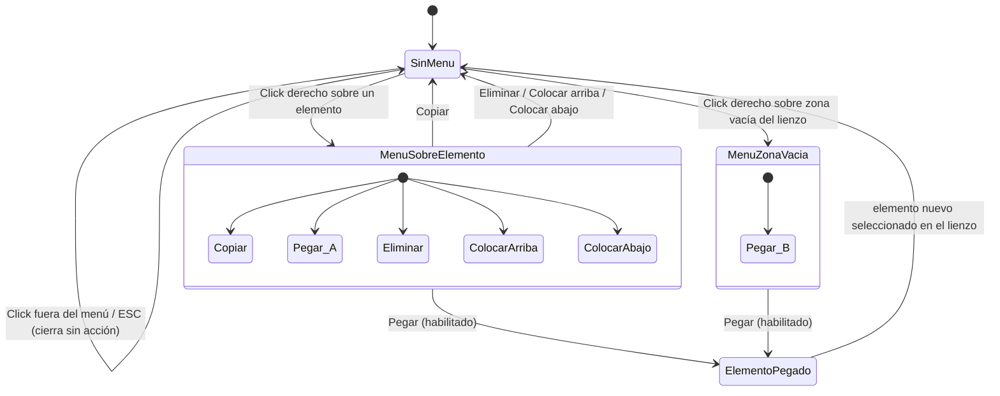

# Navegación — menú contextual con Copiar/Pegar (editor de cartas)

Notas:
- "Pegar" es el mismo destino (`ElementoPegado`) se invoque desde el menú sobre un elemento o desde el menú en zona vacía — el resultado no depende de dónde se abrió el menú, solo de la posición del cursor.
- Si no hay nada copiado, "Pegar" aparece pero no es una transición disponible (deshabilitada): el menú permanece abierto hasta elegir otra opción o cerrarlo.
- Cerrar el menú sin elegir nada (click fuera o ESC) es el comportamiento ya existente, sin cambios.
