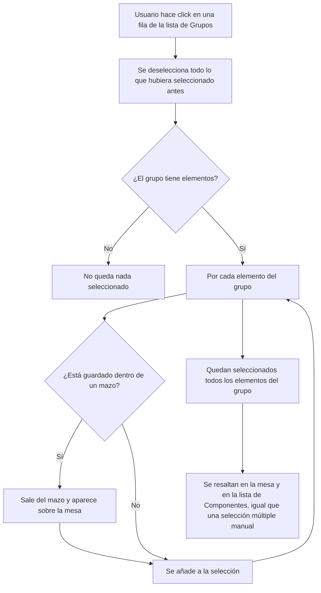

- **Nombre**: Seleccionar todos los componentes de un grupo desde la lista de Grupos
- **Código**: 00130
- **Tipo**: change

## Prompt original del usuario

en la lista de grupos del modo edición quiero que se pueda seleccionar un grupo, y al hacerlo se seleccionen automáticamente todos los elementos que forman del grupo. Si hay otros seleccionados antes, se deseleccionan primero.

## Descripción completa

En la ventana flotante "Grupos" del modo edición, al hacer click sobre una fila de la lista se seleccionan automáticamente, en la mesa y en la lista de Componentes, todos los elementos que pertenecen a ese grupo. Cualquier selección anterior se deselecciona primero por completo — el resultado siempre es exactamente el conjunto de miembros del grupo clicado, nunca una combinación con lo que hubiera seleccionado antes.

Puntos de comportamiento acordados:

1. **Grupo vacío**: si el grupo no tiene elementos, el click deselecciona todo lo anterior y no selecciona nada nuevo.
2. **Sin alternancia (toggle)**: volver a clicar la misma fila de grupo no "deselecciona" nada — cada click vuelve a fijar la selección a los miembros de ese grupo. No existe un estado de "este grupo está seleccionado" que se pueda apagar clicando de nuevo, porque la selección puede divergir del grupo justo después (p.ej. si el usuario añade o quita algún elemento a mano).
3. **Sin modo aditivo**: a diferencia de la selección de elementos individuales (donde Ctrl+clic añade/quita del conjunto), clicar una fila de grupo siempre reemplaza la selección completa, se use o no un modificador de teclado.
4. **Feedback visual en la propia lista de Grupos**: la fila del grupo clicado queda resaltada mientras el usuario mantenga el foco dentro de esa ventana de Grupos; en cuanto el foco pasa a otro sitio (la mesa, otro panel, etc.) el resaltado de la fila desaparece — pero la selección de elementos en la mesa y en la lista de Componentes se mantiene igualmente hasta que ocurra otra acción de selección. Es decir, son dos indicadores independientes: uno ligado al foco (la fila de grupo) y otro ligado a la acción de seleccionar (los elementos seleccionados).
5. **Elementos guardados dentro de un mazo**: si alguno de los elementos del grupo es una carta que en ese momento está guardada dentro de un mazo (por tanto no visible en la mesa), al seleccionar el grupo esa carta sale primero del mazo y aparece sobre la mesa, y a partir de ahí queda seleccionada con normalidad. Si varias cartas del grupo salen del mismo mazo a la vez, todas aparecen apiladas en el mismo punto (la zona donde ya aparece hoy cualquier carta sacada de un mazo), sin ningún reparto especial entre ellas.
6. **Borrar un grupo no cambia**: se confirma explícitamente que esta funcionalidad no modifica el borrado de un grupo ya existente — sigue eliminando solo el grupo (los elementos que pertenecían a él pasan a "Sin grupo"), nunca los elementos en sí.
7. **Sin excepciones por estado del elemento**: se seleccionan todos los miembros del grupo sin importar si están marcados como bloqueados u ocultos.
8. **Botones de la fila**: pulsar "Editar" o "Eliminar" sobre una fila de grupo sigue haciendo solo esa acción, sin disparar además la selección de sus elementos.
9. **Acciones posteriores sobre la selección** (por ejemplo, eliminar en bloque o arrastrar varios elementos a la vez manteniendo su posición relativa) se comportan igual que hoy con cualquier selección múltiple manual — no hay ninguna diferencia por venir de seleccionar un grupo.

No se ha creado ninguna maqueta visual nueva: el resaltado de los elementos seleccionados reutiliza el que ya existe hoy en la mesa y en la lista de Componentes, sin introducir ningún elemento visual nuevo.

## Apuntes técnicos

- `core/group.js` → `getComponentsUsingGroup(group.id, components)`: ya usada por la columna "Elementos" del panel de Grupos, misma función a reutilizar para obtener los miembros del grupo clicado.
- `core/deck.js` → `getCartaIdsEnAlgunMazo(components)` para detectar qué miembros del grupo están guardados dentro de un mazo; `core/state.js` → `sacarCartaDeMazo(mazoId, cartaId)` (ya usada por el botón "Ver contenido del mazo" y por el modo juego) para sacarlos a la mesa — hay que localizar a qué `'mazo'` pertenece cada `cartaId` recorriendo los componentes de ese tipo.
- `ui/groupList.js` no expone hoy ningún callback de selección de fila (solo `onEdit`/`onRemove`); necesita uno nuevo (p.ej. `onSelectGroup`), análogo al `onSelectRow` que ya expone `ui/componentList.js` cableado a `toggleSelect` en `modes/edit/editMode.js`.
- `modes/edit/editMode.js` mantiene `selectedComponentIds` (`Set<string>`, estado de módulo) y la función `toggleSelect` ya existente para gestionarlo; la nueva selección desde grupo es un reemplazo completo del set, no un toggle, así que probablemente conviene una función distinta (no reutilizar `toggleSelect` tal cual).
- El resaltado de fila ligado al foco real (punto 4) apunta a una solución basada en foco del navegador (fila con `tabindex`, estilo `:focus`/`:focus-within` en `src/styles/main.css`) en vez de un estado JS adicional de "grupo activo" — se apaga solo al perder el foco del panel.
- Botones "Editar"/"Eliminar" de `ui/groupList.js` deberán usar `event.stopPropagation()` en su listener de click, mismo patrón que ya usan las acciones de fila en `ui/componentList.js`.
