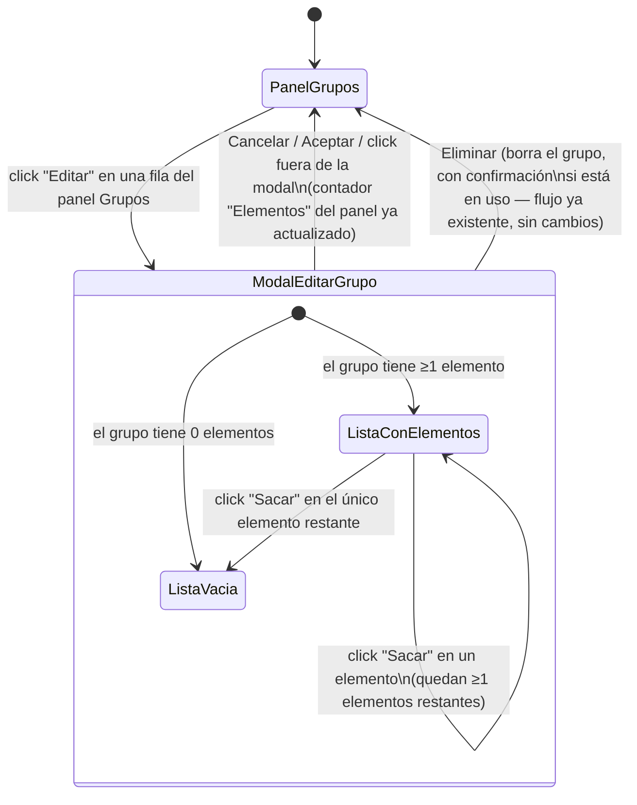

# Navegación — Editar grupo con lista de elementos (cambio 00131)

**Notas:**
- "Sacar" no cierra la modal ni pide confirmación: solo desvincula ese elemento del grupo y repinta la lista interna al instante (mismo patrón que la modal "Contenido del mazo").
- La transición `ListaConElementos → ListaVacia` sustituye la lista por el mensaje "No hay elementos en este grupo." en el momento en que se saca el último elemento, sin salir de la modal.
- Esta modal solo entra en juego al editar un grupo ya existente; desde "+ Añadir grupo" se abre la misma modal pero sin esta sección (no aplica, un grupo nuevo no tiene elementos).
