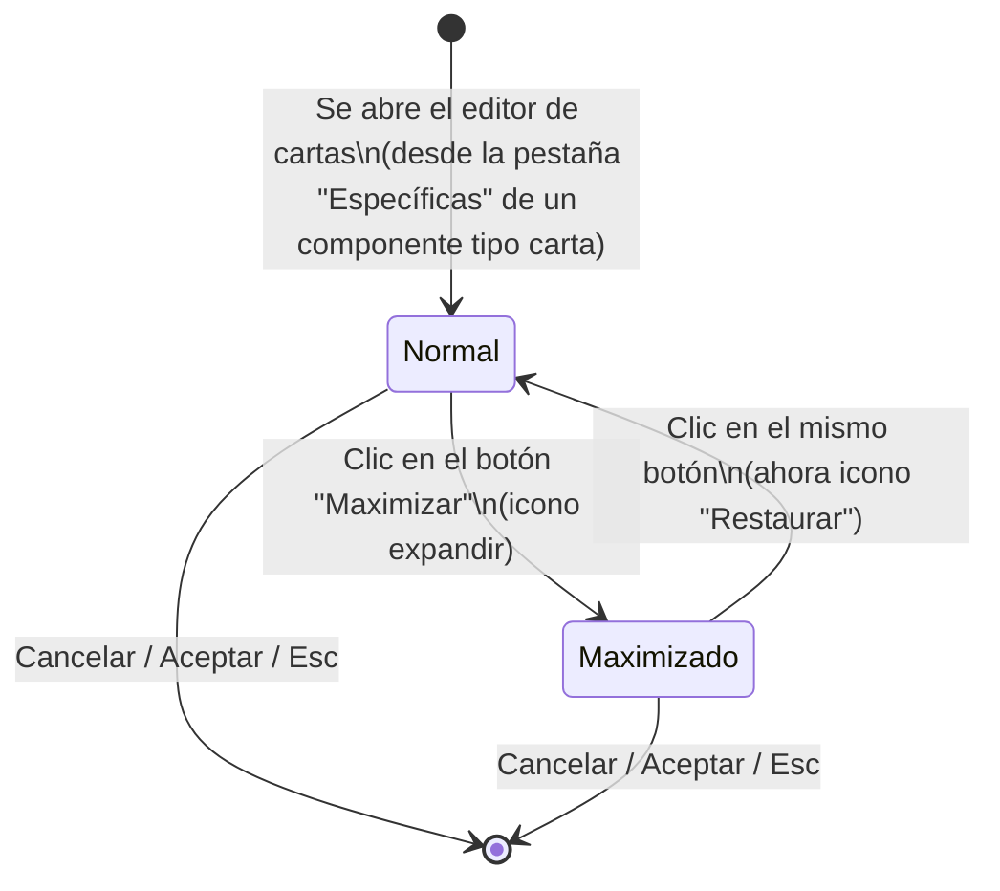

# Navegación: maximizar/restaurar el editor de cartas

Notas:

- El botón es el mismo control en ambos estados; solo cambia su icono y su acción (expandir ↔ restaurar).
- Cerrar el editor (Cancelar, Aceptar o Esc) tiene el mismo comportamiento existente hoy, sea cual sea el estado (Normal o Maximizado) — no hay un paso intermedio de "restaurar" antes de cerrar.
- El estado no se recuerda: cada vez que se entra a `[*] → Normal` (se abre el editor), se parte siempre de Normal, independientemente del estado en que se dejó la vez anterior.
