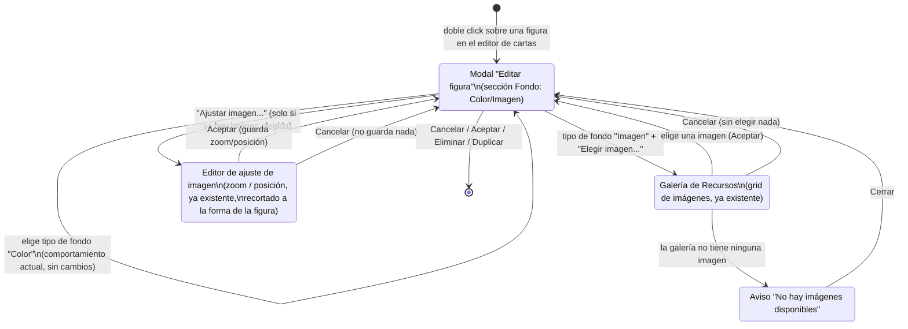

# Navegación: fondo de imagen en una figura geométrica

Notas:
- "Elegir imagen..." y "Ajustar imagen..." son dos botones independientes dentro de la misma sección "Fondo": el primero cambia qué imagen está elegida, el segundo abre el ajuste de zoom/posición sobre la imagen ya elegida. "Ajustar imagen..." está deshabilitado mientras no haya ninguna imagen elegida.
- Tanto la Galería de Recursos como el Editor de ajuste de imagen son componentes ya existentes en el proyecto (reutilizados sin cambios visuales propios); solo cambia desde dónde se invocan.
- Ningún paso de este flujo sale del modal "Editar figura": todas las transiciones vuelven a él, que a su vez solo se cierra con sus propios botones de pie (Cancelar/Aceptar/Eliminar/Duplicar), sin cambios respecto al comportamiento actual.
