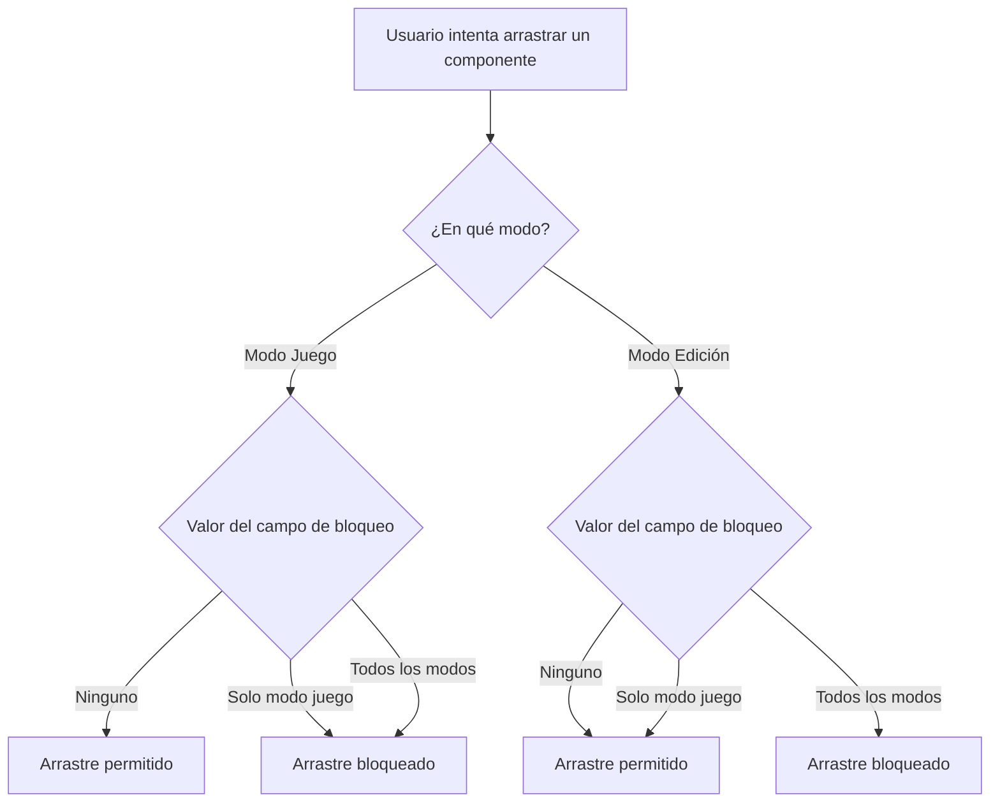

- **Nombre**: Alcance de "Bloqueado" por modo (desplegable Ninguno/Solo modo juego/Todos los modos)
- **Código**: 00138
- **Tipo**: change
- **Fecha creación**: 2026-08-05

## Prompt original del usuario

añadir a la propiedad general Bloqueado un desplegable para indicar si el bloque aplica solo al modo juego o a todo (todos los modos) o a ninguno (si está desmarcado).
Por defecto al crear un nuevo elemento: desmarcado
Cuando apliques el cambio, los que tenga esta propiedad marcada, selecciona la opción solo modo juego

## Descripción completa

La propiedad general "Bloqueado" de un componente, hoy un simple checkbox (marcado/desmarcado), pasa a ser un desplegable con tres opciones que indican en qué modo(s) ese componente no se puede arrastrar por la mesa:

- **Ninguno** — el componente se puede arrastrar libremente tanto en Modo Juego como en Modo Edición.
- **Solo modo juego** — el componente no se puede arrastrar en Modo Juego, pero sí en Modo Edición. Es el comportamiento que ya tenía el checkbox marcado hasta ahora (hoy "Bloqueado" solo restringía el arrastre durante la partida, nunca en edición).
- **Todos los modos** — el componente no se puede arrastrar ni en Modo Juego ni en Modo Edición. Es la novedad de este cambio: hasta ahora no existía ninguna forma de fijar un componente también en Modo Edición.

En ambos casos de bloqueo, solo se restringe el arrastre: editar el componente desde su modal, redimensionarlo, eliminarlo, seleccionarlo, etc. siguen disponibles con total normalidad.

**Valor por defecto al crear un componente nuevo**: "Ninguno" (desmarcado), para cualquiera de los 6 tipos de componente. Esto cambia el comportamiento por defecto actual, en el que la mayoría de tipos nacían "Bloqueado" (marcado) salvo "Carta/Ficha", que ya nacía desmarcada; con este cambio, todos los tipos comparten el mismo valor de partida.

**Migración de las partidas/componentes ya guardados**, al aplicar este cambio: los componentes que hoy tienen la propiedad "Bloqueado" marcada pasan automáticamente a la opción "Solo modo juego" (mantiene exactamente el comportamiento que ya tenían: solo bloqueaba Modo Juego). Los que la tienen desmarcada pasan a "Ninguno".

### Diagrama de flujo — decisión de arrastre según modo y valor

### Dudas de alcance resueltas con el usuario

1. **¿Qué bloquea "Todos los modos" en Modo Edición?** Bloquea también el arrastre del componente en Modo Edición (mover con el ratón sobre la mesa) — el resto de acciones de edición (modal, redimensionar, eliminar...) no se ven afectadas. Mismo criterio que ya aplicaba "Solo modo juego" sobre Modo Juego.
2. **¿Cuándo se muestra la insignia de candado en Modo Edición?** Se sigue mostrando de forma permanente siempre que el valor sea "Solo modo juego" o "Todos los modos" (cualquier bloqueo activo); solo se oculta con "Ninguno". Mismo criterio de visibilidad que tenía antes el checkbox marcado.
3. **¿Qué hace el menú contextual de Modo Juego ("Bloquear"/"Desbloquear")?** Se mantiene como un toggle simple de dos estados: "Bloquear" fija el valor a "Solo modo juego" (sea cual sea el valor previo); "Desbloquear" lo fija a "Ninguno" (incluso si estaba en "Todos los modos" — para recuperar ese matiz hay que entrar en Modo Edición y usar el desplegable).
4. **¿Se sincroniza este campo entre un elemento "Copia" y su original?** No — queda independiente por copia, igual que ya ocurría con el checkbox "Bloqueado" (mismo grupo de campos no sincronizados: posición, orden de apilado, "Oculto", estado de interacción de juego).
5. **Texto del icono de ayuda** junto al desplegable: "Indica en qué modo(s) este componente no se puede mover. 'Todos los modos' lo fija también en Modo Edición; 'Solo modo juego' lo fija únicamente durante la partida (comportamiento por defecto anterior); 'Ninguno' permite arrastrarlo libremente en ambos."
6. **Orden de las opciones en el desplegable**: Ninguno / Solo modo juego / Todos los modos (de menos a más restrictivo, con "Ninguno" primero al ser ahora el valor por defecto).

### Casos límite y convivencia

- El campo sigue viviendo en la pestaña "Generales" de la modal de configuración de un componente, en la misma posición que ocupaba el checkbox "Bloqueado" (primer control, antes de "Oculto").
- Disponible por igual para los 6 tipos de componente, sin variar por tipo.
- No hay alcance de datos ni de usuarios/sesiones distinto del resto de propiedades de un componente: se guarda igual que cualquier otro campo (autoguardado del navegador, exportación a fichero).
- No hay roles distintos en el proyecto: cualquiera en Modo Edición puede cambiar este campo, igual que el resto de propiedades generales.
- No hay ninguna dimensión visual nueva en Modo Juego: el candado no se muestra ahí (solo se percibe a través del menú contextual, sin cambios en ese patrón).

## Apuntes técnicos

- Campo actual: `bloqueado: boolean` en el modelo de componente (`core/component.js`, valor por defecto `true`; forzado a `false` para el tipo `'carta'` en `ui/componentModal.js#createDefaultComponent`). Pasa a ser un campo de 3 valores — el nombre/representación exacta (mantener `bloqueado` como string enum vs. renombrarlo) lo decide `ms-how`.
- Puntos de consumo actuales a migrar:
  - `modes/play/playMode.js` (~línea 148): `canMove: (component) => component.bloqueado !== true` — determina si se puede arrastrar en Modo Juego.
  - `modes/play/playMode.js` (~líneas 172-235): menú contextual de Modo Juego, fila general "Bloquear"/"Desbloquear", alterna el booleano vía `replaceComponent`/`updateComponent`.
  - `ui/componentRenderer.js`: 6 puntos (uno por tipo: textBox, board, dice, documentViewer, carta, mazo) con `if (showLockIndicator && component.bloqueado) ...appendChild(createLockBadge())`.
  - `modes/edit/editMode.js`: hoy NO consulta `bloqueado` en absoluto (el arrastre en Modo Edición nunca ha estado restringido por este campo) — hay que añadir ahí la nueva restricción de arrastre para el valor "Todos los modos".
  - `ui/componentModal.js` (~líneas 231-248): el checkbox y su `createHelpIcon` a sustituir por el desplegable; línea ~141 `component.bloqueado = false` (default especial de 'carta') a revisar tras el cambio de valor por defecto general (deja de ser necesaria esa excepción si todos los tipos comparten ya "Ninguno" por defecto).
  - `core/component.js`: `createComponent()` (default del campo) y el comentario de "Copias vinculadas" (`syncCopyWithOriginal`/`NON_SYNCED_PROPERTY_KEYS`) — confirmar en `ms-how` si `bloqueado` sigue en la lista de no sincronizados tal cual con el nuevo tipo de campo.
  - Migración de datos guardados: no hay hoy ningún mecanismo formal de "migración con versión" visible en `core/state.js#loadComponents`, solo fallbacks silenciosos campo a campo (mismo patrón que `oculto`/`mostrarTooltip`/`grupoId` — campo ausente = valor por defecto). Aquí la migración no es "campo ausente = valor por defecto" sino "valor booleano existente = mapeo a nuevo valor" (`true` → "Solo modo juego", `false` → "Ninguno"), así que `ms-how` deberá definir explícitamente esa transformación en la carga.
- Documentación técnica/funcional a actualizar (detectada durante el análisis, pendiente de aplicar cuando se implemente):
  - `design/docs/ARCHITECTURE.md` sección 4 (línea 67, definición del campo en el modelo de datos) y sección 3 (líneas 42-43, indicador de candado).
  - `design/docs/FEATURES.md`, secciones "Alta/edición/borrado de componentes con modal de tabs", "Posición independiente, arrastre y redimensionado de componentes" y "Elementos tipo Copia, vinculados y sincronizados con un original" — todas describen hoy "Bloqueado" como checkbox booleano que solo afecta a Modo Juego.
