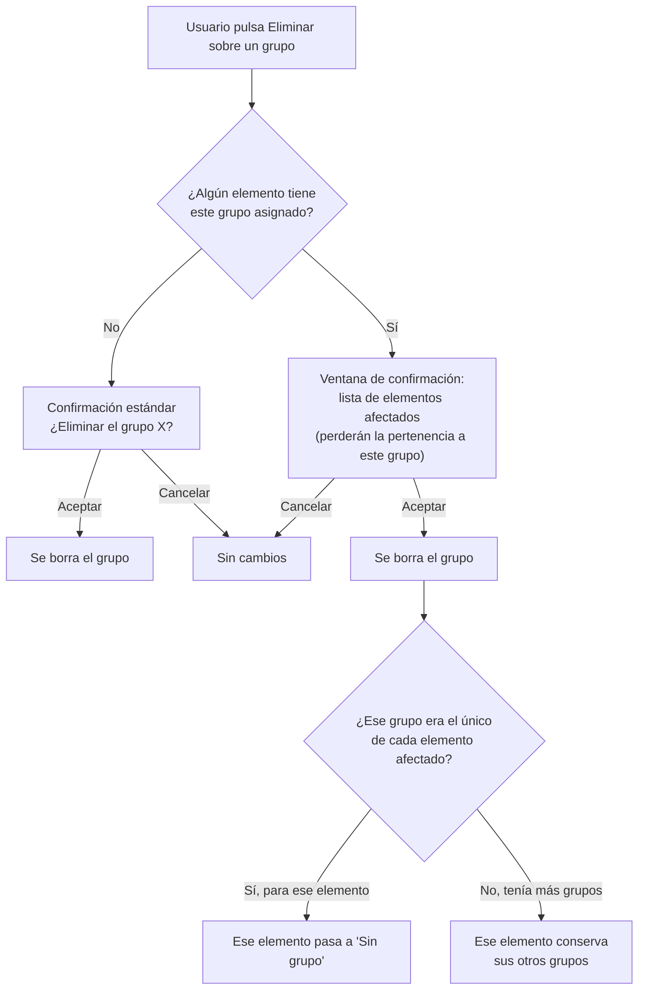

- **Nombre**: Pertenencia de un elemento a varios grupos a la vez
- **Código**: 00139
- **Tipo**: change
- **Fecha creación**: 2026-08-05

## Prompt original del usuario

analiza la posibilidad de que cada elemento pueda pertenecer a varios grupos a la vez

## Descripción completa

Cada elemento (componente de cualquier tipo: cuadro de texto, tablero, dado, visor de documentos, carta o mazo) podrá pertenecer a varios grupos a la vez, en vez de a un único grupo como hasta ahora. El grupo sigue siendo puramente organizativo, sin funcionalidad de juego asociada.

### Cambios de comportamiento respecto al modelo actual

1. **Selector en la pestaña "Generales" del modal de componente**: donde hoy hay un desplegable único "Grupo", pasa a haber una lista con un checkbox por cada grupo existente, permitiendo marcar cualquier combinación (incluida ninguna). Se conserva la opción de crear un grupo nuevo al vuelo sin salir de la modal (misma validación de nombre que hoy: no vacío, no duplicado, comparación recortada e insensible a mayúsculas/tildes), que al crearse queda automáticamente marcado. "Sin grupo" deja de ser un valor explícito y pasa a ser, simplemente, el estado de no tener ningún checkbox marcado.

2. **Selección de todos los elementos de un grupo** (click en una fila del panel "Grupos"): sin cambios de comportamiento — sigue seleccionando exactamente el conjunto de elementos que tienen ese grupo entre los suyos (ahora puede ser solo uno de varios grupos de cada elemento, no el único).

3. **Columna "Elementos" del panel "Grupos"**: sin cambio conceptual — sigue contando cuántos elementos tienen ese grupo asignado; un mismo elemento puede ahora sumar al contador de varios grupos distintos a la vez.

4. **Borrado de un grupo en uso**: la ventana de confirmación que lista los elementos afectados ajusta su mensaje — ya no puede afirmar categóricamente que esos elementos "quedan en Sin grupo", porque pueden conservar otros grupos. El texto pasa a advertir que esos elementos "perderán la pertenencia a este grupo"; solo se muestra como "Sin grupo" tras el borrado el elemento para el que este era su único grupo.

5. **Botón "Sacar" en la ventana de edición de grupo**: sin cambio de comportamiento — desvincula el elemento únicamente del grupo de esa ventana; el elemento conserva cualquier otro grupo que tuviera.

6. **Renombrar un grupo**: sin cambio — sigue sin afectar a la asignación de ningún elemento, solo cambia el nombre visible.

7. **Migración de datos existentes**: al abrir la app, cualquier proyecto/partida guardado con el modelo antiguo (un único grupo por elemento) se migra de forma silenciosa y automática a una lista de grupos (el grupo que tuviera pasa a ser el único elemento de su lista; si no tenía ninguno, la lista queda vacía). No requiere ninguna acción del usuario ni aviso.

### Alcance de los datos

Sin cambios respecto al modelo actual: se guarda en el mismo sitio (proyecto/partida), sin distinción de usuarios/sesiones.

### Quién puede usarlo

Sin cambios: disponible solo en modo edición, igual que el resto de la funcionalidad de grupos.

### Convivencia con lo existente

Es una generalización del modelo actual (1 grupo → N grupos), no una funcionalidad nueva independiente; toda la funcionalidad existente de grupos (alta, edición, borrado, lista, selección por fila, columna de contador, botón Sacar) se mantiene y se adapta a la nueva cardinalidad como se describe arriba.

### Flujo: borrado de un grupo en uso, con el mensaje ajustado

### Definición visual de alto nivel

En la pestaña "Generales" del modal de edición de componente, donde hoy hay un `<select>` único "Grupo" como campo suelto, pasa a haber una sección con borde y título propio ("Grupos", mismo patrón visual que otras secciones tituladas del modal, p.ej. "Interacciones programadas"), que contiene una lista de checkboxes (uno por grupo existente, con su nombre) más una opción final "+ Crear nuevo grupo…" que al activarse muestra un campo de texto para el nombre del grupo nuevo (igual que hoy). Cualquier combinación de checkboxes marcados es válida, incluida ninguna. No hay cambios visuales en el panel "Grupos" ni en sus ventanas de alta/edición/borrado, salvo el texto ajustado del punto 4.

### Preguntas de alcance resueltas

- **Selector de grupos en el modal de componente**: se decidió una lista de checkboxes (en vez de un `<select multiple>` nativo), por ser más descubrible para el usuario.
- **Encaje visual del selector**: se decidió envolver la lista de checkboxes en una sección con borde y título propio ("Grupos"), en vez de dejarla como campo suelto (como estaba el `<select>` actual).
- **Mensaje de borrado de un grupo en uso**: se decidió ajustar el texto para no afirmar que los elementos afectados quedan en "Sin grupo", ya que pueden conservar otros grupos.
- **Botón "Sacar"**: se confirmó que no cambia de comportamiento — desvincula solo del grupo de esa ventana.
- **Migración de datos guardados**: se decidió migración silenciosa y automática al abrir la app, igual que la migración Mazo→Grupo previa.

## Apuntes técnicos

- Requiere cambiar `grupoId: string|null` por `grupoIds: string[]` en `src/core/component.js`.
- `getComponentsUsingGroup` en `src/core/group.js` (hoy filtra por `component.grupoId === groupId`) debe pasar a comprobar pertenencia dentro del array.
- `src/ui/componentModal.js` (líneas ~307-394 y ~1056-1100): el `<select>` único "Grupo" y el copiar/pegar de estilo ("Generales", que incluye el grupo) deben adaptarse a la lista de checkboxes/array.
- `src/core/importMerge.js`: la fusión de importaciones que autocrea grupos ausentes referenciados por `grupoId` debe iterar sobre el array.
- Migración de partidas/proyectos guardados con `grupoId` escalar, siguiendo el mismo patrón que la migración Mazo→Grupo del cambio 00105.
