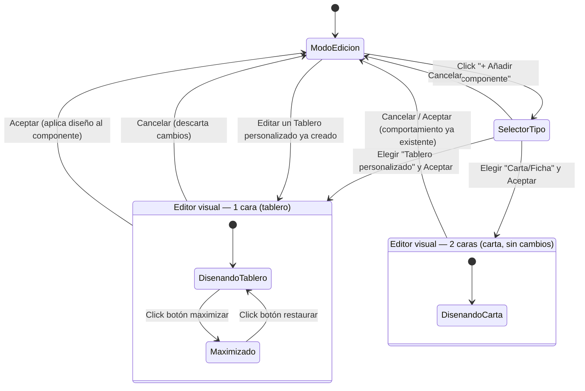

# Navegación — Alta y edición de un Tablero personalizado

## Notas

- `SelectorTipo` es la modal ya existente (`ui/componentTypeModal.js`), con la nueva opción "Tablero personalizado" añadida junto a "Tablero simple" (ver `design_selector-tipo-componente.html`).
- `EditorVisual_1cara` y `EditorVisual_2caras` son el mismo componente ("Editor visual" generalizado), abierto con distinto número de caras según el tipo — no dos modales separadas.
- El estado `Maximizado`/restaurado es transitorio a esa apertura del editor, sin persistencia entre usos (igual que ya ocurre hoy en el editor de cartas).
- Igual que con una carta, reabrir el editor sobre un Tablero personalizado ya existente entra directamente en `DisenandoTablero` con el diseño guardado cargado.
