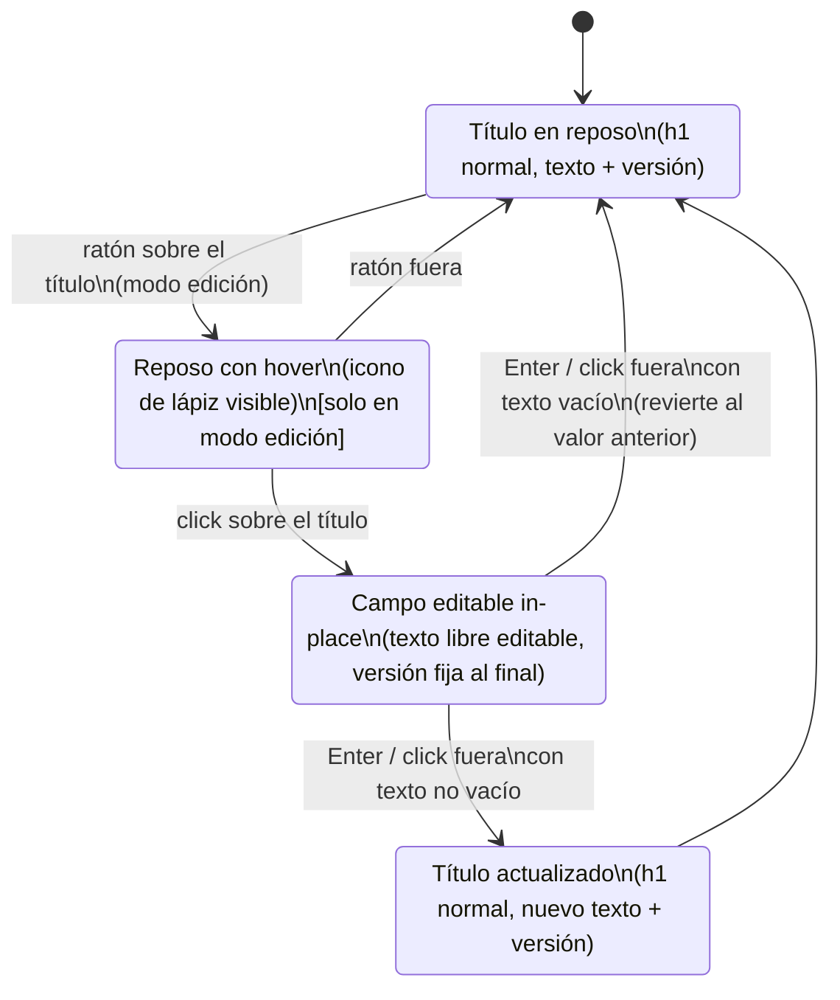

# Navegación — edición del título de cabecera

**Notas:**
- En modo juego, el título nunca pasa por `ReposoHover` ni `Editando` — se muestra siempre en el estado `Reposo`/`Confirmado`, sin reaccionar al ratón ni al click.
- La versión (`v.NNNNN`) no participa en esta navegación: se muestra igual en todos los estados y nunca se selecciona ni edita.
- El estado `Confirmado` persiste el título en el estado del juego (localStorage + fichero exportado), por lo que sobrevive a recargar la página o reabrir el fichero.
