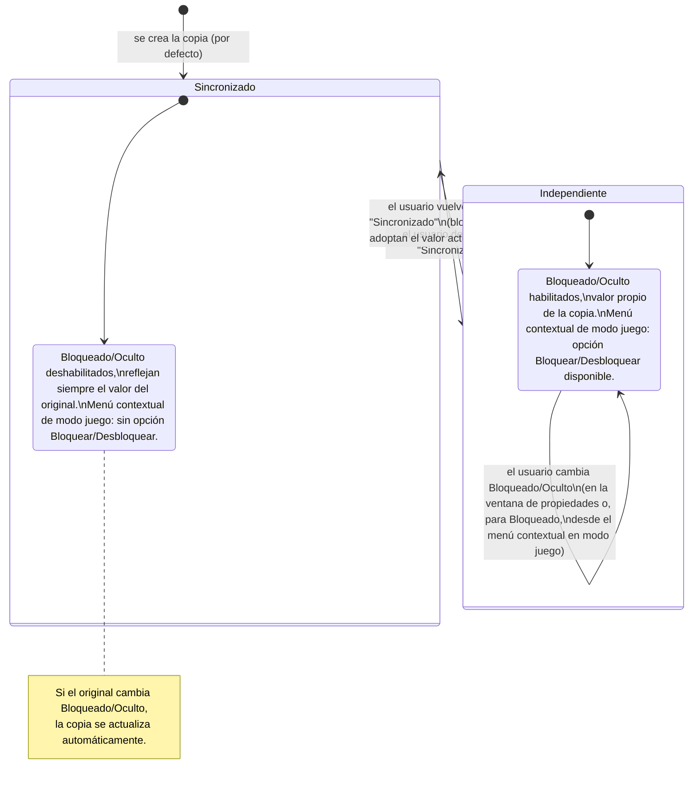

- **Nombre**: Toggle "Sincronizado" para bloqueado/oculto en copias vinculadas
- **Código**: 00149
- **Tipo**: change
- **Fecha creación**: 2026-08-05

## Prompt original del usuario

En modo edición:
-Me gustaría que las copias tuvieran un check "Sincronizado" marcado por defecto. Mientres esté marcado, se sincroniza al 100% con su original.
-Si se desmarca, se pueden configurar las propiedades que tenga disponibles y estas mantienen su valor sin sincronizarse con su original.

En el modo juego no hay cambios

(Aclaraciones posteriores del usuario, resolviendo dudas de alcance):
1. El toggle "Sincronizado" solo afecta a Bloqueado y Oculto, que deberían sincronizarse con su original o ser independientes según si "Sincronizado" está marcado o no. El resto de propiedades de una copia no se ven afectadas por este cambio (siguen sincronizándose siempre, como hoy).
2. En el modo juego, la opción "Bloquear/Desbloquear" del menú contextual de una copia solo debe aparecer si "Sincronizado" está desmarcado. Si está marcado, esa opción no debe aparecer en el menú contextual.

## Descripción completa

Una "Copia" es un componente vinculado permanentemente a otro (su "original"): mientras ambos existan, la copia refleja automáticamente los cambios de diseño/configuración del original. Hoy esa sincronización es total e incondicional en todo lo que se puede editar desde la ventana de propiedades — salvo dos aspectos, "Bloqueado" (si el componente se puede mover o no) y "Oculto" (si el componente se ve o no en la partida), que siempre han sido independientes por copia, pero que hoy no se pueden configurar de ninguna forma para una copia: la ventana de propiedades de una copia no tiene ningún control editable.

Este cambio añade, en la ventana de propiedades de una copia (en modo edición), una casilla "Sincronizado", marcada por defecto, junto con los controles de "Bloqueado" y "Oculto" (los mismos que ya existen para un componente normal).

**Con "Sincronizado" marcado (comportamiento por defecto de una copia recién creada):**
- Los controles "Bloqueado" y "Oculto" se muestran deshabilitados, reflejando en todo momento el valor actual del original.
- Si el original cambia su "Bloqueado" u "Oculto", la copia lo refleja automáticamente, igual que ya pasa con el resto de propiedades sincronizadas.

**Con "Sincronizado" desmarcado:**
- Los controles "Bloqueado" y "Oculto" se habilitan y el usuario puede fijar un valor propio para esa copia, distinto al del original.
- Ese valor propio se mantiene estable y deja de seguir al original mientras la casilla siga desmarcada.

**Al volver a marcar "Sincronizado":** la copia adopta de inmediato el "Bloqueado" y "Oculto" actuales del original, descartando el valor propio que tuviera fijado.

El resto de propiedades de una copia (nombre, imagen, tamaño, mostrar tooltip, grupos, interacciones activas/desactivadas, acción de clic derecho, y las propiedades específicas de su tipo) no se ven afectadas por este cambio en absoluto: siguen sincronizándose siempre al 100% con el original, sin ninguna forma de hacerlas independientes. Tampoco cambia nada en el borrado en cascada (borrar el original borra también sus copias), en el renombrado del id de las copias cuando cambia el id del original, ni en la prohibición de crear copias de una copia.

**En modo juego**, el único cambio es en el menú contextual (clic derecho) de una copia: la opción "Bloquear"/"Desbloquear" solo aparece si esa copia tiene "Sincronizado" desmarcado (porque solo entonces tiene sentido tocar su bloqueo de forma independiente). Si la copia tiene "Sincronizado" marcado, esa opción no aparece en su menú contextual — el resto de opciones del menú no se ven afectadas. Para un componente que no es copia, el menú contextual no cambia. "Oculto" sigue sin tener ningún control en modo juego, en ningún caso (igual que hoy).

### Diagrama del comportamiento del toggle

## Apuntes técnicos

- `core/component.js`: `createComponent` define los campos generales de un componente; `syncCopyWithOriginal` (líneas ~143-160) es la función pura que aplica los campos sincronizables de un original sobre una copia, documentando explícitamente en su comentario que `bloqueado`/`oculto` (junto a `x`/`y`/`order`) quedan siempre independientes — este cambio introduce la primera excepción condicional a esa regla, ligada al nuevo campo `sincronizado`.
- Nuevo campo de datos en el componente: `sincronizado` (booleano, `true` por defecto al crear una copia con "Copiar"). Solo tiene sentido en componentes con `copyOf` truthy. Se persiste igual que el resto de campos generales (localStorage, export/import).
- `core/state.js`, función `replaceComponent` (líneas 63-84): único punto donde se invoca `syncCopyWithOriginal`, al actualizar un componente que no es copia (`!updatedComponent.copyOf`), iterando sobre todas las copias vinculadas (`c.copyOf === id`). Aquí habrá que añadir la propagación condicional de `bloqueado`/`oculto` cuando la copia tenga `sincronizado: true`.
- `ui/componentModal.js` (líneas ~361-415): contiene ya los controles de referencia para "Bloqueado" (select de 3 opciones: Ninguno/Solo modo juego/Todos los modos) y "Oculto" (checkbox) que hay que reutilizar visualmente en la modal de copia.
- `ui/copyComponentModal.js`: modal reducida actual de una copia (sin ningún campo editable) — es el fichero principal a modificar para añadir el checkbox "Sincronizado" y los controles de Bloqueado/Oculto.
- `modes/play/playMode.js` (líneas ~176, 236-239): construye la entrada de menú contextual "Bloquear"/"Desbloquear" para cualquier componente con `accionClickDerecho !== 'ninguno'`; aquí habrá que añadir la condición de ocultar esa entrada si el componente es una copia con `sincronizado: true`.
- `design/docs/ARCHITECTURE.md`, sección "Copias vinculadas (copyOf)" (líneas ~105-112): documenta el mecanismo actual y tendrá que actualizarse para reflejar el nuevo campo `sincronizado` y el comportamiento condicional de `bloqueado`/`oculto`.
- No se han detectado incongruencias entre `design/docs/ARCHITECTURE.md`/`STYLE_BIBLE.md` y el código real relevantes para este cambio.
