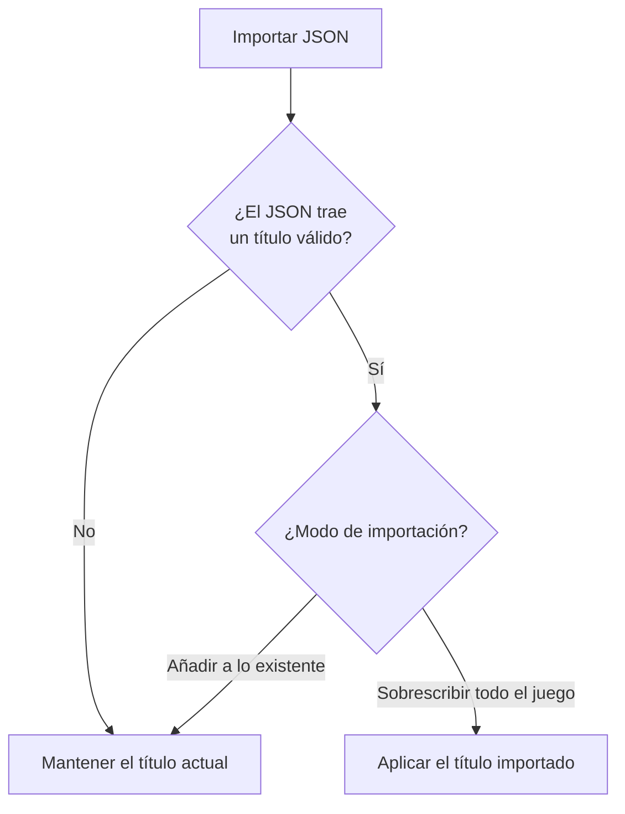

- **Nombre**: Guardar y restaurar el título de cabecera en la exportación/importación JSON
- **Código**: 00150
- **Tipo**: change
- **Fecha creación**: 2026-08-05

## Prompt original del usuario

guarda también el título de la cabecera al exportar en json para restablecerlo cuando se importe

## Descripción completa

Al usar "Exportar" en modo edición (que genera un fichero JSON ligero con los componentes/recursos/grupos seleccionados, distinto de "Guardar", que genera un HTML completo y ya guarda el título), el fichero JSON generado incluye también el título de cabecera actual de la partida.

Al usar "Importar" un fichero JSON, si ese fichero trae un título:

- Si se elige el modo de importación **"Sobrescribir todo el juego"**, el título de cabecera de la partida se reemplaza por el importado.
- Si se elige el modo de importación **"Añadir a lo existente"**, el título de cabecera actual se mantiene sin cambios, aunque el fichero importado traiga uno — al añadir contenido a una partida en curso no tiene sentido que cambie su título.
- Si el fichero importado es de una versión anterior de la app y no trae ningún título, el título actual tampoco se toca, en ningún modo — no debe vaciarse ni dar error.

No se añade ningún control nuevo en pantalla: no hay ninguna casilla para decidir si se exporta el título (siempre se incluye, como un dato más de la partida) ni para decidir si se importa (se aplica o no según el modo de importación ya existente, sin preguntar nada aparte).

### Preguntas de alcance resueltas

- **¿Cuándo debe aplicarse el título importado?** Se preguntó al usuario entre tres opciones (aplicarlo solo al sobrescribir todo el juego, aplicarlo siempre, o preguntar explícitamente). Se confirmó la primera: solo se aplica en modo "Sobrescribir todo el juego"; en modo "Añadir a lo existente" el título actual se conserva siempre.

### Lógica de importación

## Apuntes técnicos

- El título de cabecera vive en `core/state.js` (`appTitle`, `getAppTitle`/`setAppTitle`) y ya se persiste en el autoguardado (`core/persistence.js` → `saveState`/`parseState`) y en el export HTML "Guardar" (`core/fileExport.js` → `buildExportHtml`).
- El export/import JSON es un flujo distinto y más ligero (`core/persistence.js` → `buildComponentsExport`/`parseImportedComponents`), cableado en `ui/editModeToggle.js` (`openExportFlow`/`importComponentsFromFile`) — hoy no incluye `appTitle` en absoluto.
- El modo de importación (`'add'`/`'overwrite'`) ya existe y se recoge en `ui/importConfirmModal.js`, se usa en `core/importMerge.js` (`mergeImportedGame`) para fusionar `components`/`resources`/`groups` — la nueva lógica del título debe usar ese mismo `mode`, ya disponible en el callback `onAccept` de `openImportConfirmModal` (`ui/editModeToggle.js`), sin necesidad de tocar `mergeImportedGame` (el título no es una colección que fusionar, es un valor único aparte).
- Sin incongruencias detectadas entre documentación técnica (`ARCHITECTURE.md`) y código en este análisis.
