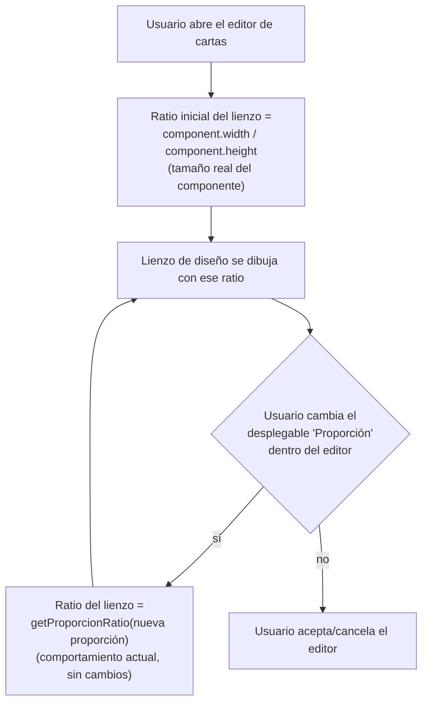

- **Nombre**: El editor de cartas usa el tamaño real como fuente de la proporción al abrirse
- **Código**: 00151
- **Tipo**: change
- **Fecha creación**: 2026-08-05

## Prompt original del usuario

al abrir el editor de cartas utiliza solo la proporción seleccionada, pero debería mirar ahora solo el tamaño, que es dónde tenemos la proporción real

## Descripción completa

Redimensionar una carta en la mesa no debe reescalar su contenido (imagen de fondo, formas geométricas, cuadros de texto): ese contenido debe permanecer con su mismo tamaño y su misma posición, igual que ya ocurre desde el cambio 00152 para "Tablero personalizado" — redimensionar la carta cambia solo el tamaño del marco visible, no lo que hay dibujado dentro. Si el nuevo tamaño es menor que el contenido, ese contenido puede quedar recortado/fuera de la vista al no caber; es el comportamiento esperado, no un problema a evitar.

Este cambio extiende a `'carta'` el mismo criterio que el cambio 00152 ya aplicó a "Tablero personalizado" — en aquel cambio se dejó explícitamente pendiente para una entrada aparte, que es esta.

Consecuencia directa para el editor de diseño de la carta: como el contenido ya no se reescala nunca al redimensionar, el lienzo donde se diseña debe representar directamente el tamaño real que tiene la carta en ese momento (no un lienzo de tamaño fijo derivado solo de la proporción elegida, como pasa hoy), para que lo que se ve al diseñar coincida siempre con lo que aparece después en la mesa.

**Qué no cambia:**
- El desplegable "Proporción" del editor sigue existiendo igual que hoy, y sigue sirviendo para elegir la forma de la carta (rectangular, circular, hexagonal, triangular...) y su silueta/recorte visual. Si el usuario cambia la proporción mientras diseña, el lienzo sí recalcula su forma a partir de la proporción recién elegida — solo el momento de abrir el editor pasa a partir del tamaño real en vez de la proporción guardada.
- El redimensionado en la mesa sigue forzando el ratio de la proporción activa (salvo `'circular'`/`'libre'`, que ya son libres) — este cambio no toca esa restricción, solo lo que pasa con el contenido al redimensionar dentro de ese ratio.
- Si el tamaño real de la carta no coincide exactamente con la proporción "canónica" de su forma (p. ej. se puso un ancho/alto desde la sección "Tamaño" que no da exactamente un hexágono regular), el editor muestra el lienzo con ese tamaño real tal cual, sin corregir ni avisar.

**Preguntas de alcance resueltas con el usuario:**
- ¿Debe extenderse a `'carta'` el mismo criterio del cambio 00152 (contenido en píxeles reales, sin reescalar al redimensionar; editor diseña siempre al tamaño real), en vez de solo cambiar de dónde saca el ratio inicial el editor al abrirse? — Sí, confirmado: es la extensión que 00152 dejó pendiente.
- ¿El desplegable "Proporción" de dentro del editor sigue existiendo y determinando la forma/silueta? — Sí, sin cambios ahí.
- ¿Si el tamaño real no encaja con la forma activa, se corrige/ajusta al abrir o se muestra tal cual? — Se muestra tal cual, sin corregir ni avisar.

## Apuntes técnicos

- Precedente directo a replicar: `changes/closed/00152` (fix "El contenido de un Tablero personalizado se reescala al redimensionarlo"), que dejó anotado explícitamente que el usuario pidió extender su mismo criterio a `'carta'` en una entrada aparte.
- `ui/componentRenderer.js`, rama `component.type === 'carta'`: hoy `renderScale = width / CARD_DESIGN_WIDTH` y se invoca `paintCartaFace(contentParent, cara, renderScale, width, height)` — el contenido se reescala proporcionalmente según el tamaño real de la carta frente al lienzo de diseño fijo (`CARD_DESIGN_WIDTH = 300`, `core/cardProportions.js`). Análogo directo al `paintCartaFace(tableroContent, cara, width / TABLERO_PERSONALIZADO_DESIGN_WIDTH, ...)` que 00152 corrigió a escala fija `1`.
- `ui/visualEditorModal.js` → `getFaceDesignSize()` (línea ~282): hoy, con `showProporcionSelector` (caso `'carta'`), devuelve `getDesignSize(working.proporcion)`; con `!showProporcionSelector` (caso `'tableroPersonalizado'`, ya arreglado en 00152) devuelve `{ width: component.width, height: component.height }`. Este cambio debe hacer que el caso `showProporcionSelector` también devuelva el tamaño real del componente al menos al abrir el editor — ver duda pendiente sobre qué pasa si el usuario cambia la Proporción dentro del propio editor (mantener forma/recorte pero en qué tamaño), a resolver técnicamente en `ms-how`.
- `core/cardProportions.js`: `CARD_DESIGN_WIDTH`/`getDesignSize` quedarían sin uso para `'carta'` si se replica el criterio de 00152 tal cual (igual que `TABLERO_PERSONALIZADO_DESIGN_WIDTH`/`_HEIGHT` quedaron sin uso y se eliminaron en ese fix) — a confirmar en el análisis técnico si algún otro punto los sigue necesitando (p. ej. `ui/mazoContentModal.js`, miniaturas de carta) antes de eliminarlos.
- Sin migración de datos, mismo criterio que 00152: `properties.caraFrontal`/`caraTrasera` (`formas`/`textBoxes`/`imagenResourceId`) ya guardan `x`/`y`/`width`/`height`; una carta ya diseñada bajo el sistema de reescalado actual seguirá viéndose con los mismos números, ahora interpretados como píxeles reales en vez de "unidades de diseño" reescaladas — mismos números, sin salto visual adicional más allá de que a partir de ahora no cambian solos al redimensionar.

