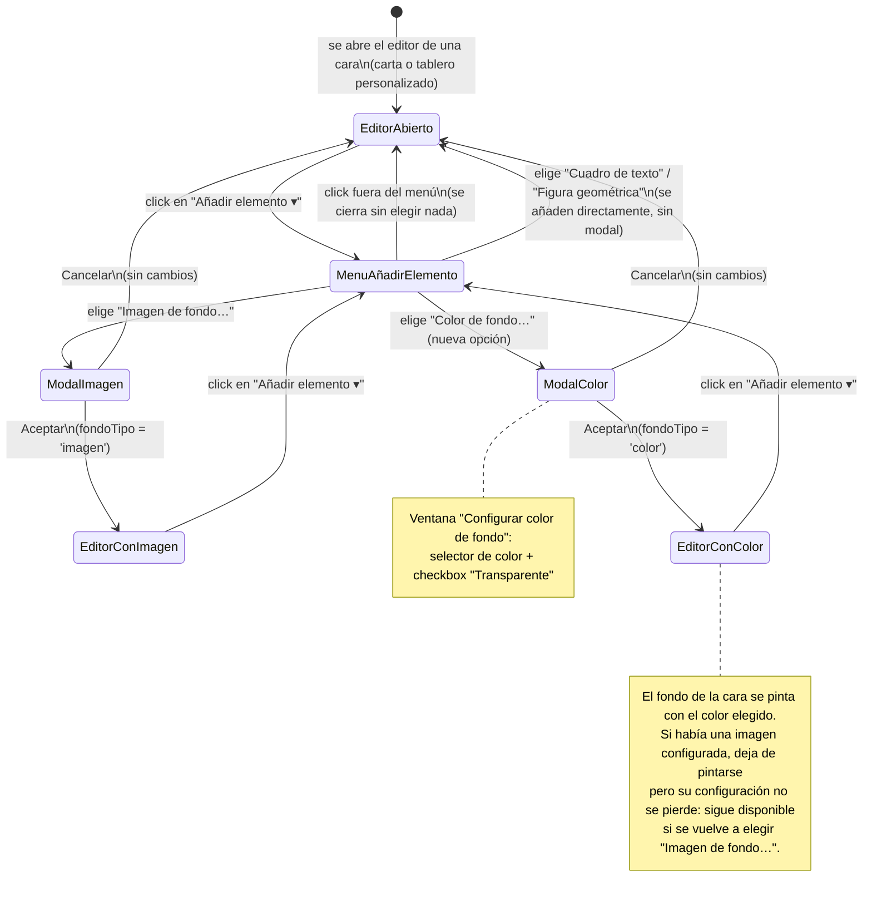

# Navegación — "Color de fondo" en el editor visual (carta / tablero personalizado)

**Notas**

- "Cuadro de texto" y "Figura geométrica" no abren modal: añaden el elemento directamente sobre el lienzo (comportamiento ya existente, sin cambios). Solo "Imagen de fondo…" y la nueva "Color de fondo…" abren una ventana de configuración antes de aplicar el cambio.
- `EditorConImagen` y `EditorConColor` son mutuamente excluyentes en todo momento: la cara nunca tiene ambos fondos activos a la vez, solo el `fondoTipo` vigente decide cuál se pinta.
