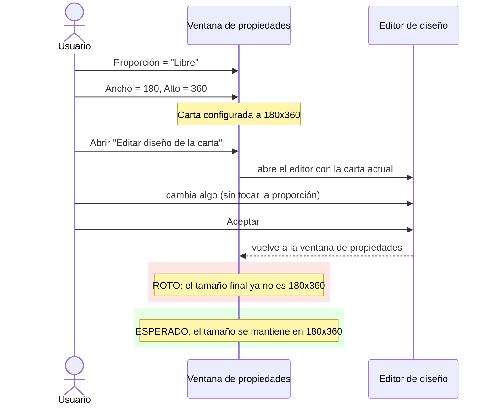

- **Nombre**: Redimensionamiento de cartas no respeta Ancho/Alto tras usar el editor
- **Código**: 00159
- **Tipo**: fix
- **Fecha creación**: 2026-08-05

## Prompt original del usuario

el redimensionamiento de las cartas usando las propiedades alto y ancho y con el editor no funciona bien.
Una prueba es:
- entro en las propieades de la carta y cambio su proporción a libre y sus dimensiones a 180x360
- entro en el editor y cambio algo.
- Acepto y salgo y la carta tiene otro tamaño diferente

Si repito la prueba seleccionando otras proporciones y luego cambiando las dimensiones, al acepta no las respeta

## Descripción completa

Al configurar el tamaño de una carta a mano (campos "Ancho"/"Alto" de sus propiedades) y después entrar en el editor visual de la carta para cambiar cualquier cosa de su diseño, al aceptar el editor y cerrar la ventana de propiedades la carta termina con un tamaño distinto del que se había fijado.

Reproducción reportada:

1. Se abren las propiedades de una carta, se fija su proporción a "Libre" y sus dimensiones a 180×360 (Ancho×Alto).
2. Se entra en el editor de diseño de la carta y se cambia cualquier cosa.
3. Se acepta el editor y se sale de la ventana de propiedades — la carta queda con un tamaño distinto de 180×360.

Repitiendo la prueba con otras proporciones (no solo "Libre") y ajustando las dimensiones después de elegir la proporción, al aceptar tampoco se respetan las dimensiones introducidas: el tamaño final vuelve a no coincidir con lo que se había fijado.

### Comportamiento esperado

- Con la proporción "Libre", el ancho y el alto que se fijan en los campos de tamaño deben conservarse exactamente igual después de usar el editor de diseño (o cualquier otra acción de la ventana de propiedades) — "Libre" implica que no hay ninguna proporción fija que imponer sobre esas dimensiones.
- Con cualquier otra proporción (proporciones fijas como "Poker", "Tarot", "Cuadrada", etc.), el tamaño que la persona haya fijado explícitamente no debe descartarse sin más al usar el editor o al aceptar los cambios — solo tiene sentido reajustar el alto a la nueva proporción cuando es la propia proporción la que se acaba de cambiar, no como efecto colateral de otras acciones sobre la carta.

### Diagrama del flujo (roto vs esperado)

## Apuntes técnicos

- En `src/ui/componentModal.js`, dentro de `renderCartaSpecificFields`, hay tres puntos que recalculan `workingComponent.height` como `width / getProporcionRatio(proporcion)`, machacando el "Alto" que el usuario ya había fijado en los campos "Ancho (px)"/"Alto (px)" de la sección "Tamaño" (líneas ~312-392):
  1. El listener `change` del `<select>` "Proporción" (línea ~1382-1387).
  2. El callback `onAccept` del editor visual de la carta, tras pulsar "Aceptar" dentro de `ui/visualEditorModal.js` (línea ~1409-1418) — se ejecuta SIEMPRE al aceptar el editor, aunque el usuario no haya tocado la proporción dentro de él.
  3. El botón "Pegar estilo" al pegar una `proporcion` copiada (línea ~1497-1503).
- En `src/core/cardProportions.js`, la proporción `'libre'` (pensada para que el usuario fije ancho y alto totalmente independientes) tiene un `ratio` hardcodeado a `5/7` (línea 16) — un valor de repuesto que los tres puntos de arriba usan igualmente para "recalcular" el alto, como si `'libre'` tuviera una proporción fija que no tiene.
- No se ha detectado ninguna incongruencia entre `ARCHITECTURE.md`/`STYLE_BIBLE.md` y el código real durante el análisis: `ARCHITECTURE.md` documenta correctamente `width`/`height` como campos independientes (null = automático), y el redimensionado con `clamp` de `ui/resizeHandle.js` para proporciones fijas es un mecanismo interactivo aparte que no interviene en este bug — el bug ocurre solo en los tres puntos de `componentModal.js` señalados arriba.
