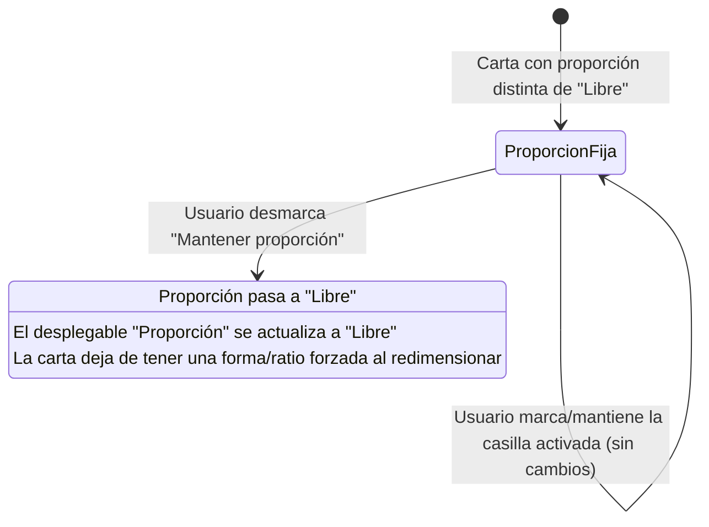

- **Nombre**: Desmarcar "Mantener proporción" pasa la carta a proporción libre
- **Código**: 00164
- **Tipo**: fix
- **Fecha creación**: 2026-08-06

## Prompt original del usuario

cuando el usuario desmarque la casilla de "mantener proporción" en una carta, cambia su proporción automáticamente a "libre"

## Descripción completa

En el modal de propiedades de una carta hay dos controles relacionados con su forma que hoy funcionan de manera totalmente independiente:

- La casilla **"Mantener proporción"**, en la sección "Tamaño".
- El desplegable **"Proporción"**, que fija la forma de la carta (5:7, circular, hexagonal, libre, etc.).

Actualmente, desmarcar "Mantener proporción" no tiene ningún efecto sobre el desplegable "Proporción": si la carta tiene una proporción fija (cualquier valor distinto de "Libre"), esa proporción se sigue forzando tanto al escribir directamente los campos Alto/Ancho como al redimensionar la carta arrastrando en el lienzo — aunque el usuario haya desmarcado la casilla pensando que así deja de forzarse.

**Comportamiento esperado**: al desmarcar la casilla "Mantener proporción" en una carta, el desplegable "Proporción" debe pasar automáticamente a "Libre" (reflejándolo también visualmente en el propio desplegable). A partir de ahí, la carta deja de tener una forma/ratio forzada, tanto al editar Alto/Ancho a mano como al redimensionar arrastrando.

Volver a marcar la casilla no restaura una proporción anterior: simplemente deja de forzar la sincronización de Alto/Ancho al editarlos a mano, igual que hoy.

### Diagrama de flujo

## Apuntes técnicos

- Casilla "Mantener proporción" (`keepRatioCheckbox`): `src/ui/componentModal.js`, sección "Tamaño" (líneas ~359-392). Es genérica para cualquier tipo de componente, no solo cartas; hoy solo controla si, al editar Alto/Ancho a mano en el propio modal, el otro campo se recalcula proporcionalmente.
- Desplegable "Proporción" (`proporcionSelect`, específico de cartas): `src/ui/componentModal.js`, función `renderCartaSpecificFields` (líneas ~1366-1392). Usa los valores de `src/core/cardProportions.js` (`CARD_PROPORTIONS`), incluyendo `'libre'`.
- El cambio debe limitarse a componentes de tipo carta (donde existe `proporcionSelect`); en otros tipos de componente la casilla no tiene un campo "Proporción" al que afectar.
- Relacionado: `src/ui/resizeHandle.js` fuerza la ratio de la carta en el redimensionado por arrastre vía el parámetro `clamp` (usa `getProporcionRatio`), documentado en `design/docs/ARCHITECTURE.md` (línea ~331). Al pasar `proporcion` a `'libre'`, esa restricción deja de aplicarse — es justo el efecto esperado por el usuario, más allá del propio modal.
- No se ha detectado ninguna incongruencia entre `design/docs/ARCHITECTURE.md` / `design/docs/stylebible/STYLE_BIBLE.md` y el código real relevante a este fix.
