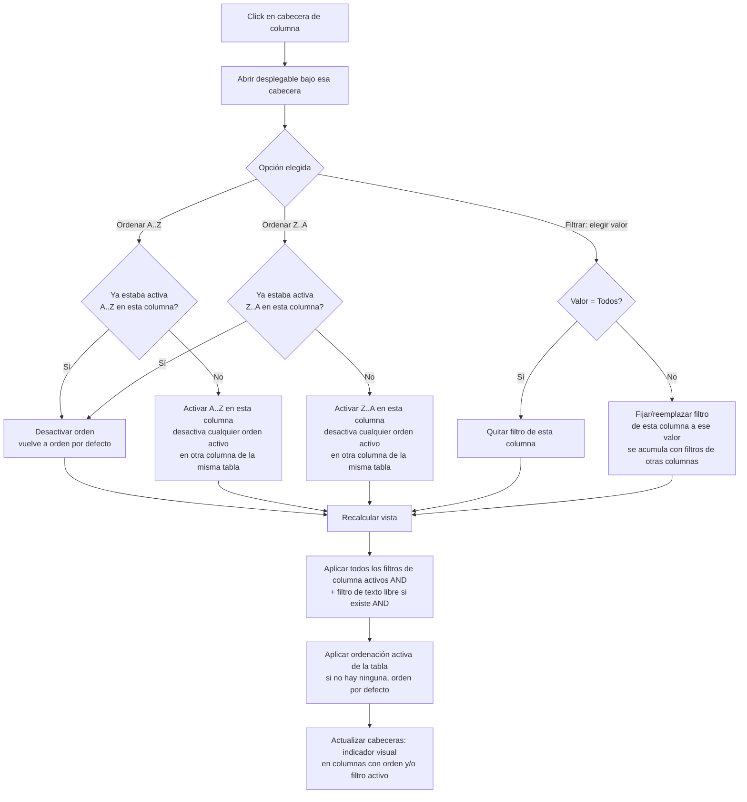

- **Nombre**: Menú de ordenación y filtrado en cabeceras de columna (modo edición)
- **Código**: 00165
- **Tipo**: change
- **Fecha creación**: 2026-08-06

## Prompt original del usuario

quiero añadir una mejora en las ventanas del modo edición (componentes, recursos y grupos):

Al pulsar el sobre el nombre de cualquier columna debe aparecer un menú contextual con las siguientes opciones:
- Ordenar A..Z
- Ordenar Z...A
- Filtrar + combo con todos los valores diferentes que hay en la lista para esa columna (por defecto Todos y, si se cambia, se aplica el filtro)

## Descripción completa

En las tres ventanas flotantes del modo edición — Componentes, Recursos y Grupos — al pulsar sobre el nombre de cualquier columna de su tabla se abre un desplegable con estas opciones:

- **Ordenar A..Z**
- **Ordenar Z..A**
- **Filtrar**, con un combo desplegable que lista todos los valores distintos que existen en esa columna (calculados sobre la lista completa, sin tener en cuenta otros filtros ya aplicados). Por defecto el combo muestra "Todos" (sin filtrar); al elegir un valor concreto, la tabla se filtra para mostrar solo las filas que tengan ese valor en esa columna.

Columnas a las que aplica, por ventana (la columna "Acciones" queda siempre excluida, no es un dato de la fila):

- **Componentes**: Orden, Id, Tipo, Copia. La columna "Orden" es una excepción: solo ofrece "Ordenar A..Z"/"Ordenar Z..A", sin opción de filtrar (es la posición de apilado en la mesa, ya tiene su propio mecanismo de edición directa en la tabla, y filtrar por ella no aporta ningún valor práctico).
- **Recursos**: Nombre, Usos, Tipo.
- **Grupos**: Nombre, Elementos.

### Comportamiento de la ordenación

- "Ordenar A..Z" y "Ordenar Z..A" funcionan como botones de activar/desactivar: al pulsar uno se activa (queda marcado como seleccionado dentro del propio menú) y, si el otro estaba activo en esa misma columna, se desactiva. Si se vuelve a pulsar la opción que ya está activa, se desactiva y la tabla vuelve a su orden por defecto (el que ya tenía antes de aplicar cualquier ordenación de columna).
- Cada ventana (Componentes, Recursos, Grupos) solo puede tener **una** columna con ordenación activa a la vez, de forma independiente entre las tres ventanas. Si había una columna ordenada y se activa la ordenación de otra columna distinta dentro de la misma ventana, la ordenación anterior se desactiva automáticamente (se sustituye, no se combinan dos criterios de orden).

### Comportamiento del filtrado

- Cada columna puede tener su propio filtro de valor activo de forma independiente, y los filtros de varias columnas dentro de la misma ventana se combinan entre sí (una fila solo se muestra si cumple todos los filtros de columna activos a la vez).
- El filtro de una columna y la ordenación de esa misma columna (o de otra) pueden estar activos a la vez sin ningún conflicto — se combinan igual que el resto.
- Componentes y Recursos ya tenían un cuadro de filtro de texto libre (que busca por id/nombre/tipo). Ese filtro de texto sigue funcionando exactamente igual que hasta ahora, y se combina con los nuevos filtros de columna (una fila debe cumplir el texto libre y todos los filtros de columna activos para mostrarse).

### Persistencia

La ordenación y los filtros de columna activos son temporales: se mantienen mientras se está usando la aplicación (sobreviven a añadir/editar/borrar filas, o a colapsar y expandir el panel), pero se pierden al recargar la página — igual que ya ocurre hoy con el cuadro de filtro de texto libre existente. No es un ajuste que se guarde de una sesión a otra.

### Indicador visual

Cualquier columna que tenga en ese momento una ordenación y/o un filtro activo muestra un pequeño indicador visual en su cabecera, para que se note de un vistazo qué criterios están aplicados sin tener que abrir el desplegable.

### Paridad de la ventana Grupos con Componentes y Recursos

Hasta ahora, la ventana Grupos era la única de las tres que no tenía cuadro de filtro de texto libre ni permitía redimensionar el ancho de sus columnas (Componentes y Recursos sí tienen ambas cosas). Como parte de este cambio, Grupos pasa a tener también esas dos funcionalidades, además del nuevo menú de cabecera — quedando así con el mismo comportamiento que las otras dos ventanas en estos aspectos.

### Preguntas de alcance resueltas con el usuario

- **¿A qué columnas aplica el menú?** A todas las columnas de datos de las tres tablas, salvo "Acciones". Confirmado, con la excepción de "Filtrar" en la columna "Orden" de Componentes (solo ordenar).
- **¿El menú se abre con click izquierdo o derecho?** Click izquierdo sobre la cabecera, como un desplegable anclado bajo ella (no junto al cursor).
- **¿La ordenación admite varios criterios a la vez?** No, uno solo por ventana, excluyente entre columnas de esa misma ventana.
- **¿Los filtros de columna son acumulables entre sí y con el filtro de texto ya existente?** Sí, se combinan todos (AND) dentro de cada ventana.
- **¿Se persiste el criterio de orden/filtro entre sesiones?** No, es transitorio como el filtro de texto ya existente.
- **¿El combo de "Filtrar" se calcula sobre la lista completa o la ya filtrada?** Sobre la lista completa sin filtrar, para que no cambie de opciones según qué otros filtros haya activos.
- **¿Aplica también a Grupos aunque hoy tenga menos funcionalidad que las otras dos ventanas?** Sí, y además se le añade el filtro de texto libre y el redimensionado de columna que le faltaban para quedar a la par.
- **¿Qué pasa si se vuelve a pulsar la opción de ordenación ya activa?** Se desactiva y la tabla vuelve a su orden por defecto (asunción del análisis, no objetada por el usuario).

## Apuntes técnicos

- Las tres tablas (`ui/componentList.js`, `ui/resourceList.js`, `ui/groupList.js`) generan un `<table>` con `<th data-col="clave">` por columna dentro de un panel flotante propio (colapso/posición/tamaño independientes).
- Ya existe un menú contextual genérico, `ui/contextMenu.js` (`openContextMenu`), pero se abre junto al cursor (click derecho, usado hoy en el menú de componente de `modes/play/playMode.js`) y no soporta un control tipo `<select>` embebido en un ítem — no encaja directamente para este desplegable de cabecera, que se ancla bajo el `<th>` pulsado. Es más parecido al patrón `createAddMenu` de `ui/resourceList.js` (desplegable fijo bajo un botón).
- `ui/tableColumnResize.js` (`attachColumnResizing`) ya gestiona el redimensionado de columnas mediante `attachResizeHandle` sobre cada `<th>`, usado hoy en Componentes y Recursos; hay que aplicarlo también a Grupos.
- Filtro de texto libre existente: estado de módulo (`filterText` en `componentList.js`, análogo en `resourceList.js`), normaliza el texto y compara contra id/tipo o nombre.
- Orden por defecto actual de cada tabla: Componentes por el campo `order` (`core/state.js`); Recursos y Grupos alfabético por nombre (`core/textSort.js` → `sortByName`).
- Grupos no tiene hoy ni `columnWidths` ni cuadro de filtro de texto (ver `design/docs/ARCHITECTURE.md`, sección 3: "sin `columnWidths` — la tabla ... no tiene redimensionado de columna").

