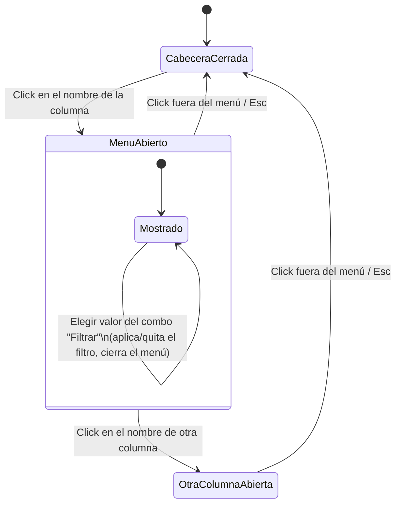

# Navegación — menú de cabecera de columna

Aplica igual en las tres ventanas de modo edición (Componentes, Recursos, Grupos). El desplegable es propio de cada columna: solo puede haber uno abierto a la vez por ventana.

Notas:
- Abrir el desplegable de una columna cierra automáticamente el de otra si estaba abierto (nunca dos desplegables visibles a la vez en la misma ventana).
- Elegir una opción de orden o un valor de filtro cierra el desplegable y aplica el cambio de inmediato sobre la tabla (recalcula filas visibles y, si aplica, el orden).
- El estado "activo" de orden/filtro no depende de que el menú esté abierto: se refleja en el indicador de la cabecera (ver `design_menu-cabecera-columna.html`) incluso con el desplegable cerrado.
