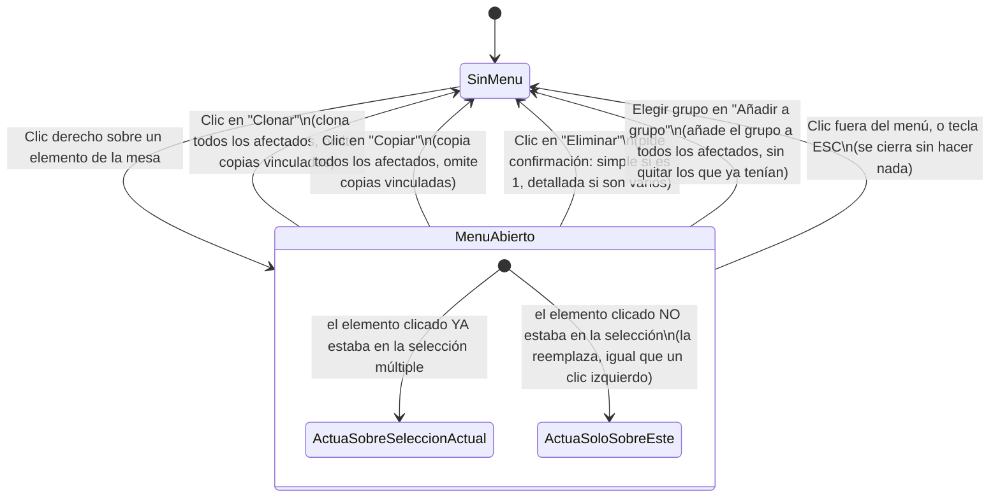

# Navegación — menú contextual de elemento en Modo Edición (cambio 00170)

**Notas:**
- "Añadir a grupo" solo es accionable si existe al menos un grupo en la partida; si no hay ninguno, la fila se muestra pero deshabilitada y no cierra el menú al pulsarla.
- El cierre del menú (por acción, clic fuera o ESC) es siempre inmediato — no hay estados intermedios de carga.
