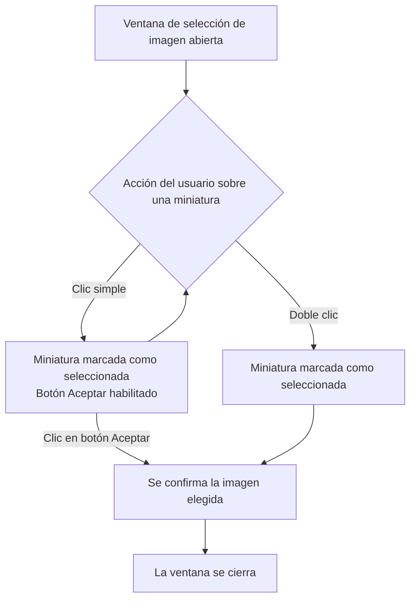

- **Nombre**: Selección de imagen con doble clic en el modal de elegir imagen
- **Código**: 00177
- **Tipo**: change
- **Fecha creación**: 2026-08-06

## Prompt original del usuario

en la ventana para elegir una imagen quiero que la hacer doble clic sobre una image se seleccione automáticamente sin tener que darle al botón Aceptar

## Descripción completa

En la ventana para elegir una imagen, además de poder seleccionar una miniatura con un clic y luego confirmar pulsando el botón "Aceptar", ahora se puede hacer doble clic directamente sobre una miniatura para seleccionarla y confirmarla en un único gesto, sin necesidad de pulsar después el botón "Aceptar".

El clic simple no cambia: sigue marcando la imagen como seleccionada (mostrando el resaltado correspondiente) y habilitando el botón "Aceptar", pero sin cerrar la ventana. El doble clic es un atajo adicional, no un reemplazo del flujo actual: quien prefiera seleccionar y luego pulsar "Aceptar" puede seguir haciéndolo igual que hasta ahora.

El doble clic funciona igual independientemente de si la imagen ya estaba seleccionada previamente o no: en ambos casos, confirma esa imagen y cierra la ventana.

Esta ventana se usa en varios sitios del proyecto (elegir la forma de una carta, elegir el fondo de un componente del tablero, elegir una imagen desde el editor visual). Al ser siempre la misma ventana, el comportamiento de doble clic se aplica igual en los tres casos, sin ningún tratamiento especial en ninguno de ellos.

No aparece ningún elemento visual nuevo en pantalla: es un cambio en la forma de interactuar con la ventana ya existente. El siguiente diagrama resume el flujo resultante:

### Preguntas de alcance resueltas

- **¿Qué debe pasar si se hace doble clic sobre una miniatura que ya estaba seleccionada?** Debe confirmar igualmente y cerrar la ventana, sin ningún caso especial.
- **¿El clic simple debe seguir comportándose igual que hoy?** Sí, sin cambios: solo selecciona, no cierra la ventana.
- **¿El nuevo comportamiento debe aplicarse a los tres flujos que usan esta ventana?** Sí, al compartir la misma ventana, se aplica igual a los tres sin tratamiento especial.

## Apuntes técnicos

- Componente afectado: `openBoardImageModal`, en `src/ui/boardImageModal.js`. Es JS vanilla con DOM (no React/JSX).
- Reutilizado en tres flujos: `src/ui/cardShapeModal.js:273`, `src/ui/componentModal.js:1012` y `src/ui/visualEditorModal.js:781`.
- Cada miniatura es un `<button>` con clase `board-image-modal__item`. Tiene hoy un listener `click` (líneas ~82-87) que fija `selectedId`, actualiza la clase `board-image-modal__item--selected` y llama a `updateAcceptButton()`.
- El botón "Aceptar" (`acceptBtn`, texto exacto `'Aceptar'`, línea ~42) tiene su propio listener (líneas ~124-128): si hay `selectedId`, invoca `onAccept(selectedId)` y hace `overlay.remove()` para cerrar el modal.
- No existe en el proyecto ningún patrón previo de `dblclick` para confirmar selección en modales de galería. El único uso existente de `dblclick`, en `src/ui/componentRenderer.js` (líneas 560, 776, 940, 1101, 1254, 1319, 1511, 1716), es para otra cosa: abrir el editor de un componente del tablero al hacer doble clic sobre el lienzo. Se introduce el patrón desde cero.
- No hay guardado a backend ni persistencia adicional: `onAccept` ya es el único efecto de confirmar; cada uno de los 3 llamantes decide qué hacer con el `resourceId` recibido.
- Solución natural (a confirmar por `ms-how`): añadir un listener `dblclick` en cada `item`, junto al `click` existente, que fije `selectedId`, actualice la clase `--selected` y dispare la misma lógica que hoy ejecuta el listener del botón `acceptBtn` (`onAccept(selectedId)` + `overlay.remove()`).
